FLASHATTENTION-2: FASTER ATTENTION WITH
BETTER PARALLELISM AND WORK PARTITIONING

ABSTRACT

Scaling Transformers to longer sequence lengths has been a major problem in the
last several years, promising to improve performance in language modeling and high-
resolution image understanding, as well as to unlock new applications in code, audio,
and video generation.

The attention layer is the main bottleneck in scaling to longer
sequences, as its runtime and memory increase quadratically in the sequence length.

FLASHATTENTION (Dao et al., 2022) exploits the asymmetric GPU memory hier-
archy to bring significant memory saving (linear instead of quadratic) and runtime
speedup (2-4x compared to optimized baselines), with no approximation.

 However,
FLASHATTENTION is still not nearly as fast as optimized matrix-multiply (GEMM)
operations, reaching only 25-40% of the theoretical maximum FLOPs/s. We observe
that the inefficiency is due to suboptimal work partitioning between different thread
blocks and warps on the GPU, causing either low-occupancy or unnecessary shared
memory reads/writes. 

We propose FLASHATTENTION-2, with better work partition-
ing to address these issues. In particular, we (1) tweak the algorithm to reduce the
number of non-matmul FLOPs (2) parallelize the attention computation, even for a
single head, across different thread blocks to increase occupancy, and (3) within each
thread block, distribute the work between warps to reduce communication through
shared memory. These yield around 2x speedup compared to FLASHATTENTION,
reaching 50-73% of the theoretical maximum FLOPs/s on A100 and getting close
to the efficiency of GEMM operations.

1 INTRODUCTION

 Dao et al. (2022) proposed to reorder the
attention computation and leverages classical techniques (tiling, recomputation) to significantly speed
it up and reduce memory usage from quadratic to linear in sequence length. This yields 2-4 wall-clock
time speedup over optimized baselines, up to 10-20 memory saving, with no approximation, and as a
result FLASHATTENTION has seen wide adoption in large-scale training and inference of Transformers

while FLASHATTENTION is already
2-4 faster than a standard attention implementation, the forward pass only reaches 30-50% of the theoretical maximum FLOPs/s of the device (Fig. 6), while the backward pass is even more challenging,
reaching only 25-35% of maximum throughput on A100 GPU (Fig. 7). In contrast, optimized GEMM
can reach up to 80-90% of the theoretical maximum device throughput.

Building on FLASHATTENTION, we propose FLASHATTENTION-2 with better parallelism and work
partitioning to address these challenges.
1. In Section 3.1, we tweak the algorithms to reduce the number of non-matmul FLOPs while not
changing the output. While the non-matmul FLOPs only account for a small fraction of the total
FLOPs, they take longer to perform as GPUs have specialized units for matrix multiply, and as
a result the matmul throughput can be up to 16 higher than non-matmul throughput. It is thus
important to reduce non-matmul FLOPs and spend as much time as possible doing matmul FLOPs.

2. We propose to parallelize both the forward pass and backward pass along the sequence length dimen-
sion, in addition to the batch and number of heads dimension. This increases occupancy (utilization
of GPU resources) in the case where the sequences are long (and hence batch size is often small)

3. Even within one block of attention computation, we partition the work between different warps
of a thread block to reduce communication and shared memory reads/writes.

2 BACKGROUND
We provide some background on the performance characteristics and execution model of GPUs. We
also describe the standard implementation of attention, as well as FLASHATTENTION

2.1 HARDWARE CHARACTERISTICS
GPU performance characteristics.
The GPU consists of compute elements (e.g., floating point arith-
metic units) and a memory hierarchy. Most modern GPUs contain specialized units to accelerate matrix
multiply in low-precision (e.g., Tensor Cores on Nvidia GPUs for FP16/BF16 matrix multiply). The
memory hierarchy comprise of high bandwidth memory (HBM), and on-chip SRAM (aka shared mem-
ory). As an example, the A100 GPU has 40-80GB of high bandwidth memory (HBM) with bandwidth
1.5-2.0TB/s and 192KB of on-chip SRAM per each of 108 streaming multiprocessors with bandwidth
estimated around 19TB/s (Jia et al., 2018; Jia and Van Sandt, 2021). As the L2 cache is not directly
controllable by the programmer, we focus on the HBM and SRAM for the purpose of this discussion.

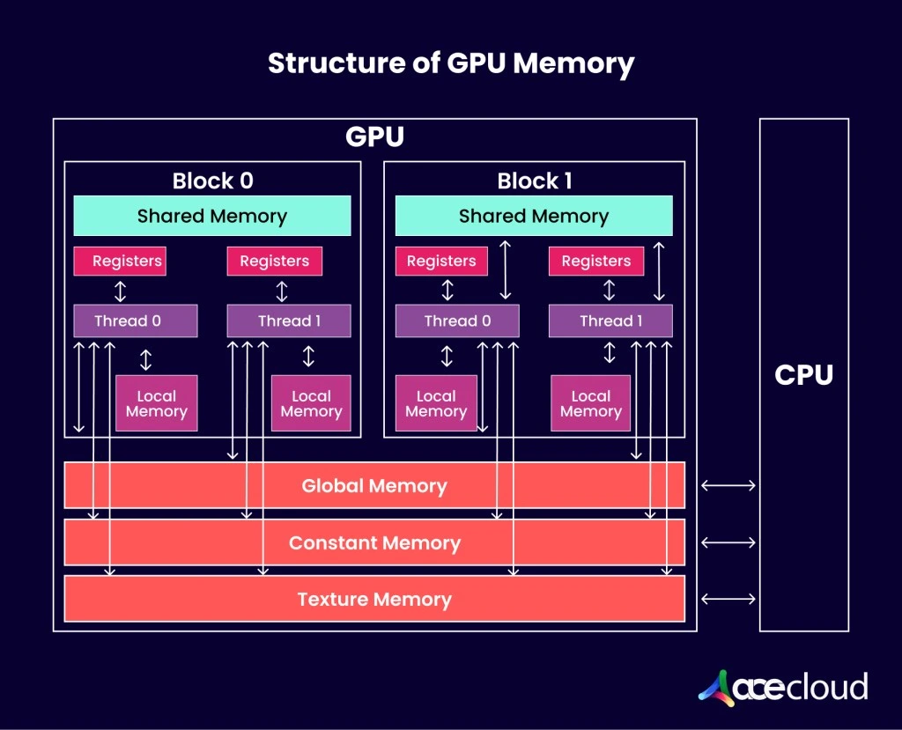

Execution Model. GPUs have a massive number of threads to execute an operation (called a kernel).
Threads are organized into thread blocks, which are scheduled to run on streaming multiprocessors
(SMs). Within each thread blocks, threads are grouped into warps (a group of 32 threads). Threads
within a warp can communicate by fast shuffle instructions or cooperate to perform matrix multiply.
Warps within a thread block can communicate by reading from / writing to shared memory. Each
kernel loads inputs from HBM to registers and SRAM, computes, then writes outputs to HBM.

2.2 STANDARD ATTENTION IMPLEMENTATION

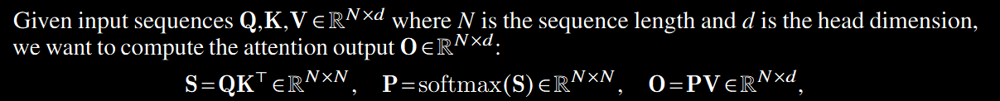

where softmax is applied row-wise.1 For multi-head attention (MHA), this same computation is
performed in parallel across many heads, and parallel over the batch dimension (number of input
sequences in a batch).

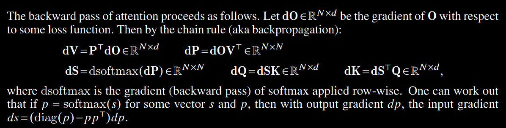
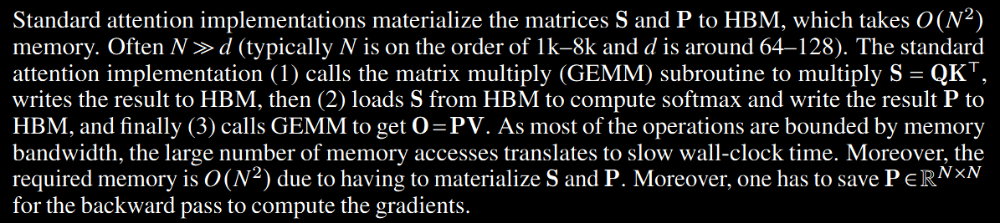

2.3 FLASHATTENTION
To speed up attention on hardware accelerators such as GPU, (Dao et al., 2022) proposes an algorithm
to reduce the memory reads/writes while maintaining the same output (without approximation)

2.3.1 FORWARD PASS

FLASHATTENTION applies the classical technique of tiling to reduce memory IOs, by (1) loading
blocks of inputs from HBM to SRAM, (2) computing attention with respect to that block, and then (3)
updating the output without writing the large intermediate matrices S and P to HBM. 

As the softmax
couples entire rows or blocks of row, online softmax (Milakov and Gimelshein, 2018; Rabe and Staats,
2021) can split the attention computation into blocks, and rescale the output of each block to finally get
the right result (with no approximation). 

By significantly reducing the amount of memory reads/writes,
FLASHATTENTION yields 2-4x wall-clock speedup over optimized baseline attention implementations.

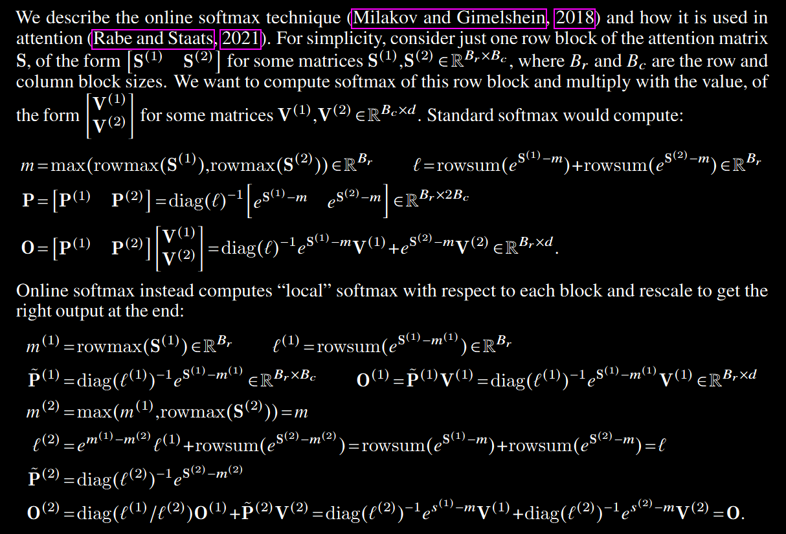

We show how FLASHATTENTION uses online softmax to enable tiling (Fig. 1) to reduce memory
reads/writes.

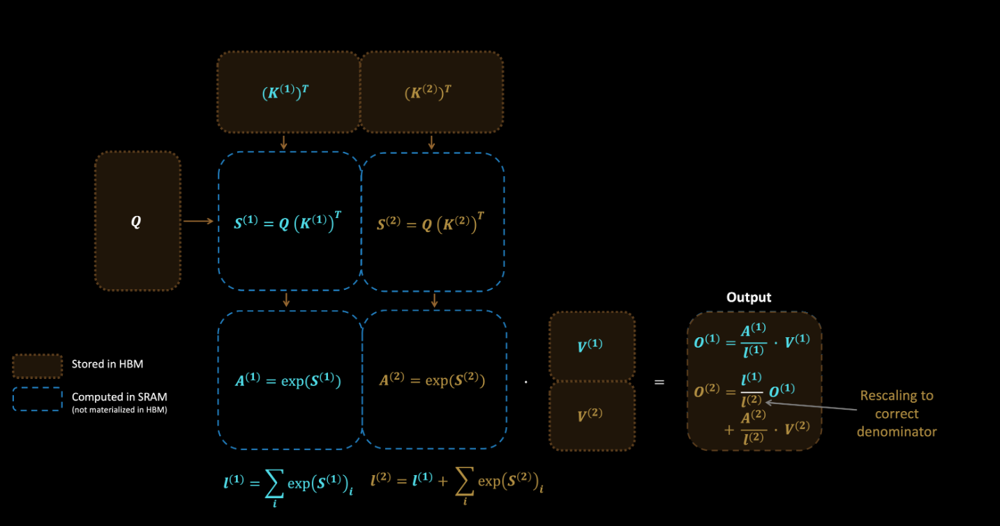

Figure 1: Diagram of how FLASHATTENTION forward pass is performed, when the key K is partitioned
into two blocks and the value V is also partitioned into two blocks. By computing attention with respect
to each block and rescaling the output, we get the right answer at the end, while avoiding expensive
memory reads/writes of the intermediate matrices S and P. We simplify the diagram, omitting the step
in softmax that subtracts each element by the row-wise max.

2.3.2 BACKWARD PASS

In the backward pass, by re-computing the values of the attention matrices S and P once blocks
of inputs Q, K, V are already loaded to SRAM, FLASHATTENTION avoids having to store large
intermediate values. By not having to save the large matrices S and P of size 𝑁 x𝑁, FLASHATTENTION
yields 10-20x memory saving depending on sequence length (memory required in linear in sequence
length 𝑁 instead of quadratic). The backward pass also achieves 2-4x wall-clock speedup due to
reduce memory reads/writes.

The backward pass applies tiling to the equations in Section 2.2. Though the backward pass is simpler
than the forward pass conceptually (there is no softmax rescaling), the implementation is significantly
more involved. This is because there are more values to be kept in SRAM to perform 5 matrix multiples
in the backward pass, compared to just 2 matrix multiples in the forward pass.

3 FLASHATTENTION-2:
ALGORITHM, PARALLELISM, AND WORK PARTITIONING

We describe the FLASHATTENTION-2 algorithm, which includes several tweaks to FLASHATTENTION
to reduce the number of non-matmul FLOPs. We then describe how to parallelize the computation
on different thread blocks to make full use the GPU resources. Finally we describe we partition the
work between different warps within one thread block to reduce the amount of shared memory access.
These improvements lead to 2-3x speedup as validated in Section 4.

3.1 ALGORITHM

---repetation---

We tweak the algorithm from FLASHATTENTION to reduce the number of non-matmul FLOPs. This
is because modern GPUs have specialized compute units (e.g., Tensor Cores on Nvidia GPUs) that
makes matmul much faster. As an example, the A100 GPU has a max theoretical throughput of 312
TFLOPs/s of FP16/BF16 matmul, but only 19.5 TFLOPs/s of non-matmul FP32. Another way to think
about this is that each non-matmul FLOP is 16x more expensive than a matmul FLOP. To maintain
high throughput (e.g., more than 50% of the maximum theoretical TFLOPs/s), we want to spend as
much time on matmul FLOPs as possible

-------------

3.1.1 FORWARD PASS(To revisit)

We revisit the online softmax trick as shown in Section 2.3 and make two minor tweaks to reduce
non-matmul FLOPs

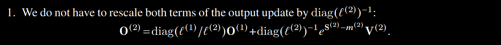
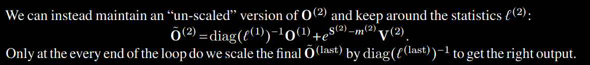
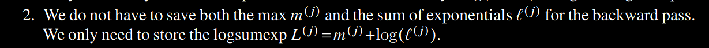
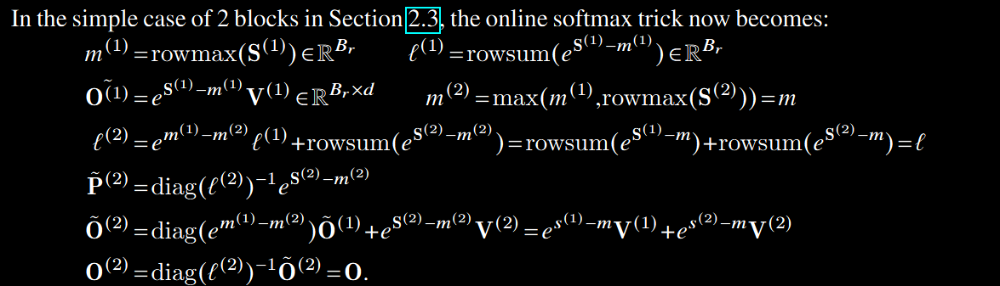
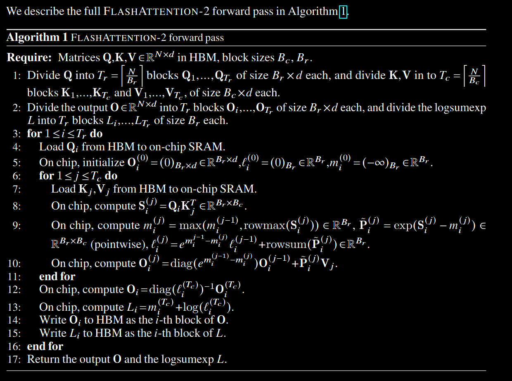

Causal masking.
One common use case of attention is in auto-regressive language modeling, where we need to apply
a causal mask to the attention matrix S (i.e., any entry S𝑖 𝑗 with 𝑗 > 𝑖 is set to float('-inf')).
1. As FLASHATTENTION and FLASHATTENTION-2 already operate by blocks, for any blocks where
all the column indices are more than the row indices (approximately half of the blocks for large
sequence length), we can skip the computation of that block. This leads to around 1.7-1.8x speedup
compared to attention without the causal mask.
2. We do not need to apply the causal mask for blocks whose row indices are guaranteed to be strictly
less than the column indices. This means that for each row, we only need apply causal mask to
1 block (assuming square block).

Correctness, runtime, and memory requirement. As with FLASHATTENTION, Algorithm 1 returns
the correct output O = softmax(QK^T)V (with no approximation), using 𝑂 (𝑁^2* 𝑑) FLOPs and requires 𝑂(𝑁) additional memory beyond inputs and output (to store the logsumexp 𝐿). The proof is almost
the same as the proof of Dao et al. (2022, Theorem 1), so we omit it here

3.1.2 BACKWARD PASS (To recheck algo.)

The backward pass of FLASHATTENTION-2 is almost the same as that of FLASHATTENTION. We
make a minor tweak to only use the row-wise logsumexp 𝐿 instead of both the row-wise max and
row-wise sum of exponentials in the softmax. 

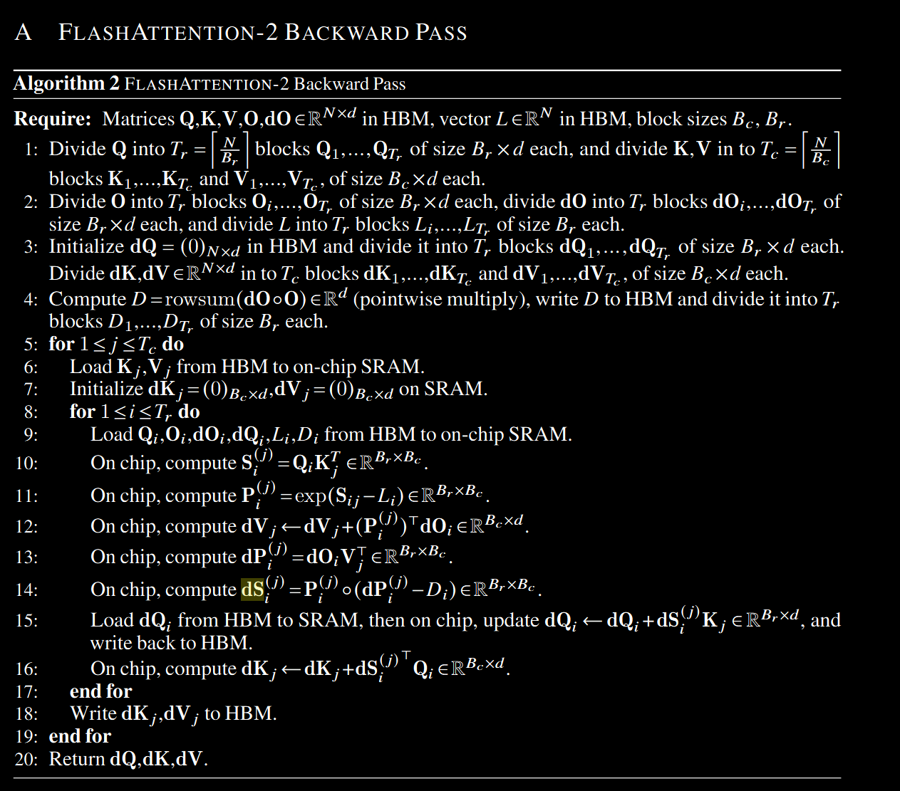

Multi-query attention and grouped-query attention. Multi-query attention (MQA) (Shazeer, 2019)
and grouped-query attention (GQA) (Ainslie et al., 2023) are variants of attention where multiple
heads of query attend to the same head of key and value, in order to reduce the size of KV cache during
inference. Instead of having to duplicate the key and value heads for the computation, we implicitly
manipulate the indices into the head to perform the same computation. In the backward pass, we need
to sum the gradients dK and dV across different heads that were implicitly duplicated.

3.2 PARALLELISM

The first version of FLASHATTENTION parallelizes over batch size and number of heads.
We use
1 thread block to process one attention head, and there are overall batch size*number of heads thread
blocks.
Each thread block is scheduled to run on a streaming multiprocessor (SM), and there are 108
of these SMs on an A100 GPU for example. This scheduling is efficient when this number is large
(say>= 80), since we can effectively use almost all of the compute resources on the GPU.

In the case of long sequences (which usually means small batch sizes or small number of heads[<---BUT WHY--->]), to
make better use of the multiprocessors on the GPU, we now additionally parallelize over the sequence
length dimension. This results in significant speedup for this regime.

Forward pass. We see that the outer loop (over sequence length) is embarrassingly parallel, and we
schedule them on different thread blocks that do not need to communicate with each other. We also
parallelize over the batch dimension and number of heads dimension, as done in FLASHATTENTION.
The increased parallelism over sequence length helps improve occupancy (fraction of GPU resources
being used) when the batch size and number of heads are small, leading to speedup in this case.

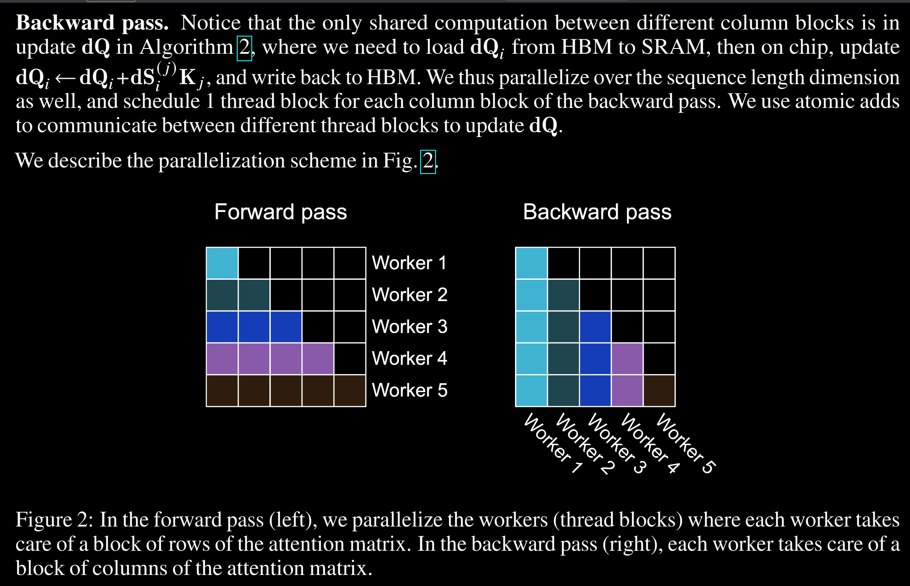

Decoding. During LLM inference, most of the time is spent on iterative decoding, where one token
is predicted at a time. The bottleneck for the attention operation during decoding is different from that
during training or prefill (prompt processing), because the query length is very short (often query length
is 1 since only the new extra token is attending to all the previous tokens, stored in the KV cache). As a
 result, the bottleneck is no longer the read/write of intermediate matrices the scores QK^T and attention
probabilities softmax(QK^T). Instead, the bottleneck is to load the KV cache as quickly as possible.

To accommodate this setting, we split the KV cache loading among different thread blocks, to
increase occupancy and saturate the HBM bandwidth. However, since the thread blocks cannot easily
communicate with each other, we write intermediate results to HBM, then call a separate kernel to
reduce the results and produce final output.

3.3 WORK PARTITIONING BETWEEN WARPS
As Section 3.2 describe how we schedule thread blocks, even within each thread block, we also have
to decide how to partition the work between different warps. We typically use 4 or 8 warps per thread
block, and the partitioning is described in Fig 3

Forward pass. For each block, FLASHATTENTION splits K and V across 4 warps while keeping
Q accessible by all warps. Each warp multiplies to get a slice of QK^T, then they need to multiply
with a slice of V and communicate to add up the result. This is referred to as the 'split-K' scheme.
However, this is inefficient since all warps need to write their intermediate results out to shared memory,
synchronize, then add up the intermediate results. These shared memory reads/writes slow down the
forward pass in FLASHATTENTION.
In FLASHATTENTION-2, we instead split Q across 4 warps while keeping K and V accessible by all
warps. After each warp performs matrix multiply to get a slice of QK^T, they just need to multiply with
their shared slice of V to get their corresponding slice of the output. There is no need for communication
between warps. The reduction in shared memory reads/writes yields speedup

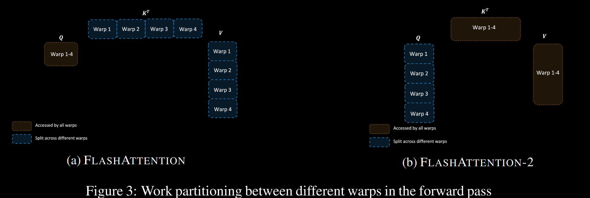

Backward pass. Similarly for the backward pass, we choose to partition the warps to avoid the
“split-K” scheme. However, it still requires some synchronization due to the more complicated
dependency between all the different inputs and gradients Q–K–V–O–dO–dQ–dK–dV. Nevertheless,
avoiding “split-K” reduces shared memory reads/writes and again yields speedup

Tuning block sizes Increasing block sizes generally reduces shared memory loads/stores, but increases
the number of registers required and the total amount of shared memory. Past a certain block size,
register spilling causes significant slowdown, or the amount of shared memory required is larger
than what the GPU has available, and the kernel cannot run at all. Typically we choose blocks of size
{64,128}*{64,128}, depending on the head dimension 𝑑 and the device shared memory size.
We manually tune for each head dimensions since there are essentially only 4 choices for block sizes,
but this could benefit from auto-tuning to avoid this manual labor. We leave this to future work.

4 EMPIRICAL VALIDATION

4.1 BENCHMARKING ATTENTION FOR TRAINING

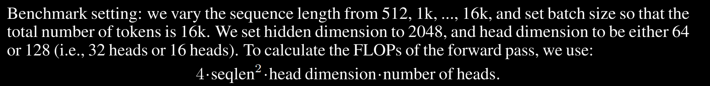

With causal mask, we divide this number by 2 to account for the fact that approximately only half
of the entries are calculated. To get the FLOPs of the backward pass, we multiply the forward pass
FLOPs by 2.5 (since there are 2 matmuls in the forward pass and 5 matmuls in the backward pass,
due to recomputation)

4.2 BENCHMARKING ATTENTION FOR INFERENCE

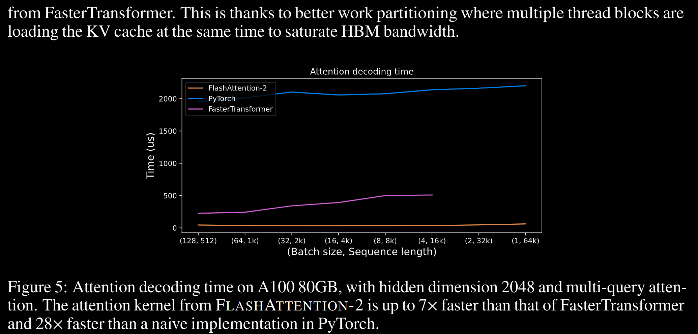

4.3 END-TO-END PERFORMANCE

Note that we calculate the FLOPs by the formula, following Megatron-LM (Shoeybi et al., 2019) (and
many other papers and libraries):
6 * seqlen * number of params + 12 * number of layers * hidden dim * seqlen^2
The first term accounts for the FLOPs due to weight-input multiplication, and the second term accounts
for the FLOPs due to attention. However, one can argue that the second term should be halved, as
with causal mask we only need to compute approximately half the number of elements in attention.
We choose to follow the formula from the literature (without dividing the attention FLOPs by 2) for
consistency

additional notes:
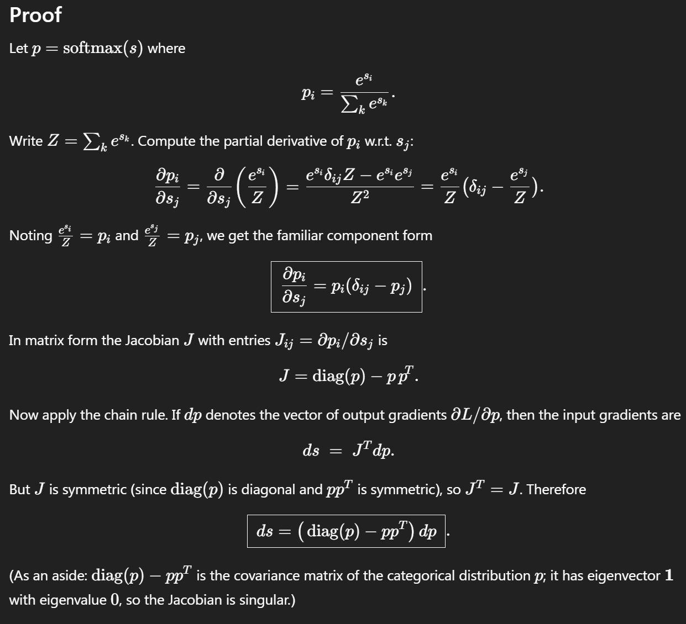

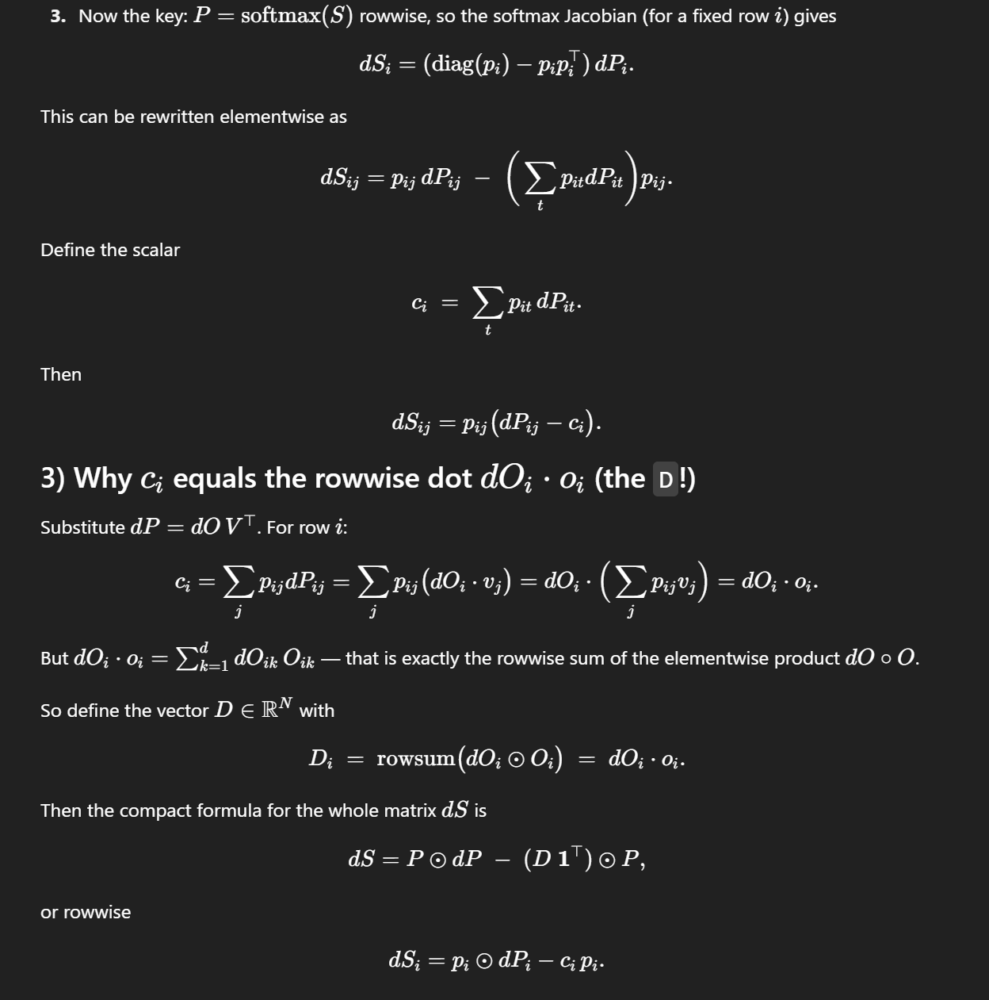