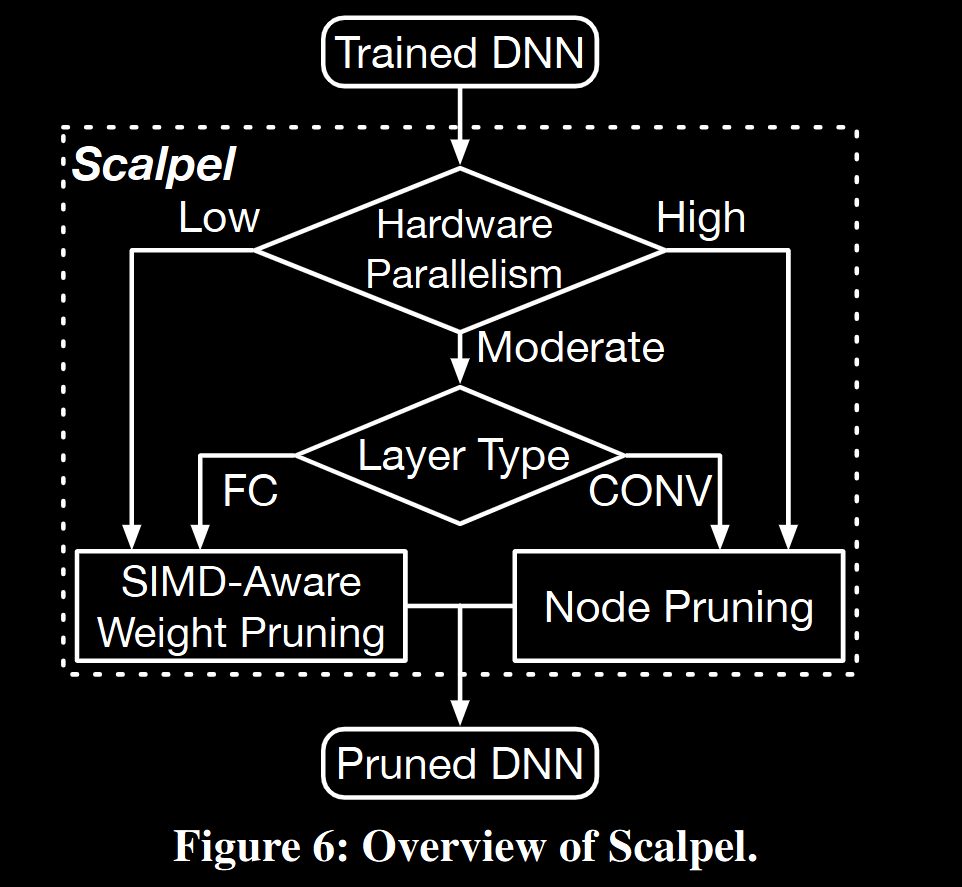
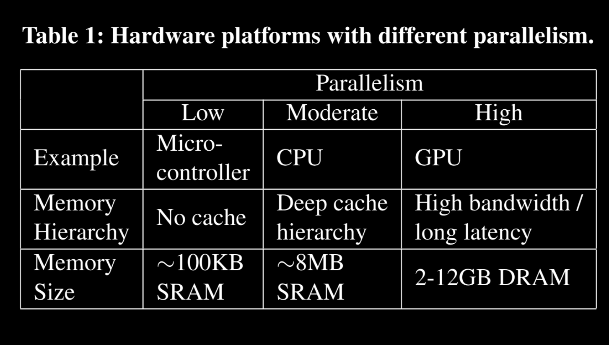
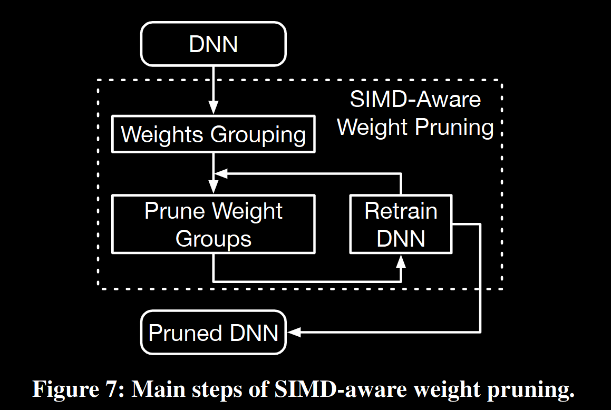
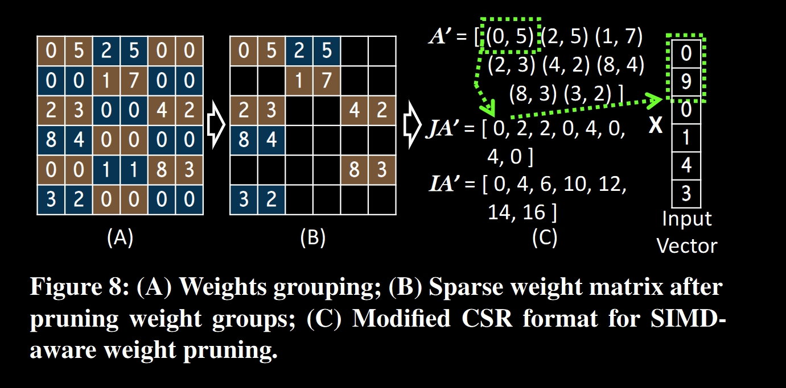
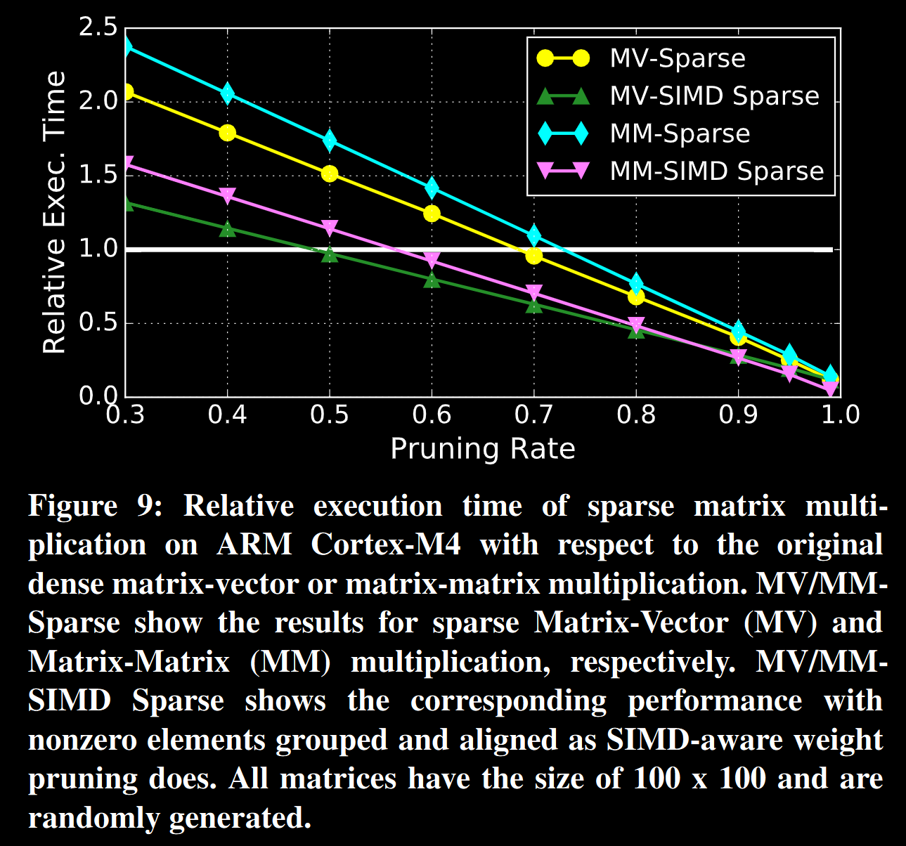
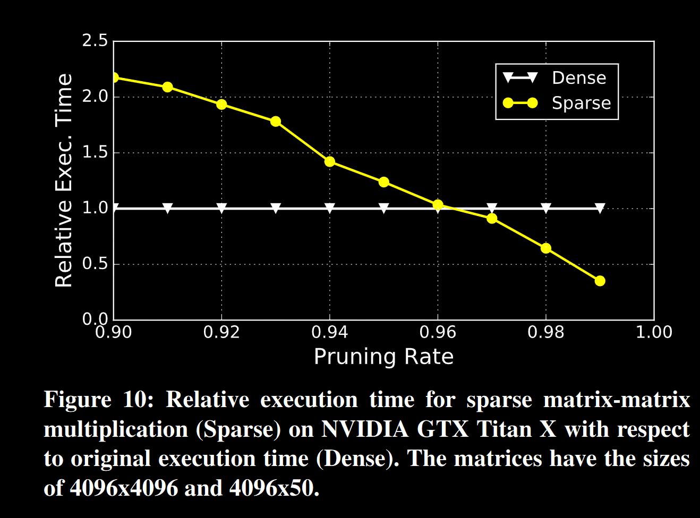
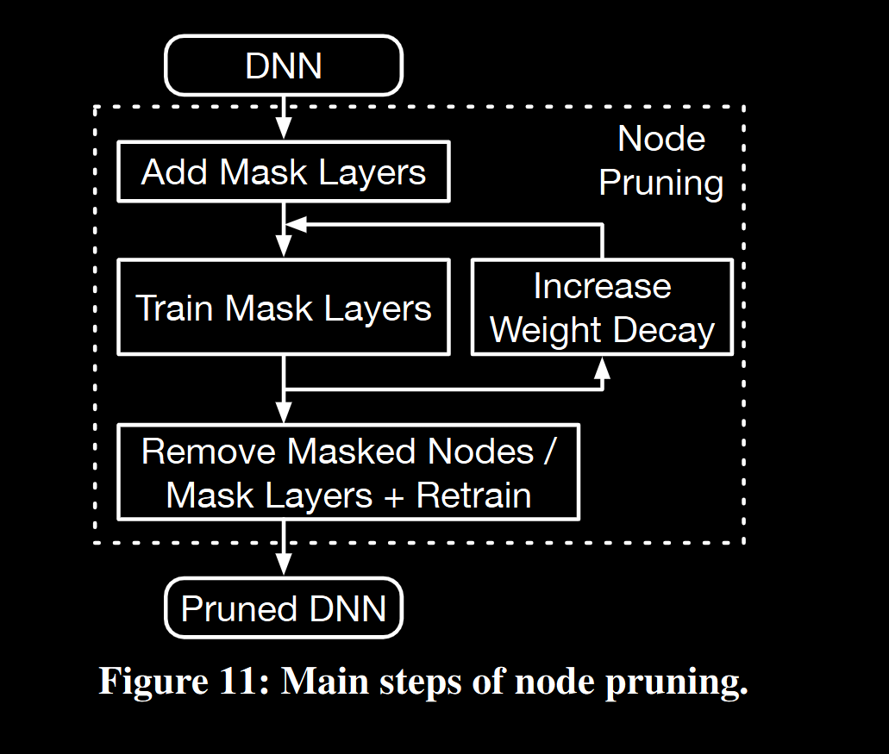
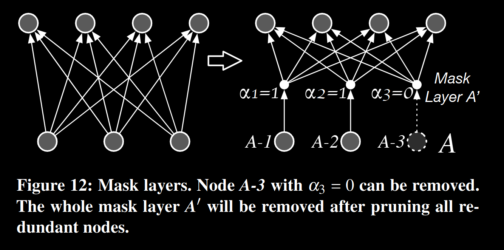
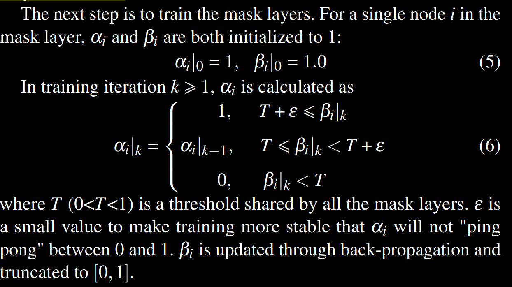
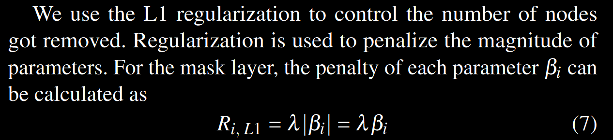

DNNs consists of two types of layers: fully-connected layers and
convolutional layers. They perform matrix-vector and matrix-matrix
multiplication, respectively. Weight pruning techniques [ 19, 21 , 31]
measure the importance of each weight and remove those deemed
unimportant, resulting in both memory storage and computation
reductions. After weight pruning, redundant weights and related
MAC operations are removed. The matrix computation in the pruned
networks becomes sparse, thus the remaining weights are stored in a
sparse matrix format.

The sparsity of pruned networks often leads to a performance de-
crease in DNN computation. Sparse weight matrices lose the regular
structure of dense matrices, and sparse matrix multiplication needs
extra computation to decode the sparse format.

The performance
impact of weight pruning is heavily intertwined with the under-
lying hardware. 

On microcontrollers, weight pruning consistently
improves DNN performance. The simple architecture of microcon-
trollers cannot hide the memory access latency. The reduction in
model size can, therefore, make up for the computation inefficiencies
of sparse matrix multiplication. However, the reduction in execu-
tion time is still much lower than the computation reduction.

For
GPUs, weight pruning consistently loses performance. The sparse
matrix computation cannot make optimal usage of the supported
hardware, e.g. memory coalescing. Also, dense matrix optimizations,
like matrix tiling, are less effective.

For CPUs, the effect of weight pruning varies for different net-
works and depends on the computation breakdown between fully-
connected and convolutional layers. For fully-connected layers,
weight pruning can improve performance because the total memory
footprint is critical to matrix-vector multiplication. But for convolu-
tional layers that perform matrix-matrix multiplication, the matrix
data will be reused multiple times, and there is limited benefit from
the memory footprint reduction. Therefore, the inefficiencies in-
herent in the sparse matrix format will hurt the performance of
convolutional layers on CPUs.

 In addition to the performance de-
crease, another challenge for weight pruning is that a significant
amount of data is necessary to record the sparse matrix structure.
Each nonzero weight needs one extra column index to record its
position. This extra overhead reduces the impact of weight pruning
across all hardware platforms

Scalapel

. For hardware with low
parallelism like microcontrollers, SIMD-aware weight pruning re-
moves redundant weights but forces the remaining weights to be in
groups. All groups are sized to the SIMD width, thereby, improv-
ing performance by ensuring the SIMD units are fully utilized. It
also decreases the remaining model size since weights in the same
group can share the same column index

The pruned DNN models generated by Scalpel do not suffer a loss
in prediction accuracy compared with the original models.

This paper makes the following contributions:

DNN weight pruning is not a panacea,
but rather its impact is closely coupled to both the structure
of the network (fully-connected vs. convolutional layers)
as well as the data-parallel structure of the target hardware.
The blind application of traditional weight pruning often
results in performance loss,

2.1 DNN Weight Pruning
Figure 1 shows a typical
DNN used for image classification. It consists of two CONV layers
followed by two FC layers. In FC layers, all input values are con-
nected to every neuron. For CONV layers, as shown in Figure 1,
they consist of a stack of 2D matrices named feature maps.

The convolution operation is performed between the input feature maps
and the weights to generate the output.
FC layers perform matrix-vector multiplication, and CONV layers
perform matrix-matrix multiplication. Weights of each layer can be
grouped into a weight matrix. For FC layers, the input values are
stored in a 1D vector (input vector). Then, the weight matrix can
be multiplied with the input vector to generate the output which is
also a 1D vector. For each CONV layer, its input is effectively a
3D array. The image-to-column (im2col) function will rearrange the
3D array into a 2D matrix (input matrix). Then, the weight matrix
will be multiplied with the input matrix to generate an output matrix
which can be converted back to a 3D array for the next layer
-------------------------------------------------------------------------------------------------------------------------
As an example, FC layers perform the computation
Y = f (W · X) (1)
where Y is the output activation vector, W is the weight matrix
and X is the input vector. f is the element-wise non-linear activa-
tion function. Bias values can be appended to weights matrix with
corresponding input values equal to 1 and, therefore, are neglected.
As shown in Figure 2, weight pruning removes redundant weights
and the dense weight matrix W (Figure 2(A)) is converted into a
sparse matrix Wsparse (Figure 2(B)). Every output element yi ∈ Y
should be calculated as
yi = f ( ∑
wsparse
i j ,0, j∈[0,n−1]
wsparse
i j x j ) (2)
where multiply-accumulate operations with zero weight have been
removed. n is the number of columns in W.
--------------------------------------------------------------------------------------------------------------------------

After weight pruning, the input vector or input matrix is still dense
for each layer. The FC and CONV layers need to perform sparse
matrix-vector and sparse matrix-matrix multiplication, respectively

Deep Compression [19, 20] provides a typical weight pruning
technique. Weights with absolute values lower than the thresholds
are removed, and the remaining network is retrained. The steps of
removing weights and retraining are iteratively applied to generate
the pruned DNN model.

2.2 Challenges
Weight pruning can dramatically decrease DNN model sizes and the
number of MAC operations. However, several challenges exist for
traditional DNN pruning techniques.

The first challenge is that the sparse weight matrix spends too
much extra data to record the sparse matrix format. For example, as
shown in Figure 2 (C), the compressed sparse rows (CSR) format use
three 1-D arrays (A, IA, JA) to store a m × n matrix W. A holds all
the nonzero values. IA records the index into A of the first nonzero
element in each row of W. JA stores the column indexes of the
nonzero elements. Since the index array JA has the same size with
the data array A, more than half of the data in the CSR format is
used to store the sparse matrix format

The second challenge is that weight pruning can hurt the DNN
computation performance. Figure 3 shows the relative execution
time, model sizes and MAC operations of network models pruned
by the weight pruning method in Deep Compression with respect
to the original DNN models. The first three bars show the relative
execution time on the microcontroller, CPU and GPU. As shown
in the figure, the relative execution time is much higher than the
relative model sizes and MAC operations. Weight pruning hurts the
performance of LeNet-5 (on GPU), ConvNet, NIN and AlexNet,
which causes an execution time increase for these networks

The real execution time of
the FC layers is significantly reduced by traditional weight pruning,
which is similar to the results shown in the previous work [19]. For
both FC and CONV layers, there is a large gap between the real
execution time of the pruned networks and the expected values. The
performance gains are lagging significantly behind the reduction in
MAC operations. Lastly, weight pruning is ineffective for CONV
layers, leading to substantial increases in execution time for ConvNet,
NIN and AlextNet.

The gap between real and expected execution times occurs be-
cause the sparse weight matrices lose the regular structure of their
dense counterparts
CSR indexing of input values requires ad-
ditional computation and memory accesses. Worse yet, since sparse
matrices lose the regular structure, many optimizations applicable
to dense matrices, e.g. matrix tiling, cannot be applied. For CPU
computation, FC layers do not suffer as much from these reasons
because they have a much lower computation/memory access ratio
compared with CONV layers.

fIG-5
We measure three cases: original dense layer (Dense), sparse
layer with 80% (Sparse-0.80) and 60% (Sparse-0.60) of the weights
removed. We profile the computation with Callgrind. Sparse-0.60
represents the actual pruning rate for this layer, while Sparse-0.80
represents the pruning rate necessary to reach the break-even per-
formance point. As shown in the figure, weight pruning leads to
large increases in L1 D-Cache load misses, stores, and store misses
due to the sparse representation

With 60% pruning, these overheads
are not counter-balanced by the computation reduction, hence a net
performance loss is observed. At 80% pruning, the combination of
modestly lower memory access overheads and higher reductions
in computations results in break-even performance. Pruning rates
of more than 80% are necessary to overcome the memory access
overhead for this layer and achieve a net performance gain.

The first step of Scalpel
is profiling and determining the parallelism level of the hardware
platform. All general-purpose hardware platforms are divided into
three categories based on their internal parallelism: low parallelism,
moderate parallelism, and high parallelism.
For low-parallelism hardware, SIMD-aware weight pruning is
applied. It prunes weights in groups and forces the remaining weights
to be in aligned groups. All groups have the same size as the SIMD
width and the weights in the same group share the same column
index, reducing the overhead of the sparse format.
For high-parallelism hardware, node pruning is applied. It re-
moves the DNN redundancy by removing redundant nodes instead
of redundant weights. Removing nodes does not break the regular
structure of dense weight matrices.<---Duplicate>

3.2
Multiple inputs for the same DNN can be processed in a batch to
reduce the memory access. The weight matrices can be loaded once
and shared for the computation of multiple different inputs. Batch
processing will increase the computation throughput but also the
latency
On low-parallelism and moderate-parallelism hardware, we
set the batch size to 1 because real-time applications need the DNN
computation to be completed within a short latency. However, for
high-parallelism hardware, the computation is throughput-driven,
and DNN computation with a large batch size can still meet the
latency requirement. In this case, we set the batch size to 50 for
DNN computation on high-parallelism hardware. Han et al. [19 ] set
batch size to 1 for GPU testing, which is actually unpractical

3.3

The main steps of SIMD-aware weight pruning are
shown in Figure above
 We use ARM Cortex-M4 microcontroller as an
example of low-parallelism hardware. It has a 2-way SIMD unit for
16-bit fixed-point numbers.
The first step is weights grouping. All the weights are divided
into aligned groups with the same size equal to the supported SIMD
width. Figure 8 (A) shows a simple example of weights grouping.
All groups have a size of 2 which is the SIMD width of Cortex-M4.

The second step is pruning weight groups. We calculate the Root-
Mean-Square (RMS) of each group and use it to measure the impor-
tance of weight groups. Groups with RMS value below a threshold
are removed. Figure 8 (B) shows an example of the weight matrix
after pruning weight groups. Then the pruned weight matrix will
be retrained. The steps of pruning weight groups and retraining
DNN are iteratively applied until the retrained DNN cannot keep the
original accuracy

SIMD-aware weight pruning works layer by layer. The execution
time for each layer will be generated at the beginning, and the
pruning process starts with the layer of the highest execution time.
Every time after retraining the pruned DNN, the execution time of
each layer will be updated. The new slowest layer will be pruned
in the next iteration if the retrained DNN does not lose the original
accuracy. We will not prune the layers which have low redundancy
and cannot get a performance improvement through the SIMD-aware
weight pruning.

During SIMD-aware weight pruning, we need to adjust the dropout
ratio. Dropout is a widely used technique for preventing overfit-
ting [39]. During network training, dropout is implemented by keep-
ing a neuron active with some probability p, or setting it to zero
otherwise. This procedure can be regarded as sampling the neu-
ral network, and only the sampled part of the network needs to be
updated through this iteration of training. For next iteration, the
network should be re-sampled. SIMD-aware weight pruning will
remove connections and reduce the DNN model capacity. We use
the same technique with Han et al. [ 20] to adjust the dropout ratio.
Assuming for the layer i, Ci is the number of the connections where
Cio is for the original network and Cir is for the remaining network.
We can adjust the dropout ratio as
Dr = Do
√ Cir
Cio
(3)
where Do is the original dropout ratio and Dr is the adjusted dropout
ratio for retraining the remaining network after pruning weight
group

After SIMD-aware weight pruning, we use a modified CSR format
to record the sparse weight matrices. The modified CSR format,
shown in Figure 8(C), includes three 1-D arrays: A′, IA′ and JA′.
A′ stores all the nonzero weight groups with the original order.
IA′ records the index into A′ of the first nonzero element in each
row of W. JA′ stores the column index of each group. Only the
column index of the first element in each group is recorded. In real
computation, as the dashed arrows in Figure 8 show, we can load
the nonzero weights in the array A′ in groups. Then only one index
from array JA′ is used to load the corresponding input values. Since
the input values are now also in contiguous addresses, they can be
loaded with a single SIMD instruction. With the input values and
weights loaded, the SIMD unit then performs the computation

SIMD-aware weight pruning can reduce both model sizes and
execution time of DNNs on low-parallelism hardware. Using one
column index for each weight group can dramatically reduce the
storage size of the indexes array JA′ and the entire model size.
For DNN computation, loading multiple contiguous input values
with one SIMD instruction can reduce the computation instructions.
The reduction in model size can also reduce the memory footprint.
Therefore, the DNN computation performance can be improved with
SIMD-aware weight pruning

Figure 9 shows the peak performance benefit from SIMD-aware
weight pruning. The x-axis is the pruning rate which means how
much weights we can remove from the weight matrix. For sparse
matrix-vector (MV-Sparse) and matrix-matrix (MM-Sparse) mul-
tiplication, we need to remove more than 68% and 73% of the
weight matrix to decrease the execution time, respectively. However,
with SIMD-aware weight pruning (MV-SIMD Sparse / MM-SIMD
Sparse), we only need to remove 48% and 56% of the weights

3.4
Traditional weight pruning techniques will decrease the perfor-
mance of all DNN layers on high-parallelism hardware. Figure 10
shows the relative execution time of sparse matrix-matrix multipli-
cation on GPU against the pruning rate. The two matrices have the
sizes of 4096x4096 and 4096x50. It estimates the performance of a
fully-connected layer with 4096 inputs and 4096 outputs. The com-
putation batch size is set to 50. As shown in the figure, more than
96% of the weights need to be removed to achieve a performance
speedup. However, without a loss of accuracy, it is unpractical to
remove that much weights from DNN layers. The matrix sparsity
caused by weight pruning will hurt the computation performance of
all layers

To avoid this performance decrease, node pruning removes DNN
redundancy by removing entire nodes instead of weights. It uses
mask layers to dynamically find out unimportant nodes and block
their outputs. The blocked nodes are removed after the training of
mask layers. After removing all redundant nodes, mask layers are
removed, and the network is retrained to get the pruned DNN model.

One neuron in the fully-connected layers or one feature map in the
convolutional layers is considered as one node. Removing nodes in
DNNs only shrinks the size of each layer but will not incur sparsity
into the network. The remaining DNN model after node pruning
keeps the regular dense DNN structure and will not suffer from the
overheads of network sparsity

Figure 11 shows the main steps of node pruning. First, we will add
a mask layer for each DNN layer except the input and output layers.

Figure 12 gives an example of a mask layer for fully-connected
layers. The output values of layer A need to go through the mask layer
A′ before propagated to the next layer. Each node in the mask layer
holds two parameters α and β . α is a boolean variable (α ∈ {0, 1})
and β is a floating number between 0 and 1 ( 0 6 β 6 1 ). Let array Y
and Y′ to be the output activation array of the original layer A and
the mask layer A′. For y′
i ∈ Y′ and yi ∈ Y, we have
y′i = αi · yi
With αi set to 0, the corresponding node can be considered as re-
moved because the output y′i is fixed to 0.

For convolutional layers, the activations in the feature map i will
go through the same mask node i and produce a masked feature map
keeping the same size. Therefore, convolutional layers are pruned at
a granularity of feature maps, and we are considering each feature
map as one node

where λ is the weight decay (regularization strength). It forces βi to
be close to zero. If the corresponding node is not important, βi will
be decreased to be lower than threshold T and the node is temporarily
removed. In case some removed nodes are found important, they
will be retained through the DNN training. Since the threshold T is
fixed in node pruning, increasing the weight decay λ will increase
the penalty for βi and decrease more parameters β to be lower than
T . More nodes will, therefore, be removed

Node pruning also needs to adjust the dropout ratio. Different
from SIMD-aware weight pruning, the dropout ratio is dynamically
updated during the step of training mask layers. In iteration k, the
dropout ratio is calculated as
Dropout|k = Dropout|0 × N|k/N|0 (8)
where Dropout|0 is the initial dropout ratio, N|0 is the initial number
of nodes and N|k is the number of remaining nodes in iteration k

In the step of training mask layers, the parameters of other layers
are not fixed. Weights and biases in other layers are trained to fit the
new DNN architecture with nodes removed.
After training mask layers, the weight decay of L1 regularization
on the mask layers is increased. Then more nodes will be removed in
the next iteration of training mask layers. The two steps of training
mask layers and increasing weight decay will be iteratively applied
until retraining cannot retain the DNN accuracy.

The last step of node pruning is removing masked nodes, re-
moving mask layers, and retraining the network. All the nodes and
feature maps with corresponding α value equal to zero are removed.
For example, in Figure 12, the node A-3 with α3 = 0 will be re-
moved.
The mask layers are then removed, and output activations of
remaining nodes can be directly propagated to the next layer. The
remaining network is retrained to get the final pruned DNN