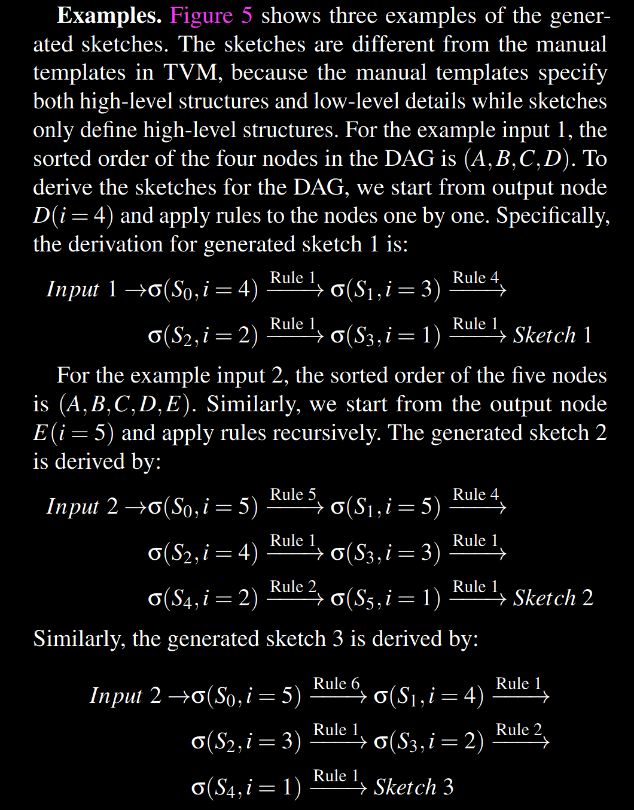
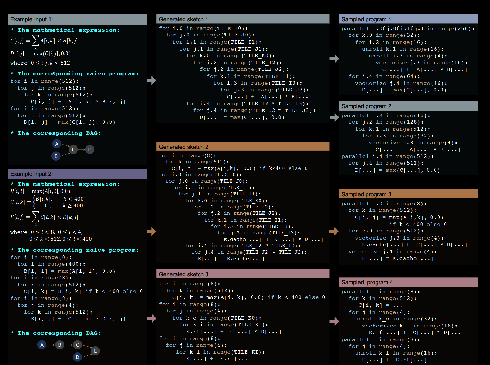
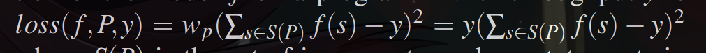
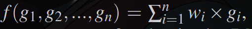
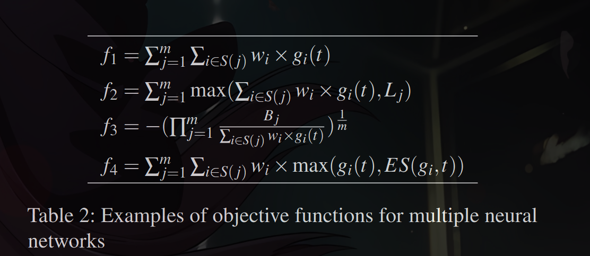

DNNs can be expressed as a directed acyclic compu-
tational graph (DAG), in which nodes represent the opera-
tors (e.g., convolution, matrix multiplication) and directed
edges represent the dependencies between operators.
. 
Existing deep learning frameworks (e.g., Tensorflow [1], PyTorch [39],
MXNet [10]) map the operators in DNNs to vendor-provided
kernel libraries (e.g., cuDNN [13], MKL-DNN [27]) to
achieve high performance. However, these kernel libraries
require significant engineering effort to manually tune for
each hardware platform and operator. The significant manual
effort required to produce efficient operator implementations
for each target accelerator limits the development and innova-
tion of new operators [7] and specialized accelerators [35].

Given the importance of DNNs' performance, researchers
and industry practitioners have turned to search-based com-
pilation [2, 11, 32, 49, 59] for automated generation of tensor
programs, i.e., low-level implementations of tensor operators.
For an operator or a (sub-)graph of multiple operators, users
define the computation in a high-level declarative language
(§2), and the compiler then searches for programs tailored
towards different hardware platforms.

To find performant tensor programs, it is necessary for a
search-based approach to explore a large enough search space
to cover all the useful tensor program optimizations. However,
existing approaches fail to capture many effective optimiza-
tion combinations, because they rely on either predefined
manually-written templates (e.g., TVM [12], FlexTensor [59])
or aggressive pruning by evaluating incomplete programs
(e.g., Halide auto-scheduler [2]), which prevents them from
covering a comprehensive search space (§2). The rules they
use to construct the search space are also limited

In this paper, we explore a novel search strategy for gener-
ating high-performance tensor programs. It can automatically
generate a large search space with comprehensive coverage of
optimizations and gives every tensor program in the space a
chance to be chosen. It thus enables to find high-performance
programs that existing approaches miss

Realizing this goal faces multiple challenges. First, it re-
quires automatically constructing a large search space to cover
as many tensor programs as possible for a given computation
definition. Second, we need to search efficiently without com-
paring incomplete programs in the large search space that can
be orders of magnitude larger than what existing templates
can cover. Finally, when optimizing an entire DNN with many
subgraphs, we should recognize and prioritize the subgraphs
that are critical to the end-to-end performance.

To this end, we design and implement Ansor, a framework
for automated tensor program generation. Ansor utilizes a
hierarchical representation to cover a large search space. This
representation decouples high-level structures and low-level
details, enabling flexible enumeration of high-level structures
and efficient sampling of low-level details. The space is con-
structed automatically for a given computation definition.
Ansor then samples complete programs from the search space
and fine-tunes these programs with evolutionary search and a
learned cost model. To optimize the performance of DNNs
with multiple subgraphs, Ansor dynamically prioritizes sub-
graphs of the DNNs that are more likely to improve the end-
to-end performance.

 Ansor searches more efficiently, generating
higher-performance programs in a shorter time, despite its
larger search space. Ansor can match the performance of a
state-of-the-art framework with an order of magnitude less
search time. Besides, Ansor enables automatic extension to
new operators by only requiring their mathematical definitions
without manual templates.

---------------------------------------\
In summary, this paper makes the following contributions:
• A mechanism to generate a large hierarchical search
space of tensor programs for a computational graph.
• An evolutionary strategy with a learned cost model to
fine-tune the performance of tensor programs.
• A scheduling algorithm based on gradient descent to
prioritize important subgraphs when optimizing the end-
to-end performance of DNNs.
• An implementation and comprehensive evaluation of the
Ansor system demonstrating that the above techniques
outperform state-of-the-art systems on a variety of DNNs
and hardware platforms
----------------------------------------\

2. Background
Template-guided search. In template-guided search, the
search space is defined by manual templates. As shown in Fig-
ure 2a, the compiler (e.g., TVM) requires the user to manually
write a template for a computation definition. The template
defines the structure of the tensor programs with some tunable
parameters (e.g., tile size and unrolling factor). The compiler
then searches for the best values of these parameters for a spe-
cific input shape configuration and a specific hardware target.
This approach has achieved good performance on common
deep learning operators. However, developing templates re-
quires substantial effort. For example, the code repository of
TVM already contains more than 15K lines of code for these
templates. This number continues to grow as new operators
and new hardware platforms emerge. Besides, constructing a
quality template requires expertise in both tensor operators
and hardware. It takes non-trivial research effort [32, 55, 59]
to develop quality templates. Despite the complexity of tem-
plate design, manual templates only cover limited program
structures because manually enumerating all optimization
choices for all operators is prohibitive. This approach typi-
cally requires defining one template for each operator. Flex-
Tensor [59] proposes a general template to cover multiple
operators, but its template is still designed for single operator
granularity, which fails to include optimizations involving
multiple operators (e.g., operator fusion). The search space
of optimizing a computational graph with multiple operators
should contain different ways to compose the operators. A
template-based approach fails to achieve this because it can-
not break down their fixed templates and re-compose them
during the search.

Sequential construction based search. This approach de-
fines the search space by decomposing the program construc-
tion into a fixed sequence of decisions. The compiler then
uses an algorithm such as beam search [34] to search for good
decisions (e.g., Halide auto-scheduler [2]). In this approach,
the compiler constructs a tensor program by sequentially un-
folding all nodes in the computational graph. For each node,
the compiler makes a few decisions on how to transform it
into low-level tensor programs (i.e., deciding computation
location, storage location, tile size, etc.). When all nodes are
unfolded, a complete tensor program is constructed. This ap-
proach uses a set of general unfolding rules for every node,
so it can search automatically without requiring manual tem-
plates. Because the number of possible choices of each de-
cision is large, to make the sequential process feasible, this
approach keeps only top- k candidate programs after every de-
cision. The compiler estimates and compares the performance
of candidate programs with a learned cost model to select the
top-k candidates; while other candidates are pruned. During
the search, the candidate programs are incomplete because
only part of the computational graph is unfolded or only some
of the decisions are made. Figure 2b shows this process

However, estimating the final performance of incomplete
programs is difficult in several respects: (1) the cost model
trained on complete programs cannot accurately predict the
final performance of incomplete programs. The cost model
can only be trained on complete programs because we need
to compile programs and measure their execution time to
get the labels for training. Directly using this model to com-
pare the final performance of incomplete programs will result
in poor accuracy. As a case study, we train our cost model
(§5.2) on 20,000 random complete programs from our search
space and use the model to predict the final performance of
incomplete programs. The incomplete programs are obtained
by only applying a fraction of loop transformations of the
complete programs. We use two ranking metrics for evalua-
tion: the accuracy of pairwise comparison and the recall@k

score of top- k programs 1 ( k = 10 ). As shown in Figure 3,
the two curves start from 50% and 0% respectively, meaning
that random guess with zero information gives 50% pairwise
comparison accuracy and 0% top-k recall. The two curves
increase quickly as the programs become complete, which
means the cost model performs very well for complete pro-
grams but fails to accurately predict the final performance of
incomplete programs. (2) The fixed order of sequential deci-
sions limits the design of the search space.

For example, some
optimization needs to add new nodes to the computational
graph (e.g., adding cache nodes, using rfactor [46]). The
number of decisions for different programs becomes different.
It is hard to align the incomplete programs for a fair compari-
son. (3) Sequential construction based search is not scalable.
Enlarging the search space needs to add more sequential con-
struction steps, which, however, leads to a worse accumulated
error.

Ansor’s hierarchical approach As shown in Figure 2c,
Ansor is backed by a hierarchical search space that decouples
high-level structures and low-level details. Ansor constructs
the search space for a computational graph automatically,
eliminating the need to manually develop templates. Ansor
then samples complete programs from the space and performs
fine-tuning on complete programs, avoiding the inaccurate es-
timation of incomplete programs. 

3)

Ansor is an automated tensor program generation framework.
Figure 4 shows the overall architecture of Ansor. The input
of Ansor is a set of to be optimized DNNs. Ansor uses the
operator fusion algorithm from Relay [42] to convert DNNs
from popular model formats (e.g., ONNX [6], TensorFlow
PB) to partitioned small subgraphs. Ansor then generates
tensor programs for these subgraphs. Ansor has three major
components: (1) a program sampler that constructs a large
search space and samples diverse programs from it; (2) a
performance tuner that fine-tunes the performance of sampled
programs; (3) a task scheduler that allocates time resources
for optimizing multiple subgraphs in the DNNs.

Program sampler. One key challenge Ansor has to ad-
dress is generating a large search space for a given computa-
tional graph. To cover diverse tensor programs with various
high-level structures and low-level details, Ansor utilizes a
hierarchical representation of the search space with two lev-
els: sketch and annotation (§4). Ansor defines the high-level
structures of programs as sketches and leaves billions of low-
level choices (e.g., tile size, parallel, unroll annotations) as
annotations. This representation allows Ansor to enumerate
high-level structures flexibly and sample low-level details ef-
ficiently. Ansor includes a program sampler that randomly
samples programs from the space to provide comprehensive
coverage of the search space.

Performance tuner. The performance of randomly sam-
pled programs is not necessarily good. The next challenge
is to fine-tune them. Ansor employs evolutionary search and
a learned cost model to perform fine-tuning iteratively (§5).
At each iteration, Ansor uses re-sampled new programs as
well as good programs from previous iterations as the ini-
tial population to start the evolutionary search. Evolutionary
search fine-tunes programs by mutation and crossover which
perform out-of-order rewrite and address the limitation of
sequential construction. Querying the learned cost model is
orders of magnitude faster than actual measurement, so we
can evaluate thousands of programs in seconds

Task scheduler. Using program sampling and performance
fine-tuning allows Ansor to find high-performance tensor pro-
grams for a computational graph. Intuitively, treating a whole
DNN as a single computational graph and generating a full
tensor program for it could potentially achieve the optimal
performance. This, however, is inefficient because it has to
deal with the unnecessary exponential explosion of the search
space. Typically, the compiler partitions the large computa-
tional graph of a DNN into several small subgraphs [11, 42].
This partition has a negligible effect on the performance
thanks to the layer-by-layer construction nature of DNNs.
This brings the final challenge of Ansor: how to allocate time
resources when generating programs for multiple subgraphs

The task scheduler (§6) in Ansor uses a scheduling algorithm
based on gradient descent to allocate resources to the sub-
graphs that are more likely to improve the end-to-end DNN
performance.

4 Program Sampling

The search space an algorithm explores determines the best
programs it can find. The considered search spaces in existing
approaches are limited by the following factors: (1) Manual
enumeration (e.g., TVM [12]). It is impractical to manually
enumerate all possible choices by templates, so existing man-
ual templates only cover a limited search space heuristically.
(2) Aggressive early pruning (e.g., Halide auto-scheduler [2]).
Aggressive early pruning based on evaluating incomplete pro-
grams prevents the search algorithm from exploring certain
regions in the space

In this section, we introduce techniques to push the bound-
ary of the considered search space by addressing the above
limitations. To solve (1), we automatically expand the search
space by recursively applying a set of flexible derivation rules.
To avoid (2), we randomly sample complete programs in the
search space. Since random sampling gives an equal chance
to every point to be sampled, our search algorithm can po-
tentially explore every program in the considered space. We
do not rely on random sampling to find the optimal program,
because every sampled program is later fined-tuned (§5)

To sample programs that can cover a large search space, we
define a hierarchical search space with two levels: sketch and
annotation. We define the high-level structures of programs
as sketches and leave billions of low-level choices (e.g., tile
size, parallel, unroll annotations) as annotations. At the top
level, we generate sketches by recursively applying a few
derivation rules.At the bottom level, we randomly annotate
these sketches to get complete programs. This representation
summarizes a few basic structures from billions of low-level
choices, enabling the flexible enumeration of high-level struc-
tures and efficient sampling of low-level details.

--------------------------
While Ansor supports both CPU and GPU, we explain the
sampling process for CPUs in §4.1 and §4.2 as an example.
We then discuss how the process is different for GPU in §4.3.
--------------------------

4.1 Sketch Generation

As shown in Figure 4, the program sampler accepts partitioned
subgraphs as input. The first column in Figure 5 shows two
examples of the input. The input has three equivalent forms:
the mathematical expression, the corresponding naive pro-
gram obtained by directly expanding the loop indices, and the
corresponding computational graph (directed acyclic graph,
or DAG)

To generate sketches for a DAG with multiple nodes, we
visit all the nodes in a topological order and build the structure
iteratively. For computation nodes that are compute-intensive
and have a lot of data reuse opportunities (e.g., conv2d, mat-
mul), we build basic tile and fusion structures for them as the
sketch. For simple element-wise nodes (e.g., ReLU, element-
wise add), we can safely inline them. Note that new nodes
(e.g., caching nodes, layout transform nodes) may also be
introduced to the DAG during the sketch generation

We propose a derivation-based enumeration approach to
generate all possible sketches by recursively applying several
basic rules. This process takes a DAG as an input and returns
a list of sketches. We define the State s = (S, i) , where S is
the current partially generated sketch for the DAG, and i is the
index of the current working node. The nodes in a DAG are
sorted in a topological order from output to input. The deriva-
tion begins from the initial naive program and the last node, or
the initial state s = (naive program, index o f the last node) .
Then we try to apply all derivation rules to the states re-
cursively. For each rule, if the current state satisfies the ap-
plication condition, we apply the rule to sigma = (S, i) and get
sigma' = (S' , i' ) where i' <= i . This way the index i (working node)

decreases monotonically. A state becomes a terminal state
when i = 0. During enumeration, multiple rules can be ap-
plied to one state to generate multiple succeeding states. One
rule can also generate multiple possible succeeding states.
So we maintain a queue to store all intermediate states. The
process ends when the queue is empty. All s.S in terminal
states form a sketch list at the end of the sketch generation.
The number of sketches is less than 10 for a typical subgraph.

Derivation rules. Table 1 lists derivation rules we used
for the CPU. We first provide the definition of the used
predicates and then describe the functionality of each rule.
IsStrictInliable(S, i) indicates if the node i in S is a sim-
ple element-wise operator that can always be inlined (e.g.,
element-wise add, ReLU). HasDataReuse(S, i) indicates if
the node i in S is a compute-intensive operator and has
plentiful intra-operator data reuse opportunity (e.g., mat-
mul, conv2d). HasFusibleConsumer(S, i) indicates if the
node i in S has only one consumer j and node j can be
fused into node i (e.g., matmul + bias_add, conv2d + relu).
HasMoreReductionParallel(S, i) indicates if the node i in S
has little parallelism in space dimensions but has ample paral-
lelism opportunity in reduction dimensions. (e.g., computing
2-norm of a matrix, matmul C2⇥2 = A 2⇥512 · B512⇥2 ). We per-
form static analysis on the computation definitions to get the
values for these predicates. The analysis is done automatically
by parsing the read/write pattern in the mathematical expres-
sions. Next, we introduce the functionality of each derivation
rule.

Rule 1 just simply skips a node if it is not strictly inlinable.
Rule 2 always inlines strictly inlinable nodes. Since the condi-
tions of rule 1 and rule 2 are mutually exclusive, a state with
i > 1 can always satisfy one of them and continue to derive.
Rules 3, 4, and 5 deal with the multi-level tiling and fusion
for nodes that have data reuse. Rule 3 performs multi-level
tiling for data reusable nodes. For CPU, we use a “SSRSRS”
tile structure, where “S” stands for one tile level of space
loops and “R” stands for one tile level of reduction loops.
For example, in the matmul C(i, j) = Âk A[i, k] ⇥ B[k, j] , i and
j are space loops and k is a reduction loop. The “SSRSRS”
tile structure for matmul expands the original 3-level loop
(i, j, k) into a 10-level loop (i0 , j0 , i1 , j1 , k0 , i 2 , j2 , k1 , i 3 , j3 ).
Although we do not permute the loop order, this multi-level
tiling can also cover some cases of reordering. For example,
the above 10-level loop can be specialized to just a simple
reorder (k0 , j2 , i3 ) by setting the length of other loops to one.
The "SSRSRS" tile structure is general for compute-intensive
dense operators (e.g., matmul, conv2d, conv3d) in deep learn-
ing, because they all consist of space loops and reduction
loops.

Rule 4 performs multi-level tiling and also fuses the fusible
consumers. For example, we fuse the element-wise nodes
(e.g., ReLU, bias add) into the tiled nodes (e.g., conv2d, mat-
mul). Rule 5 adds a caching node if the current data-reusable
node does not have a fusible consumer. For example, the fi-
nal output node in a DAG does not have any consumer, so it
directly writes results into main memory by default and this
is inefficient due to the high latency of memory accesses. By
adding a cache node, we introduce a new fusible consumer
into the DAG, then rule 4 can be applied to fuse this newly
added cache node into the final output node. With the cache
node fused, now the final output node writes its results into a
cache block, and the cache block will be written to the main
memory at once when all data in the block is computed.

Rule 6 can use rfactor [46] to factorize a reduction loop
into a space loop to bring more parallelism.

4.2 Random Annotation
The sketches generated by the previous subsection are incom-
plete programs because they only have tile structures without
specific tile sizes and loop annotations, such as parallel, unroll,
and vectorization. In this subsection, we annotate sketches to
make them complete programs for fine-tuning and evaluation.
Given a list of generated sketches, we randomly pick one
sketch, randomly fill out tile sizes, parallelize some outer
loops, vectorize some inner loops, and unroll a few inner
loops. We also randomly change the computation location
of some nodes in the program to make a slight tweak to
the tile structure. All “random” in this subsection means a
uniform distribution over all valid values. If some special
algorithms require custom annotations to be effective (e.g.,
special unrolling), we allow users to give simple hints in the
computation definition to adjust the annotation policy. Finally,
since changing the layout of constant tensors can be done in
compilation time and brings no runtime overhead, we rewrite
the layouts of the constant tensors according to the multi-level
tile structure to make them as cache-friendly as possible. This
optimization is effective because the weight tensors of convo-
lution or dense layers are constants for inference applications.
Examples of random sampling are shown in Figure 5. The
sampled program might have fewer loops than the sketch
because the loops with length one are simplified

4.3 GPU Support
For GPU, we change the multi-level tiling structure from
"SSRSRS" to "SSSRRSRS" to match the architecture of GPU.
The loops in the first three space tiles are bound to BlockIdx,
virtual thread (for reducing bank conflicts), and ThreadIdx,
respectively. We add two sketch derivation rules, one for uti-
lizing shared memory by inserting a caching node (similar to
Rule 5) and the other for cross-thread reduction (similar to
Rule 6)

5 Performance Fine-tuning
The programs sampled by the program sampler have good cov-
erage of the search space, but their qualities are not guaranteed.
This is because the optimization choices, such as tile struc-
ture and loop annotations, are all randomly sampled. In this
section, we introduce the performance tuner that fine-tunes
the performance of the sampled programs via evolutionary
search and a learned cost model.
The fine-tuning is performed iteratively. At each iteration,
we first use evolutionary search to find a small batch of promis-
ing programs according to a learned cost model. We then mea-
sure these programs on hardware to get the actual execution
time cost. Finally, the profiling data got from measurement is
used to re-train the cost model to make it more accurate.
The evolutionary search uses randomly sampled programs
as well as high-quality programs from the previous mea-
surement as the initial population and applies mutation and
crossover to generate the next generation. The learned cost
model is used to predict the fitness of each program, which is
the throughput of one program in our case. We run evolution
for a fixed number of generations and pick the best programs
found during the search. We leverage a learned cost model be-
cause the cost model can give relatively accurate estimations
of the fitness of programs while being orders of magnitudes
faster than the actual measurement. It allows us to compare
tens of thousands of programs in the search space in seconds,
and pick the promising ones to do actual measurements.

5.1 Evolutionary Search
Evolutionary search [54] is a generic meta-heuristic algorithm
inspired by biological evolution. By iteratively mutating high-
quality programs, we can generate new programs with poten-
tially higher quality. The evolution starts from the sampled
initial generation. To generate the next generation, we first se-
lect some programs from the current generation according to
certain probabilities. The probability of selecting a program is
proportional to its fitness predicted by the learned cost model
(§5.2), meaning that the program with a higher performance
score has a higher probability to be selected. For the selected
programs, we randomly apply one of the evolution operations
to generate a new program. Basically, for decisions we made
during sampling (§4.2), we design corresponding evolution
operations to rewrite and fine-tune them.

Tile size mutation. This operation scans the program and
randomly selects a tiled loop. For this tiled loop, it divides a
tile size of one tile level by a random factor and multiplies this
factor to another level. Since this operation keeps the product
of tile sizes equal to the original loop length, the mutated
program is always valid.

Parallel mutation. This operation scans the program and
randomly selects a loop that has been annotated with parallel.
For this loop, this operation changes the parallel granularity
by either fusing its adjacent loop levels or splitting it by a
factor.

Pragma mutation. Some optimizations in a program are
specified by compiler-specific pragma. This operation scans
the program and randomly selects a pragma. For this pragma,
this operation randomly mutates it into another valid value.
For example, our underlying code generator supports auto
unrolling with a maximum number of steps by providing an
auto_unroll_max_step=N pragma. We randomly tweak the
number N

Computation location mutation. This operation scans the
program and randomly selects a flexible node that is not multi-
level tiled (e.g., a padding node in the convolution layer). For
this node, the operation randomly changes its computation
location to another valid attach point.

Node-based crossover. Crossover is an operation to gener-
ate new offspring by combining the genes from two or more
parents. The genes of a program in Ansor are its rewriting
steps. Every program generated by Ansor is rewritten from
its initial naive implementation. Ansor preserves a complete
rewriting history for each program during sketch generation
and random annotation. We can treat rewriting steps as the
genes of a program because they describe how this program
is formed from the initial naive one. Based on this, we can
generate a new program by combining the rewriting steps
of two existing programs. However, arbitrarily combining
rewriting steps from two programs might break the depen-
dencies in steps and create an invalid program. As a result,
the granularity of crossover operation in Ansor is based on
nodes in the DAG, because the rewriting steps across different
nodes usually have less dependency. Ansor randomly selects
one parent for each node and merges the rewriting steps of
selected nodes. When there are dependencies between nodes,
Ansor tries to analyze and adjust the steps with simple heuris-
tics. Ansor further verifies the merged programs to guarantee
the functional correctness. The verification is simple because
Ansor only uses a small set of loop transformation rewrit-
ing steps, and the underlying code generator can check the
correctness by dependency analysis

The evolutionary search leverages mutation and crossover
to generate a new set of candidates repeatedly for several
rounds and outputs a small set of programs with the highest
scores. These programs will be compiled and measured on the
target hardware to obtain the real running time cost. The col-
lected measurement data is then used to update the cost model.
In this way, the accuracy of the learned cost model is grad-
ually improved to match the target hardware. Consequently,
the evolutionary search gradually generates higher-quality
programs for the target hardware platform.
Unlike the search algorithms in TVM and FlexTensor that
can only work in a fixed grid-like parameter space, the evolu-
tionary operations in Ansor are specifically designed for ten-
sor programs. They can be applied to general tensor programs
and can handle a search space with complicated dependency.
Unlike the unfolding rules in Halide auto-scheduler, these op-
erations can perform out-of-order modifications to programs,
addressing the sequential limitations.

5.2 Learned Cost Model
A cost model is necessary for estimating the performance of
programs quickly during the search.
A system based on learned cost models
has great portability because a single model design can be
reused for different hardware backends by feeding in different
training data

Since our target programs are mainly data parallel tensor
programs, which are made by multiple interleaved loop nests
with several assignment statements as the innermost state-
ments, we train the cost model to predict the score of one in-
nermost non-loop statement in a loop nest. For a full program,
we make predictions for each innermost non-loop statement
and add the predictions up as the score. We build the feature
vector for an innermost non-loop statement by extracting fea-
tures in the context of a full program. The extracted features
include arithmetic features and memory access features

We use weighted squared error as the loss function. Be-
cause we mostly care about identifying the well-performing
programs from the search space, we put more weight on
the programs that run faster. Specifically, the loss func-
tion of the model f on a program P with throughput y is

where S(P) is the set of innermost non-loop statements in
P. We directly use the throughput y as weight. We train a
gradient boosting decision tree [9] as the underlying model
f . A single model is trained for all tensor programs coming
from all DAGs, and we normalize the throughput of all pro-
grams coming from the same DAG to be in the range of [0, 1] .
When optimizing a DNN, the number of measured programs
are typically less than 30,000. Training a gradient boosting
decision tree is very fast on such a small data sets, so we train
a new model every time instead of doing incremental updates.

6 Task Scheduler
A DNN can be partitioned into many independent subgraphs
(e.g., conv2d + relu). For some subgraphs, spending time in
tuning them does not improve the end-to-end DNN perfor-
mance significantly. This is due to two reasons: either (1) the
subgraph is not a performance bottleneck, or (2) tuning brings
only minimal improvement in the subgraph’s performance.
To avoid wasting time on tuning unimportant subgraphs,
Ansor dynamically allocates different amounts of time re-
sources to different subgraphs. Take ResNet-50 for example, it
has 29 unique subgraphs after the graph partitioning. Most of
these subgraphs are convolution layers with different shapes
configurations (input size, kernel size, stride, etc). We need
to generate different programs for different convolution lay-
ers because the best tensor program depends on these shape
configurations. In reality, users may have multiple DNNs for
all their applications. This leads to more subgraphs as well as
more opportunities to reduce the total tuning time, because
we can share and reuse knowledge between subgraphs. A
subgraph can also appear multiple times in a DNN or across
different DNNs.

We define a task as a process performed to generate high-
performance programs for a subgraph. It means that optimiz-
ing a single DNN requires finishing dozens of tasks (e.g., 29
tasks for ResNet-50). Ansor’s task scheduler allocates time
resources to tasks in an iterative manner. At each iteration,
Ansor selects a task, generates a batch of promising programs
for the subgraph, and measures the program on hardware. We
define such an iteration as one unit of time resources. When
we allocate one unit of time resources to a task, the task ob-
tains an opportunity to generate and measure new programs,
which also means the chance to find better programs. We next
present the formulation of the scheduling problem and our
solution

6.1 Problem Formulation
When tuning a DNN or a set of DNNs, a user can have various
types of goals, for example, reducing a DNN’s latency, meet-
ing latency requirements for a set of DNNs, or minimizing
tuning time when tuning no longer improves DNN perfor-
mance significantly. We thus provide users a set of objective
functions to express their goals. Users can also provide their
own objective functions.
Suppose there are n tasks in total. Let t 2 Zn be the allo-
cation vector, where t i is the number of time units spent on
task i. Let the minimum subgraph latency task i achieves be
a function of the allocation vector gi (t). Let the end-to-end
cost of the DNNs be a function of the latency of the sub-
graphs f (g 1 (t), g2 (t), ..., g3 (t)) . Our objective is to minimize
the end-to-end cost:
minimize f (g 1 (t), g2 (t), ..., g3 (t))

To minimize the end-to-end latency of a single DNN, we
can define 

, where wi is the
number of appearances of task i in the DNN. This formu-
lation is straightforward because f is an approximation of the
end-to-end DNN latency.

When tuning a set of DNNs, there are several options. Ta-
ble 2 shows a number of example objective functions for
tuning multiple DNNs. Let m be the number of DNNs, S( j) is
the set of tasks that belong to DNN j . f 1 adds up the latency
of every DNN, which means to optimize the cost of a pipeline
that sequentially runs all DNNs once. In f 2 , we define L j as
the latency requirement of DNN j , meaning that we do not
want to spend time on a DNN if its latency has already met
the requirement. In f 3 , we define B j as the reference latency
of a DNN j . As a result, our goal is to maximize the geo-
metric mean of speedup against the given reference latency.
Finally in f 4 , we define a function ES(gi ,t) that returns an
early stopping value by looking at the history of latency of
task i. It can achieve the effect of per-task early stopping.

