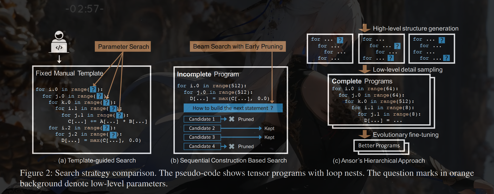
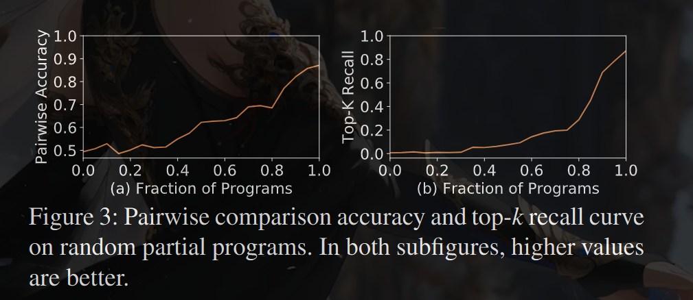
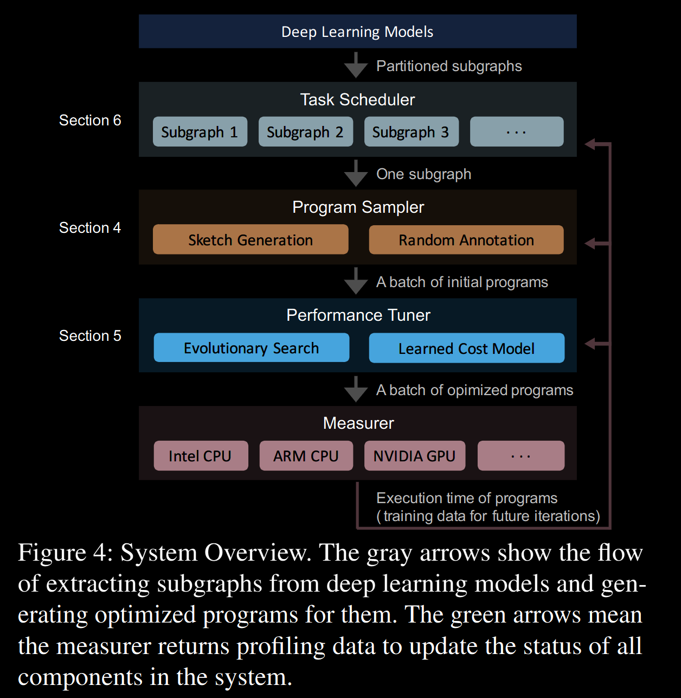

DNNs can be expressed as a directed acyclic compu-
tational graph (DAG), in which nodes represent the opera-
tors (e.g., convolution, matrix multiplication) and directed
edges represent the dependencies between operators.
. 
Existing deep learning frameworks (e.g., Tensorflow [1], PyTorch [39],
MXNet [10]) map the operators in DNNs to vendor-provided
kernel libraries (e.g., cuDNN [13], MKL-DNN [27]) to
achieve high performance. However, these kernel libraries
require significant engineering effort to manually tune for
each hardware platform and operator. The significant manual
effort required to produce efficient operator implementations
for each target accelerator limits the development and innova-
tion of new operators [7] and specialized accelerators [35].

Given the importance of DNNs' performance, researchers
and industry practitioners have turned to search-based com-
pilation [2, 11, 32, 49, 59] for automated generation of tensor
programs, i.e., low-level implementations of tensor operators.
For an operator or a (sub-)graph of multiple operators, users
define the computation in a high-level declarative language
(§2), and the compiler then searches for programs tailored
towards different hardware platforms.

To find performant tensor programs, it is necessary for a
search-based approach to explore a large enough search space
to cover all the useful tensor program optimizations. However,
existing approaches fail to capture many effective optimiza-
tion combinations, because they rely on either predefined
manually-written templates (e.g., TVM [12], FlexTensor [59])
or aggressive pruning by evaluating incomplete programs
(e.g., Halide auto-scheduler [2]), which prevents them from
covering a comprehensive search space (§2). The rules they
use to construct the search space are also limited

In this paper, we explore a novel search strategy for gener-
ating high-performance tensor programs. It can automatically
generate a large search space with comprehensive coverage of
optimizations and gives every tensor program in the space a
chance to be chosen. It thus enables to find high-performance
programs that existing approaches miss

Realizing this goal faces multiple challenges. First, it re-
quires automatically constructing a large search space to cover
as many tensor programs as possible for a given computation
definition. Second, we need to search efficiently without com-
paring incomplete programs in the large search space that can
be orders of magnitude larger than what existing templates
can cover. Finally, when optimizing an entire DNN with many
subgraphs, we should recognize and prioritize the subgraphs
that are critical to the end-to-end performance.

To this end, we design and implement Ansor, a framework
for automated tensor program generation. Ansor utilizes a
hierarchical representation to cover a large search space. This
representation decouples high-level structures and low-level
details, enabling flexible enumeration of high-level structures
and efficient sampling of low-level details. The space is con-
structed automatically for a given computation definition.
Ansor then samples complete programs from the search space
and fine-tunes these programs with evolutionary search and a
learned cost model. To optimize the performance of DNNs
with multiple subgraphs, Ansor dynamically prioritizes sub-
graphs of the DNNs that are more likely to improve the end-
to-end performance.

 Ansor searches more efficiently, generating
higher-performance programs in a shorter time, despite its
larger search space. Ansor can match the performance of a
state-of-the-art framework with an order of magnitude less
search time. Besides, Ansor enables automatic extension to
new operators by only requiring their mathematical definitions
without manual templates.

---------------------------------------\
In summary, this paper makes the following contributions:
• A mechanism to generate a large hierarchical search
space of tensor programs for a computational graph.
• An evolutionary strategy with a learned cost model to
fine-tune the performance of tensor programs.
• A scheduling algorithm based on gradient descent to
prioritize important subgraphs when optimizing the end-
to-end performance of DNNs.
• An implementation and comprehensive evaluation of the
Ansor system demonstrating that the above techniques
outperform state-of-the-art systems on a variety of DNNs
and hardware platforms
----------------------------------------\

2. Background
Template-guided search. In template-guided search, the
search space is defined by manual templates. As shown in Fig-
ure 2a, the compiler (e.g., TVM) requires the user to manually
write a template for a computation definition. The template
defines the structure of the tensor programs with some tunable
parameters (e.g., tile size and unrolling factor). The compiler
then searches for the best values of these parameters for a spe-
cific input shape configuration and a specific hardware target.
This approach has achieved good performance on common
deep learning operators. However, developing templates re-
quires substantial effort. For example, the code repository of
TVM already contains more than 15K lines of code for these
templates. This number continues to grow as new operators
and new hardware platforms emerge. Besides, constructing a
quality template requires expertise in both tensor operators
and hardware. It takes non-trivial research effort [32, 55, 59]
to develop quality templates. Despite the complexity of tem-
plate design, manual templates only cover limited program
structures because manually enumerating all optimization
choices for all operators is prohibitive. This approach typi-
cally requires defining one template for each operator. Flex-
Tensor [59] proposes a general template to cover multiple
operators, but its template is still designed for single operator
granularity, which fails to include optimizations involving
multiple operators (e.g., operator fusion). The search space
of optimizing a computational graph with multiple operators
should contain different ways to compose the operators. A
template-based approach fails to achieve this because it can-
not break down their fixed templates and re-compose them
during the search.

Sequential construction based search. This approach de-
fines the search space by decomposing the program construc-
tion into a fixed sequence of decisions. The compiler then
uses an algorithm such as beam search [34] to search for good
decisions (e.g., Halide auto-scheduler [2]). In this approach,
the compiler constructs a tensor program by sequentially un-
folding all nodes in the computational graph. For each node,
the compiler makes a few decisions on how to transform it
into low-level tensor programs (i.e., deciding computation
location, storage location, tile size, etc.). When all nodes are
unfolded, a complete tensor program is constructed. This ap-
proach uses a set of general unfolding rules for every node,
so it can search automatically without requiring manual tem-
plates. Because the number of possible choices of each de-
cision is large, to make the sequential process feasible, this
approach keeps only top- k candidate programs after every de-
cision. The compiler estimates and compares the performance
of candidate programs with a learned cost model to select the
top-k candidates; while other candidates are pruned. During
the search, the candidate programs are incomplete because
only part of the computational graph is unfolded or only some
of the decisions are made. Figure 2b shows this process

However, estimating the final performance of incomplete
programs is difficult in several respects: (1) the cost model
trained on complete programs cannot accurately predict the
final performance of incomplete programs. The cost model
can only be trained on complete programs because we need
to compile programs and measure their execution time to
get the labels for training. Directly using this model to com-
pare the final performance of incomplete programs will result
in poor accuracy. As a case study, we train our cost model
(§5.2) on 20,000 random complete programs from our search
space and use the model to predict the final performance of
incomplete programs. The incomplete programs are obtained
by only applying a fraction of loop transformations of the
complete programs. We use two ranking metrics for evalua-
tion: the accuracy of pairwise comparison and the recall@k

score of top- k programs 1 ( k = 10 ). As shown in Figure 3,
the two curves start from 50% and 0% respectively, meaning
that random guess with zero information gives 50% pairwise
comparison accuracy and 0% top-k recall. The two curves
increase quickly as the programs become complete, which
means the cost model performs very well for complete pro-
grams but fails to accurately predict the final performance of
incomplete programs. (2) The fixed order of sequential deci-
sions limits the design of the search space.

For example, some
optimization needs to add new nodes to the computational
graph (e.g., adding cache nodes, using rfactor [46]). The
number of decisions for different programs becomes different.
It is hard to align the incomplete programs for a fair compari-
son. (3) Sequential construction based search is not scalable.
Enlarging the search space needs to add more sequential con-
struction steps, which, however, leads to a worse accumulated
error.

Ansor’s hierarchical approach As shown in Figure 2c,
Ansor is backed by a hierarchical search space that decouples
high-level structures and low-level details. Ansor constructs
the search space for a computational graph automatically,
eliminating the need to manually develop templates. Ansor
then samples complete programs from the space and performs
fine-tuning on complete programs, avoiding the inaccurate es-
timation of incomplete programs. 

3)

Ansor is an automated tensor program generation framework.
Figure 4 shows the overall architecture of Ansor. The input
of Ansor is a set of to be optimized DNNs. Ansor uses the
operator fusion algorithm from Relay [42] to convert DNNs
from popular model formats (e.g., ONNX [6], TensorFlow
PB) to partitioned small subgraphs. Ansor then generates
tensor programs for these subgraphs. Ansor has three major
components: (1) a program sampler that constructs a large
search space and samples diverse programs from it; (2) a
performance tuner that fine-tunes the performance of sampled
programs; (3) a task scheduler that allocates time resources
for optimizing multiple subgraphs in the DNNs.

Program sampler. One key challenge Ansor has to ad-
dress is generating a large search space for a given computa-
tional graph. To cover diverse tensor programs with various
high-level structures and low-level details, Ansor utilizes a
hierarchical representation of the search space with two lev-
els: sketch and annotation (§4). Ansor defines the high-level
structures of programs as sketches and leaves billions of low-
level choices (e.g., tile size, parallel, unroll annotations) as
annotations. This representation allows Ansor to enumerate
high-level structures flexibly and sample low-level details ef-
ficiently. Ansor includes a program sampler that randomly
samples programs from the space to provide comprehensive
coverage of the search space.

Performance tuner. The performance of randomly sam-
pled programs is not necessarily good. The next challenge
is to fine-tune them. Ansor employs evolutionary search and
a learned cost model to perform fine-tuning iteratively (§5).
At each iteration, Ansor uses re-sampled new programs as
well as good programs from previous iterations as the ini-
tial population to start the evolutionary search. Evolutionary
search fine-tunes programs by mutation and crossover which
perform out-of-order rewrite and address the limitation of
sequential construction. Querying the learned cost model is
orders of magnitude faster than actual measurement, so we
can evaluate thousands of programs in seconds

Task scheduler. Using program sampling and performance
fine-tuning allows Ansor to find high-performance tensor pro-
grams for a computational graph. Intuitively, treating a whole
DNN as a single computational graph and generating a full
tensor program for it could potentially achieve the optimal
performance. This, however, is inefficient because it has to
deal with the unnecessary exponential explosion of the search
space. Typically, the compiler partitions the large computa-
tional graph of a DNN into several small subgraphs [11, 42].
This partition has a negligible effect on the performance
thanks to the layer-by-layer construction nature of DNNs.
This brings the final challenge of Ansor: how to allocate time
resources when generating programs for multiple subgraphs

The task scheduler (§6) in Ansor uses a scheduling algorithm
based on gradient descent to allocate resources to the sub-
graphs that are more likely to improve the end-to-end DNN
performance.

4 Program Sampling

The search space an algorithm explores determines the best
programs it can find. The considered search spaces in existing
approaches are limited by the following factors: (1) Manual
enumeration (e.g., TVM [12]). It is impractical to manually
enumerate all possible choices by templates, so existing man-
ual templates only cover a limited search space heuristically.
(2) Aggressive early pruning (e.g., Halide auto-scheduler [2]).
Aggressive early pruning based on evaluating incomplete pro-
grams prevents the search algorithm from exploring certain
regions in the space

In this section, we introduce techniques to push the bound-
ary of the considered search space by addressing the above
limitations. To solve (1), we automatically expand the search
space by recursively applying a set of flexible derivation rules.
To avoid (2), we randomly sample complete programs in the
search space. Since random sampling gives an equal chance
to every point to be sampled, our search algorithm can po-
tentially explore every program in the considered space. We
do not rely on random sampling to find the optimal program,
because every sampled program is later fined-tuned (§5)

To sample programs that can cover a large search space, we
define a hierarchical search space with two levels: sketch and
annotation. We define the high-level structures of programs
as sketches and leave billions of low-level choices (e.g., tile
size, parallel, unroll annotations) as annotations. At the top
level, we generate sketches by recursively applying a few
derivation rules.At the bottom level, we randomly annotate
these sketches to get complete programs. This representation
summarizes a few basic structures from billions of low-level
choices, enabling the flexible enumeration of high-level struc-
tures and efficient sampling of low-level details.

--------------------------
While Ansor supports both CPU and GPU, we explain the
sampling process for CPUs in §4.1 and §4.2 as an example.
We then discuss how the process is different for GPU in §4.3.
--------------------------

4.1 Sketch Generation

As shown in Figure 4, the program sampler accepts partitioned
subgraphs as input. The first column in Figure 5 shows two
examples of the input. The input has three equivalent forms:
the mathematical expression, the corresponding naive pro-
gram obtained by directly expanding the loop indices, and the
corresponding computational graph (directed acyclic graph,
or DAG)

To generate sketches for a DAG with multiple nodes, we
visit all the nodes in a topological order and build the structure
iteratively. For computation nodes that are compute-intensive
and have a lot of data reuse opportunities (e.g., conv2d, mat-
mul), we build basic tile and fusion structures for them as the
sketch. For simple element-wise nodes (e.g., ReLU, element-
wise add), we can safely inline them. Note that new nodes
(e.g., caching nodes, layout transform nodes) may also be
introduced to the DAG during the sketch generation