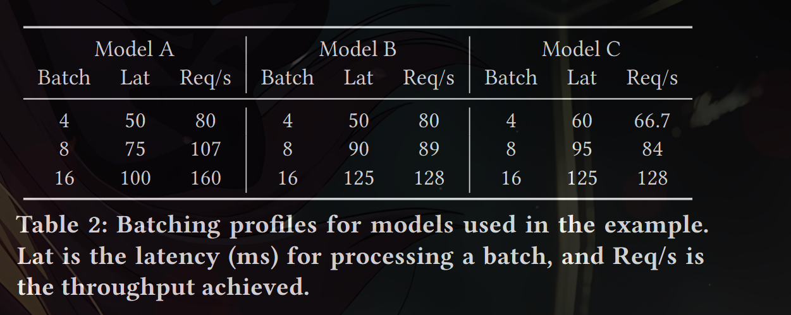
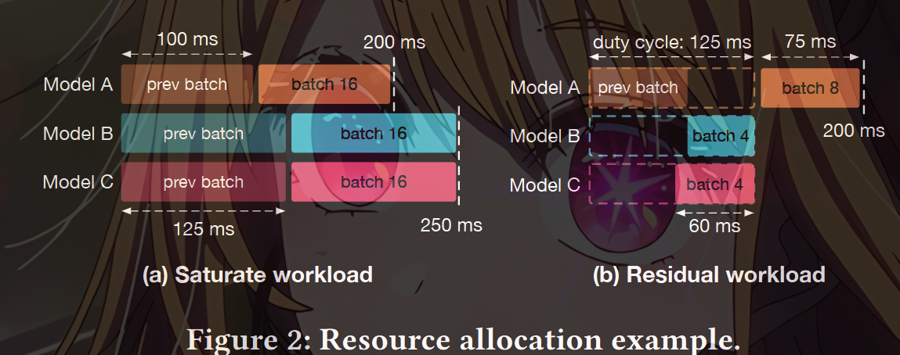

We address the problem of serving Deep Neural Networks
(DNNs) efficiently from a cluster of GPUs. In order to realize
the promise of very low-cost processing made by accelera-
tors such as GPUs, it is essential to run them at sustained
high utilization. Doing so requires cluster-scale resource
management that performs detailed scheduling of GPUs, rea-
soning about groups of DNN invocations that need to be co-
scheduled, and moving from the conventional whole-DNN
execution model to executing fragments of DNNs. Nexus is
a fully implemented system that includes these innovations.

A fundamental problem, therefore,
is to distribute the large incoming workload onto a cluster
of accelerators at high accelerator utilization and acceptable
latency. We address this problem in this paper

Conceptually, this problem can be thought of as sharding
inputs via a distributed frontend onto DNNs on backend
GPUs. Several interacting factors complicate this viewpoint.
First, given the size of GPUs, it is often necessary to place
different types of networks on the same GPU. It is then
important to select and schedule them so as to maximize
their combined throughput while satisfying latency bounds.
Second, many applications consist of groups of DNNs that
feed into each other. It is important to be able to specify
these groups and to schedule the execution of the entire
group on the cluster so as to maximize performance. Third,
it is well known that dense linear algebra computations such
as DNNs execute much more efficiently when their inputs
are batched together. Batching complicates scheduling and
routing because

(a) it benefits from cross-tenant and cross-
request coordination and (b) it forces the underlying bin-
packing-based scheduling algorithms to incorporate batch
size.

Nexus is a GPU cluster for DNN execution that addresses
these problems to attain high execution throughput under
latency Service Level Objectives (SLOs). It uses three main
techniques to do so.

 First, it relies on a novel batching-aware
scheduler (Section 6.1) that performs bin packing when the
balls being packed into bins have variable size, depending
on the size of the batch they are in. This schedule specifies
the GPUs needed, the distribution of DNNs across them, and
the order of their execution so as to maximize execution
throughput while staying within latency bounds. 

Second,
it allows groups of related DNN invocations to be written
as queries and provides automated query optimization to
assign optimal batch sizes to the components of the query
so as to maximize overall execution throughput of the query
while staying within its latency bounds (Section 6.2).

 Finally,
Nexus breaks from orthodoxy and allows batching of parts of
networks with different batch sizes. This enables the batched
execution of specialized networks (Section 6.3)

existing DNN serving systems (Tensorflow Serving [25]
and Clipper [6 ])

2.1 Accelerators and the challenge of utilizing them

. To realize their cost savings, it is critical
to sustain high utilization of this capacity. Sustaining high
utilization is hard, however.

For instance, the LeNet model of
Table 1 consumes 20 MOPs to run, implying that a single V100
would require 125 TFLOPS ÷ 20 MOPs = 6.25M inputs/second
to run at full utilization!
No single stream, or even most applications, can yield such
rates. By aggregating inputs across streams and applications,
Nexus is designed to funnel adequate work to each accelera-
tor. However, as we discuss next, having “enough” work is
not sufficient to achieve high utilization: it is important to
group the right type of work in the right place.

2.2 Placing, packing and batching DNNs

DNNs are networks of dense linear algebra operations (e.g.,
matrix multiplication and convolution), called layers or ker-
nels. Networks are also called models. By default, the GPU
simply executes the kernels presented to it in the order re-
ceived. The kernels themselves are often computationally in-
tensive, requiring MFLOPs to GFLOPs to execute, and range
in size from one MB to hundreds of MBs. These facts have
important implications for GPU utilization

First, loading models into memory can cost hundreds of
milliseconds to seconds. When serving DNNs at high volume,
therefore, it is usually essential to place the DNN on a par-
ticular GPU by pre-loading it on to GPU memory and then
re-using it across many subsequent invocations. Placement
brings with it the traditional problems of efficient packing.
Which models should be co-located on each GPU, and how
should they be scheduled to minimize mutual interference?

Second, it is well known that the processor utilization
achieved by kernels depends critically upon batching, i.e.,
grouping input matrices into higher-dimensional ones be-
fore applying custom “batched” implementations of the ker-
nels. Intuitively, batching allows kernels to avoid stalling on
memory accesses by operating on each loaded input many
more times than without batching. On an NVIDIA GTX1080,
batching improves the throughput of model execution by
4.7-13.3× for batch sizes of 32 for VGG, ResNet, and Incep-
tion models relative to executing them individually. Further,
our empirical measurements indicate that we can often use a
linear model to fit the batched execution latency as follows:
batch_lat(b) = αb + β, (1)
where β is the fixed cost to invoke a model and α is the cost
of each additional task in the batch. Large batches amortize
the fixed cost β and help achieve higher throughputs

Although batching is critical for utilization, it complicates
the resource allocation and scheduling decisions made in-
side of a cluster. We elaborate on these issues in Section 4.
Further, batching is conventionally only feasible when the
same model is invoked with different inputs. For instance,
we expect many applications to use the same well-known,
generally applicable, models (e.g., Resnet50 for object recog-
nition). However, the generality of these models comes at the
price of higher resource use. It has become common practice
[ 12, 24 ] to use smaller models specialized (using “transfer
learning”) to the few objects, faces, etc. relevant to an ap-
plication by altering (“re-training”) just the output layers of
the models. Since such customization destroys the unifor-
mity required by conventional batching, making specialized
models play well with batching is often critical to efficiency.

3.Background

To the basic batched-execution architecture of Clipper,
Nexus builds along the dimensions of scale, expressivity and
granularity

Scale: Nexus provides the machinery to scale serving to
large, changing workloads. In particular, it automates the al-
location of GPU resources and the placement and scheduling
of models across allocated resources. It provides a distributed
frontend that scales with requests. These functions are per-
formed on a continuing basis to adapt to workloads.

Expressivity: Nexus provides a query mechanism that (a)
allows related DNN execution tasks to be specified jointly,
and (b) allows the user to specify the latency SLO just at
the whole-query level. Nexus then analyzes the query and
allocates latency bounds and batch sizes to constituent DNN
tasks so as to maximize the throughput of the whole query.

Granularity: Where Clipper limits the granularity of batched
execution to whole models, Nexus automatically identifies
common subgraphs of models and executes them in a batch.
This is critical for batching on specialized models, which
often share all but the output layer, as described previously.

Serving DNNs at scale is similar to other large-scale short-
task serving problems. These systems have distributed front
ends that dispatch low-latency tasks to queues on the back-
end servers. Sparrow [27] focuses on dispatch strategies to
reduce the delays associated with queuing in such systems.
Slicer [ 3] provides a fast, fault-tolerant service for dividing
the back end into shards and load balancing across them.
Both systems assume that the backend server allocation
and task placement is performed at a higher (application)
level, using cluster resource managers such as Mesos [16]
or Omega [33]. Nexus shares the philosophy of these sys-
tems of having a fast data plane that dispatches incoming
messages from the frontend to backend GPUs and a slower
control plane that performs more heavyweight scheduling
tasks, such as resource allocation, packing and load balanc-
ing. On the other hand, compared to these generic systems,
Nexus provides query processing, task allocation, and sub-
task scheduling functionality that is targeted to better batch-
ing over DNN-based workloads.

4 Scheduling problems in batched execution

Fundamentally, the algorithm for packing models on GPUs
needs to take into account the fact that the processing cost
of an input is “squishy”, i.e., it varies with the size of the
batch within which that input is processed. Further, the la-
tency of execution also depends on the batch size. This new
version of bin packed scheduling, which we dub squishy bin
packing, needs to reason explicitly about batching.

Second,
batching complicates query processing. If a certain latency
SLO (Service Level Objective) is allocated to the query as
a whole, the system needs to partition the latency across
the DNN invocations that comprise the query so that each
latency split allows efficient batched execution of the re-
lated DNN invocation. We call this complex query scheduling

Third, in addition to batching-aware resource allocation, the
runtime dispatch engine also has to determine what requests
are batched and what requests are dropped during periods
of bursty arrival.

4.1 Squishy bin packing
Consider a workload that consists of three different types
of tasks that invoke different DNN models. Let the desired
latency SLOs for tasks invoking models A, B, and C be 200ms,
250ms, and 250ms, respectively. Table 2 provides the batch
execution latency and throughput at different batch sizes
(i.e., the “batching profile”) for each model.

We first explore the basic scenario where all three types of
tasks are associated with high request rates so that multiple
GPUs are required to handle each task type.

To maximize
GPU efficiency, we need to choose the largest possible batch
size while still meeting the latency SLO. Note that the batch
execution cost for a given task type cannot exceed half of
the task’s latency SLO; a task that missed being scheduled
with a batch would be executed as part of the next batch
and thus its latency would be twice the batch execution cost.

For example, the latency SLO for Model A tasks is 200 ms,
so the maximum batch size we can use is 16. Therefore, the
maximum throughput that Model A can achieve on a single
GPU is 160 reqs/sec, and the number of GPUs to be allocated
for Model A should rA/160, where rA is the observed request
rate. Similarly, the number of GPUs for models B and C
should be rB /128 and rC /128, where rB and rC are the request
rates for models B and C respectively. Figure 2(a) depicts the
desired schedules for the different models.

We next consider a situation where the request rates for
the models are lower, with each one requiring less than a
GPU. In this case, the scheduler needs to consolidate multiple
types of DNN tasks onto the same GPU to optimize resource
utilization. Consider a workload where Model A receives 64
reqs/sec, and Model B and Model C receive 32 reqs/sec each.

We consider schedules where multiple models are assigned
to a GPU. The GPU then executes batches of different types
of models in a round-robin manner, and it cycles through
them over a time period that we refer to as the duty cycle.
The worst-case latency for a task is no longer twice the batch
execution cost but rather the sum of the duty cycle and the
batch execution cost for that task type.

Given this setup, Model A tasks can be scheduled in batches
of 8 as part of a duty cycle of 125ms; note that the resulting
throughput is the desired rate of 64 reqs/sec, the batch exe-
cution cost for 8 tasks is 75ms, and the worst-case execution
delay of 200ms matches the latency SLO (see Figure 2(b)).
We then check whether the GPU has sufficient slack to ac-
commodate tasks associated with models B or C. Within a
duty cycle of 125ms, we would need to execute 4 tasks of
either B or C to meet the desired rate of 32 reqs/sec. The
batch execution cost of 4 model B tasks is 50ms, which can fit
into the residual slack in the duty cycle. On the other hand,
a batch of 4 model C tasks would incur 60ms and cannot
be scheduled inside the duty cycle. Further, the worst-case
latency for model B is the sum of the duty cycle and its own
batch execution cost, 175ms(= 125 + 50), which is lower than
its latency SLO 250ms. Thus, it is possible to co-locate Model
B, but not Model C, on the same GPU as Model A

We now make a few observations regarding the scenario
discussed above and why the associated optimization prob-
lem cannot be addressed directly by known scheduling al-
gorithms. First, unlike vanilla bin-packing that would pack
fixed-size balls into bins, the tasks here incur lower costs
when multiple tasks of the same type are squished together
into a GPU. Second, in addition to the capacity constraints
associated with the GPU’s compute and/or memory capa-
bilities, there are also latency constraints in generating a
valid schedule. Third, there are many degrees of freedom in
generating a valid schedule. The batch size associated with
a model execution is not only a function of the request rate
but also of the duty cycle in which the batch is embedded. In
Section 6.1, we describe how to extend traditional algorithms
to handle this setting.

4.2 Complex query scheduling

Applications often comprise of dependent computations of
multiple DNN models. For example, a common pattern is a
detection and recognition pipeline that first detects certain
objects from the image and then recognizes each object. The
developer will specify a latency SLO for the entire query,
but since the system would host and execute the constituent
models on different nodes, it would have to derive latency
SLOs for the invoked models and the schedules that meet
these latency SLOs. We discussed the latter issue in the pre-
vious example, and we now focus on the former issue.

Consider a query that executes Model X and feeds its
output to Model Y. Suppose we have a 100ms latency budget
for processing this query, and suppose that every invocation
of X yields γ outputs (on average). When γ < 1, X operates
as a filter; when γ = 1, X maps an input to an output; when
γ > 1, X yields multiple outputs from an input (e.g., detection
of objects within a frame).

For workloads involving a large number of requests, let
us assume that p and q GPUs execute X and Y, respectively.
We then have γ · p · TX = q · TY , where TX and TY are
per-GPU throughputs of X and Y, such that the pipeline
won’t be bottlenecked by any model. We define the average
throughput as the pipeline throughput divided by the total
number of GPUs, which is p · TX /(p + q). We evaluate the
average throughputs for the three latency split plans with
γ = 0.1, 1, 10. Figure 4 shows that each of the plans achieves
the best performance for different γ values. In fact, there is
no universal best split: it depends on γ , which can vary over
time.

We note two observations from this example. First latency
split for complex query impacts overall efficiency, and it is
necessary to account both batch performance and workload
statistics to make the best decision. Second, latency split
should not be static but rather adapted over time in accor-
dance with the current workload. Section 6.2 describes how
Nexus automatically and continually derives latency splits.

4.3 Rate control and adaptive batching

Model serving systems need to perform adaptive batching
based on the number of requests received. When there is a
burst of requests, the system needs to drop certain requests
in order to serve the remaining requests within the latency
SLO. One approach is to perform lazy dropping, i.e., drop
a request only when it has already missed its deadline, and
determine the batch size based on the time budget remaining
for the earliest request in the queue 