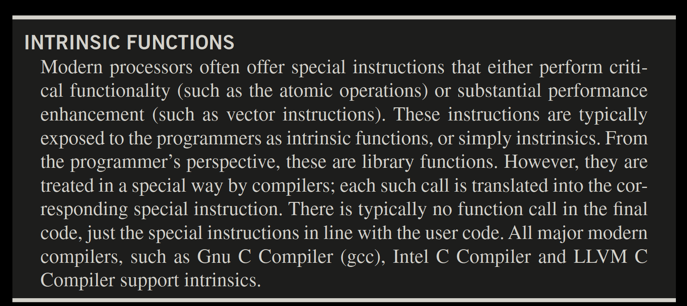
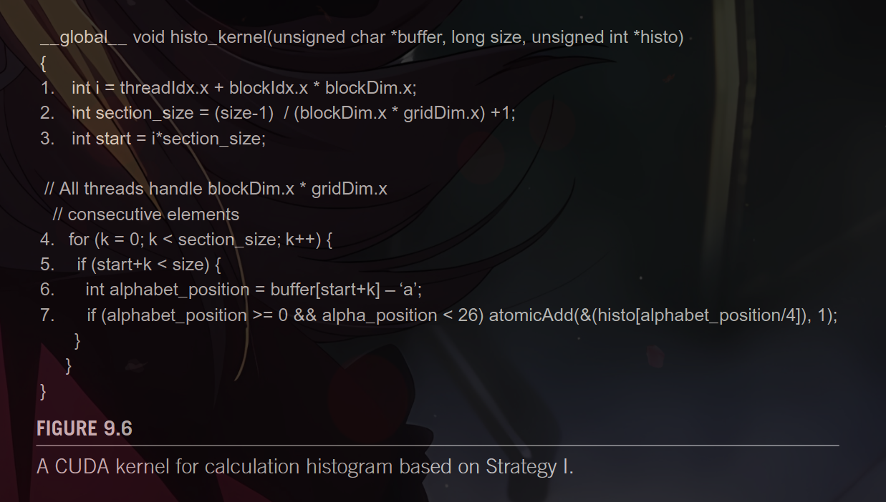
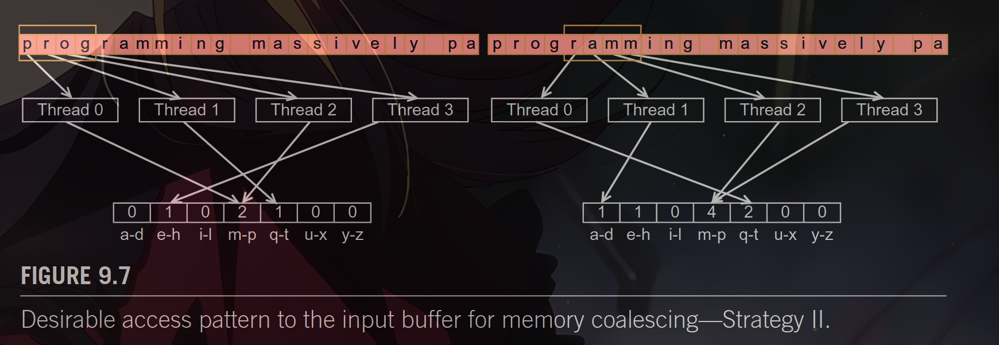
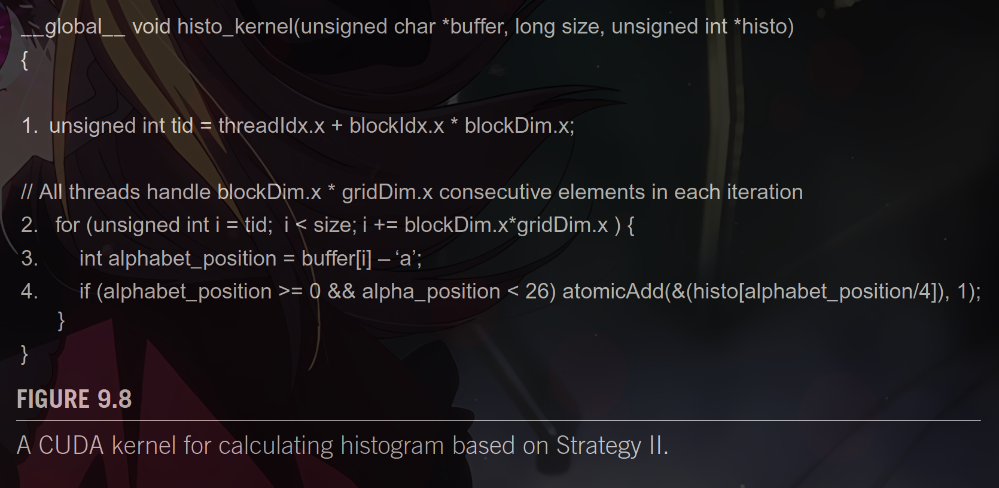
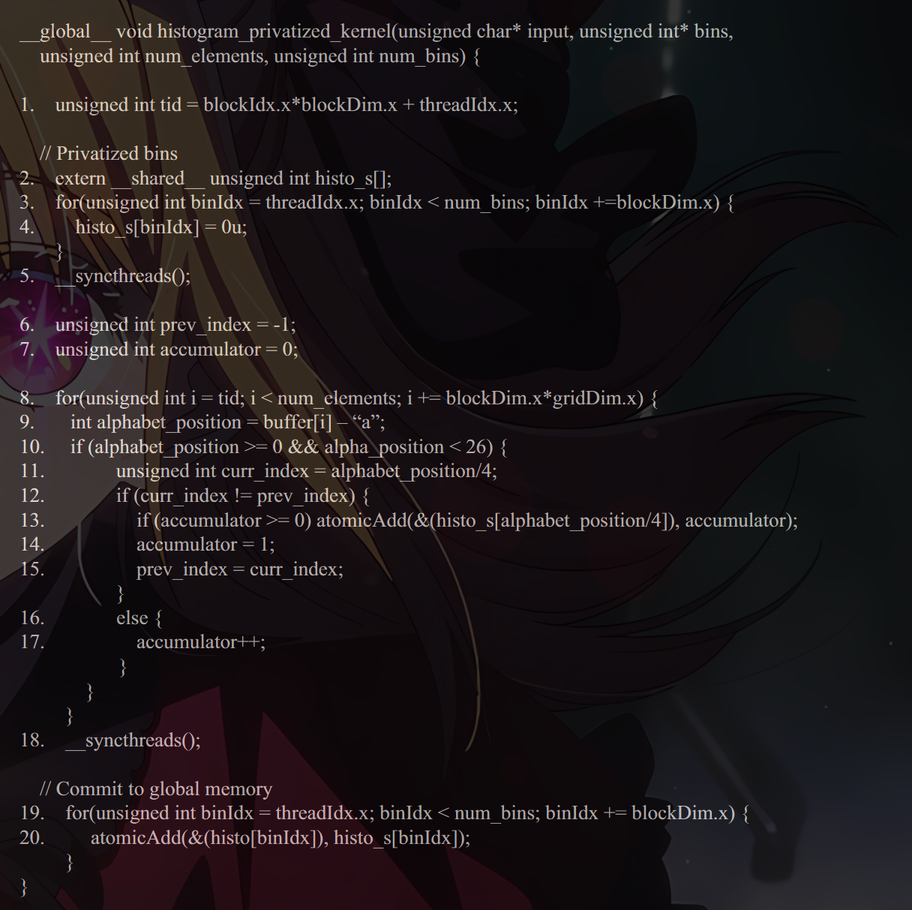

9.3 BLOCK VERSUS INTERLEAVED PARTITIONING

As we learned in Chapter 5, Performance Considerations, the large number of
simultaneously active threads in an SM typically cause too much interference in the
caches that one cannot expect a data in a cache line to remain available for all the
sequential accesses by a thread under Strategy I. Rather, we need to make sure that
threads in a warp access consecutive locations to enable memory coalescing. This
means that we need to adjust our strategy for partitioning buffer[].

9.6 PRIVATIZATION
The latency for accessing memory can be dramatically reduced by placing data
in the shared memory. Shared memory is private to each SM and has very short
access latency (a few cycles). Recall that this reduced latency directly translates into
increase throughput of atomic operations. The problem is that due to the private
nature of shared memory, the updates by threads in one thread block are no longer
visible to threads in other blocks. The programmer must explicitly deal with this lack
of visibility of histogram updates across thread blocks.
In general, a technique referred to as privatization is commonly used to address
the output interference problem in parallel computing. The idea is to replicate highly
contended output data structures into private copies so that each thread (or each sub-
set of threads) can update its private copy. The benefit is that the private copies can be
accessed with much less contention and often at much lower latency. These private
copies can dramatically increase the throughput for updating the data structures. 

9.7 AGGREGATION
Some data sets have a large concentration of identical data values in localized areas.
For example, in pictures of the sky, there can be large patches of pixels of identi-
cal value. Such high concentration of identical values causes heavy contention and
reduced throughput of parallel histogram computation

For such data sets, a simple and yet effective optimization is for each thread to
aggregate consecutive updates into a single update if they are updating the same
element of the histogram [Merrill 2015]. Such aggregation reduces the number of
atomic operations to the highly contended histogram elements, thus improving the
effective throughput of the computation.
Fig. 9.11 shows an aggregated text histogram kernel. Each thread declares three
additional register variables curr_index, prev_index and accumulator. The accu-
mulator keeps track of the number of updates aggregated thus far and prev_index
tracks the index of the histogram element whose updates has been aggregated.

