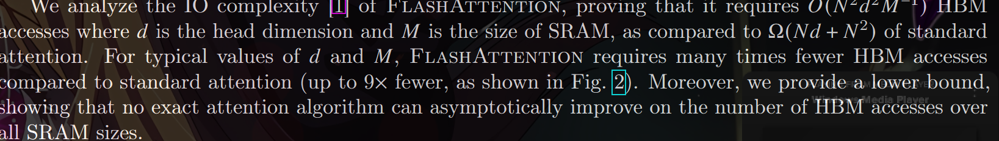
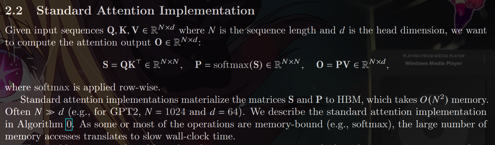
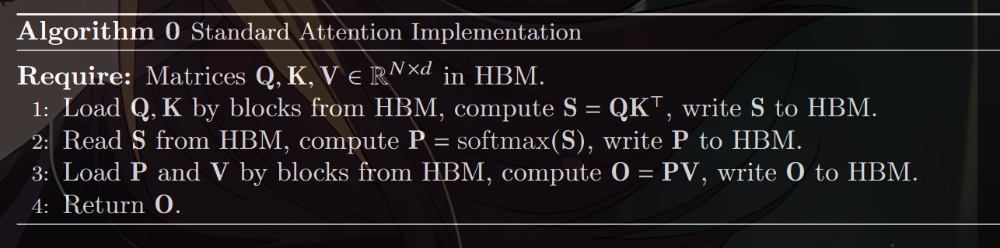
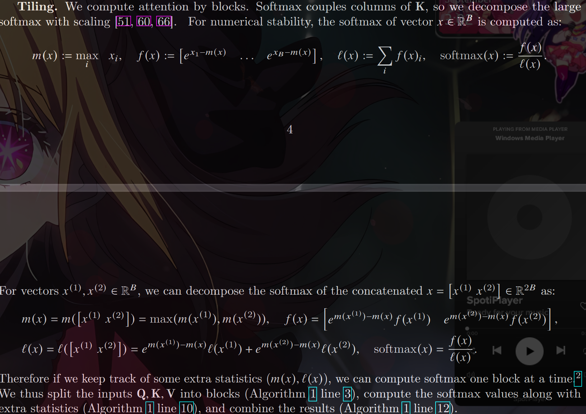
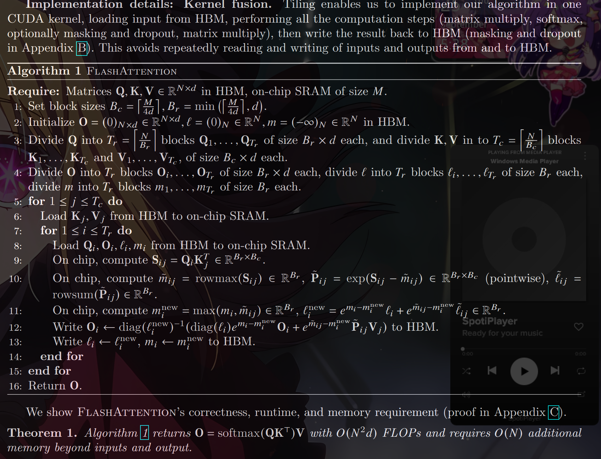
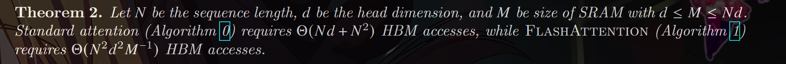
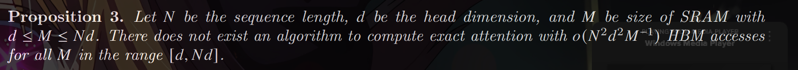
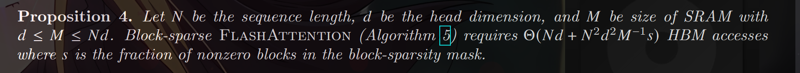
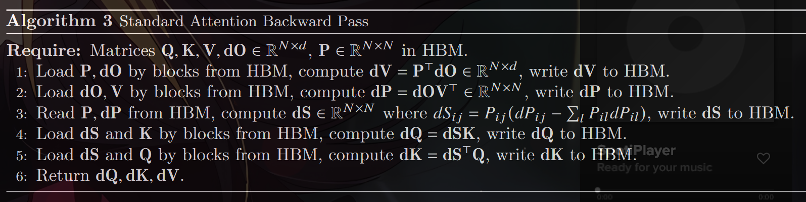
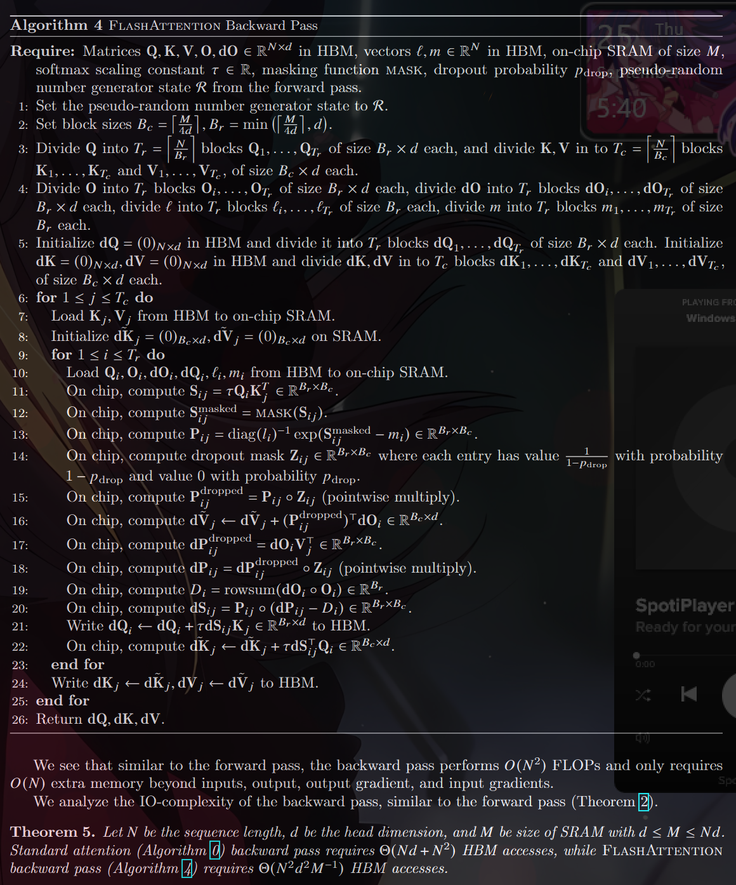

We propose FlashAttention, a new attention algorithm that computes exact attention with far fewer
memory accesses. Our main goal is to avoid reading and writing the attention matrix to and from HBM.
This requires (i) computing the softmax reduction without access to the whole input (ii) not storing the large
intermediate attention matrix for the backward pass. 

We apply two well-established techniques to address
these challenges. (i) We restructure the attention computation to split the input into blocks and make several
passes over input blocks, thus incrementally performing the softmax reduction (also known as tiling). (ii) We
store the softmax normalization factor from the forward pass to quickly recompute attention on-chip in the
backward pass, which is faster than the standard approach of reading the intermediate attention matrix from
HBM. 

We implement FlashAttention in CUDA to achieve fine-grained control over memory access and
fuse all the attention operations into one GPU kernel. Even with the increased FLOPs due to recomputation,
our algorithm both runs faster (up to 7.6x on GPT-2 [ 67], Figure 1 right) and uses less memory—linear
in sequence length—than standard attention, thanks to the massively reduced amount of HBM access.

Execution Model. GPUs have a massive number of threads to execute an operation (called a kernel).
Each kernel loads inputs from HBM to registers and SRAM, computes, then writes outputs to HBM.

Performance characteristics. Depending on the balance of computation and memory accesses, op-
erations can be classified as either compute-bound or memory-bound. This is commonly measured by the
arithmetic intensity [85], which is the number of arithmetic operations per byte of memory access.
1. Compute-bound: the time taken by the operation is determined by how many arithmetic operations there
are, while time accessing HBM is much smaller. Typical examples are matrix multiply with large inner
dimension, and convolution with large number of channels.
2. Memory-bound: the time taken by the operation is determined by the number of memory accesses, while
time spent in computation is much smaller. Examples include most other operations: elementwise (e.g.,
activation, dropout), and reduction (e.g., sum, softmax, batch norm, layer norm).

Kernel fusion. The most common approach to accelerate memory-bound operations is kernel fusion: if
there are multiple operations applied to the same input, the input can be loaded once from HBM, instead of
multiple times for each operation. Compilers can automatically fuse many elementwise operations [ 53, 65, 75]

This problem is exacerbated by other elementwise operations applied to the attention matrix, such as
masking applied to S or dropout applied to P. As a result, there have been many attempts to fuse several
elementwise operations, such as fusing masking with softmax [77]

3.1 An Efficient Attention Algorithm With Tiling and Recomputation

Given the inputs Q,K,V \belongs R^(𝑁xd) in HBM, we aim to compute the attention output O \belongs R^(𝑁x𝑑) and write it to
HBM. Our goal is to reduce the amount of HBM accesses (to sub-quadratic in 𝑁).
We apply two established techniques (tiling, recomputation) to overcome the technical challenge of
computing exact attention in sub-quadratic HBM accesses. We describe this in Algorithm 1. The main idea
is that we split the inputs Q– K– V into blocks, load them from slow HBM to fast SRAM, then compute the
attention output with respect to those blocks. By scaling the output of each block by the right normalization
factor before adding them up, we get the correct result at the end

Recomputation. One of our goals is to not store 𝑂 (𝑁^2) intermediate values for the backward pass. The
backward pass typically requires the matrices S,P \belongs R^(𝑁x𝑁) to compute the gradients with respect to Q,K,V.
However, by storing the output O and the softmax normalization statistics ¹𝑚– ℓº, we can recompute the
attention matrix S and P easily in the backward pass from blocks of Q– K– V in SRAM. This can be seen as a
form of selective gradient checkpointing [ 10, 34]. While gradient checkpointing has been suggested to reduce
the maximum amount of memory required [ 66], all implementations (that we know off) have to trade speed
for memory. In contrast, even with more FLOPs, our recomputation speeds up the backward pass due to
reduced HBM accesses (Fig. 2)

