This sequential generation process
makes the workload memory-bound, underutilizing the com-
putation power of GPUs and limiting the serving throughput.
Improving the throughput is possible by batching multi-
ple requests together. However, to process many requests
in a batch, the memory space for each request should be
efficiently managed.

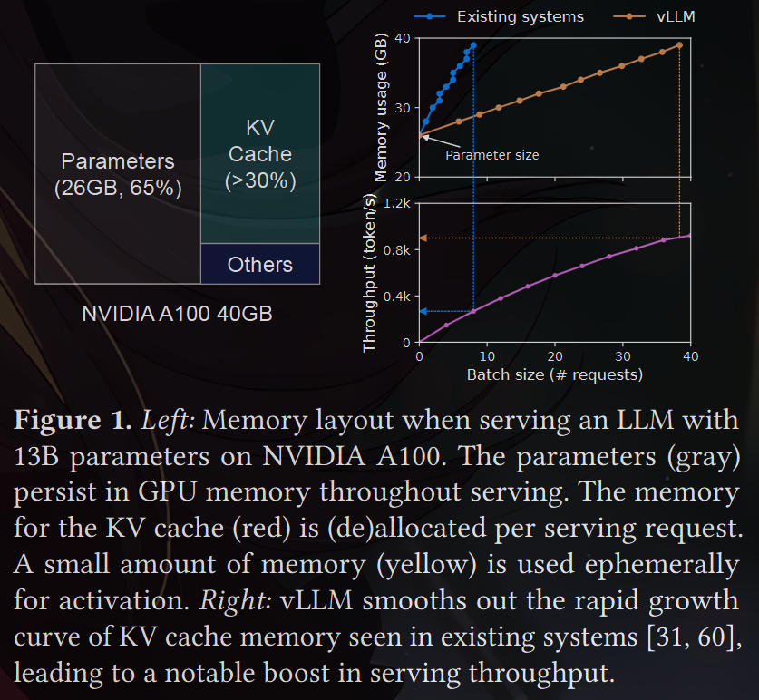

For example, Fig. 1 (left) illustrates the
memory distribution for a 13B-parameter LLM on an NVIDIA
A100 GPU with 40GB RAM. Approximately 65% of the mem-
ory is allocated for the model weights, which remain static
during serving. Close to 30% of the memory is used to store
the dynamic states of the requests. For Transformers, these
states consist of the key and value tensors associated with the
attention mechanism, commonly referred to as KV cache [ 41],
which represent the context from earlier tokens to gener-
ate new output tokens in sequence. The remaining small

percentage of memory is used for other data, including ac-
tivations – the ephemeral tensors created when evaluating
the LLM. Since the model weights are constant and the ac-
tivations only occupy a small fraction of the GPU memory,
the way the KV cache is managed is critical in determining
the maximum batch size. When managed inefficiently, the
KV cache memory can significantly limit the batch size and
consequently the throughput of the LLM, as illustrated in
Fig. 1 (right)
----
In this paper, we observe that existing LLM serving sys-
tems [31, 60] fall short of managing the KV cache memory
efficiently. This is mainly because they store the KV cache of
a request in contiguous memory space, as most deep learning
frameworks [33, 39 ] require tensors to be stored in contigu-
ous memory. However, unlike the tensors in the traditional
deep learning workloads, the KV cache has unique charac-
teristics: it dynamically grows and shrinks over time as the
model generates new tokens, and its lifetime and length are
not known a priori. 
----

These characteristics make the existing
systems’ approach significantly inefficient in two ways:
First, the existing systems [31 , 60 ] suffer from internal and
external memory fragmentation. To store the KV cache of
a request in contiguous space, they pre-allocate a contigu-
ous chunk of memory with the request’s maximum length
(e.g., 2048 tokens). This can result in severe internal frag-
mentation, since the request’s actual length can be much
shorter than its maximum length (e.g., Fig. 11). Moreover,
even if the actual length is known a priori, the pre-allocation
is still inefficient: As the entire chunk is reserved during the
request’s lifetime, other shorter requests cannot utilize any
part of the chunk that is currently unused. Besides, external
memory fragmentation can also be significant, since the pre-
allocated size can be different for each request. Indeed, our
profiling results in Fig. 2 show that only 20.4% - 38.2% of the
KV cache memory is used to store the actual token states in
the existing systems

Second, the existing systems cannot exploit the opportu-
nities for memory sharing. LLM services often use advanced
decoding algorithms, such as parallel sampling and beam
search, that generate multiple outputs per request. In these
scenarios, the request consists of multiple sequences that can
partially share their KV cache. However, memory sharing is
not possible in the existing systems because the KV cache of
the sequences is stored in separate contiguous spaces.

To address the above limitations, we propose PagedAt-
tention, an attention algorithm inspired by the operating
system’s (OS) solution to memory fragmentation and shar-
ing: virtual memory with paging

PagedAttention divides the
request’s KV cache into blocks, each of which can contain
the attention keys and values of a fixed number of tokens. In
PagedAttention, the blocks for the KV cache are not neces-
sarily stored in contiguous space. Therefore, we can manage
the KV cache in a more flexible way as in OS’s virtual mem-
ory: one can think of blocks as pages, tokens as bytes, and
requests as processes. This design alleviates internal frag-
mentation by using relatively small blocks and allocating
them on demand. Moreover, it eliminates external fragmen-
tation as all blocks have the same size. Finally, it enables
memory sharing at the granularity of a block, across the
different sequences associated with the same request or even
across the different requests

In this work, we build vLLM, a high-throughput distributed
LLM serving engine on top of PagedAttention that achieves
near-zero waste in KV cache memory. vLLM uses '''block-level
memory management''' and '''preemptive request scheduling'''
that are co-designed with PagedAttention. vLLM supports
popular LLMs such as GPT [ 5 ], OPT [62 ], and LLaMA [ 52]
with varying sizes, including the ones exceeding the memory
capacity of a single GPU. Our evaluations on various models
and workloads show that vLLM improves the LLM serving
throughput by 2-4× compared to the state-of-the-art sys-
tems [ 31 , 60], without affecting the model accuracy at all. The
improvements are more pronounced with longer sequences,
larger models, and more complex decoding algorithms (§4.3).

\redundant/----
In summary, we make the following contributions:
• We identify the challenges in memory allocation in serving
LLMs and quantify their impact on serving performance.
• We propose PagedAttention, an attention algorithm that
operates on KV cache stored in non-contiguous paged
memory, which is inspired by the virtual memory and
paging in OS.
• We design and implement vLLM, a distributed LLM serving
engine built on top of PagedAttention.
• We evaluate vLLM on various scenarios and demonstrate
that it substantially outperforms the previous state-of-the-
art solutions such as FasterTransformer [ 31] and Orca [60 ].
\/----

2 Background
In this section, we describe the generation and serving pro-
cedures of typical LLMs and the iteration-level scheduling
used in LLM serving

2.1 Transformer-Based Large Language Models
The task of language modeling is to model the probability
of a list of tokens (𝑥1, . . . , 𝑥𝑛 ).

Since language has a natural
sequential ordering, it is common to factorize the joint prob-
ability over the whole sequence as the product of conditional
probabilities (a.k.a. autoregressive decomposition [3]):
𝑃 (𝑥) = 𝑃 (𝑥1) · 𝑃 (𝑥2 | 𝑥1) · · · 𝑃 (𝑥𝑛 | 𝑥1, . . . , 𝑥𝑛−1). (1)

Transformers [ 53] have become the de facto standard ar-
chitecture for modeling the probability above at a large scale.
The most important component of a Transformer-based lan-
guage model is its self-attention layers. For an input hidden
state sequence (𝑥1, . . . , 𝑥𝑛 ) ∈ R𝑛×𝑑 , a self-attention layer
first applies linear transformations on each position 𝑖 to get
the query, key, and value vectors:
𝑞𝑖 = 𝑊𝑞 𝑥𝑖, 𝑘𝑖 = 𝑊𝑘 𝑥𝑖, 𝑣𝑖 = 𝑊𝑣 𝑥𝑖 . (2)

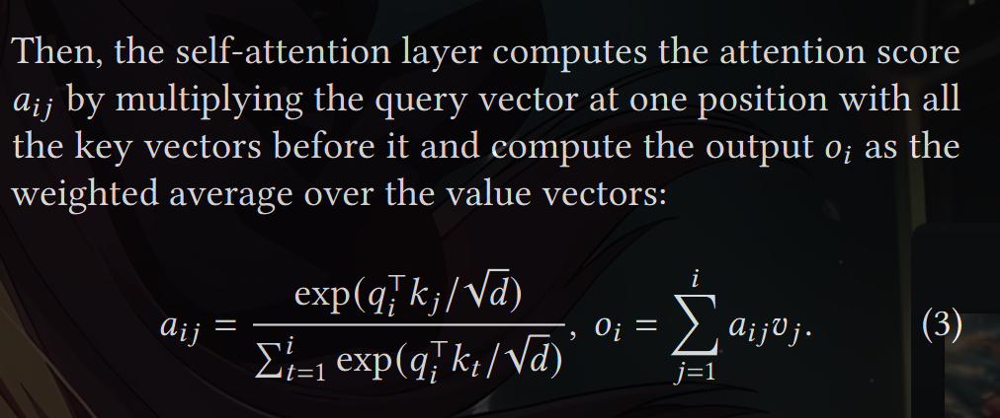

Besides the computation in Eq. 4, all other components
in the Transformer model, including the embedding layer,
feed-forward layer, layer normalization [ 2], residual connec-
tion [22], output logit computation, and the query, key, and
value transformation in Eq. 2, are all applied independently
position-wise in a form of 𝑦𝑖 = 𝑓 (𝑥𝑖 ).

2.2 LLM Service & Autoregressive Generation

Once trained, LLMs are often deployed as a conditional gen-
eration service (e.g., completion API [34] or chatbot [ 19, 35]).
A request to an LLM service provides a list of input prompt
tokens (𝑥1, . . . , 𝑥𝑛 ), and the LLM service generates a list of
output tokens (𝑥𝑛+1, . . . , 𝑥𝑛+𝑇 ) according to Eq. 1. We refer to
the concatenation of the prompt and output lists as sequence.

Due to the decomposition in Eq. 1, the LLM can only sam-
ple and generate new tokens one by one, and the generation
process of each new token depends on all the previous tokens
in that sequence, specifically their key and value vectors.

In
this sequential generation process, the key and value vectors
of existing tokens are often cached for generating future
tokens, known as KV cache. Note that the KV cache of one
token depends on all its previous tokens. This means that the
KV cache of the same token appearing at different positions
in a sequence will be different.

Given a request prompt, the generation computation in
the LLM service can be decomposed into two phases:

The prompt phase takes the whole user prompt (𝑥1, . . . , 𝑥𝑛 )
as input and computes the probability of the first new to-
ken 𝑃 (𝑥𝑛+1 | 𝑥1, . . . , 𝑥𝑛 ). 
During this process, also gener-
ates the key vectors 𝑘1, . . . , 𝑘𝑛 and value vectors 𝑣1, . . . , 𝑣𝑛 .
Since prompt tokens 𝑥1, . . . , 𝑥𝑛 are all known, the computa-
tion of the prompt phase can be parallelized using matrix-
matrix multiplication operations. Therefore, this phase can
efficiently use the parallelism inherent in GPUs

The autoregressive generation phase generates the re-
maining new tokens sequentially. At iteration 𝑡, the model
takes one token 𝑥𝑛+𝑡 as input and computes the probability
𝑃 (𝑥𝑛+𝑡 +1 | 𝑥1, . . . , 𝑥𝑛+𝑡 ) with the key vectors 𝑘1, . . . , 𝑘𝑛+𝑡 and
value vectors 𝑣1, . . . , 𝑣𝑛+𝑡 . Note that the key and value vectors
at positions 1 to 𝑛 + 𝑡 − 1 are cached at previous iterations,
only the new key and value vector 𝑘𝑛+𝑡 and 𝑣𝑛+𝑡 are com-
puted at this iteration. This phase completes either when the
sequence reaches a maximum length (specified by users or
limited by LLMs) or when an end-of-sequence (<eos>) token
is emitted. The computation at different iterations cannot
be parallelized due to the data dependency and often uses
matrix-vector multiplication, which is less efficient. As a re-
sult, this phase severely underutilizes GPU computation and
becomes memory-bound, being responsible for most portion
of the latency of a single request.

2.3 Batching Techniques for LLMs

The compute utilization in serving LLMs can be improved
by batching multiple requests. Because the requests share
the same model weights, the overhead of moving weights is
amortized across the requests in a batch, and can be over-
whelmed by the computational overhead when the batch
size is sufficiently large. However, batching the requests
to an LLM service is non-trivial for two reasons. First, the
requests may arrive at different times. A naive batching strat-
egy would either make earlier requests wait for later ones
or delay the incoming requests until earlier ones finish, lead-
ing to significant queueing delays. Second, the requests may
have vastly different input and output lengths (Fig. 11).
A straightforward batching technique would pad the inputs
and outputs of the requests to equalize their lengths, wasting
GPU computation and memory.

To address this problem, fine-grained batching mecha-
nisms, such as cellular batching [16] and iteration-level sched-
uling [ 60 ], have been proposed. Unlike traditional methods
that work at the request level, these techniques operate at
the iteration level. After each iteration, completed requests
are removed from the batch, and new ones are added.

There-
fore, a new request can be processed after waiting for a
single iteration, not waiting for the entire batch to complete.

Moreover, with special GPU kernels, these techniques elim-
inate the need to pad the inputs and outputs. By reducing
the queueing delay and the inefficiencies from padding, the
fine-grained batching mechanisms significantly increase the
throughput of LLM serving.

3 Memory Challenges in LLM Serving

Although fine-grained batching reduces the waste of com-
puting and enables requests to be batched in a more flexible
way, the number of requests that can be batched together is
still constrained by GPU memory capacity, particularly the
space allocated to store the KV cache. In other words, the
serving system’s throughput is memory-bound. Overcom-
ing this memory-bound requires addressing the following
challenges in the memory management:

Large KV cache. The KV Cache size grows quickly with the
number of requests. As an example, for the 13B parameter
OPT model [62 ], the KV cache of a single token demands 800
KB of space, calculated as 2 (key and value vectors) × 5120
(hidden state size) × 40 (number of layers) × 2 (bytes per
FP16)

Since OPT can generate sequences up to 2048 tokens,
the memory required to store the KV cache of one request
can be as much as 1.6 GB. Concurrent GPUs have memory
capacities in the tens of GBs. Even if all available memory
was allocated to KV cache, only a few tens of requests could
be accommodated. Moreover, inefficient memory manage-
ment can further decrease the batch size, as shown in Fig.

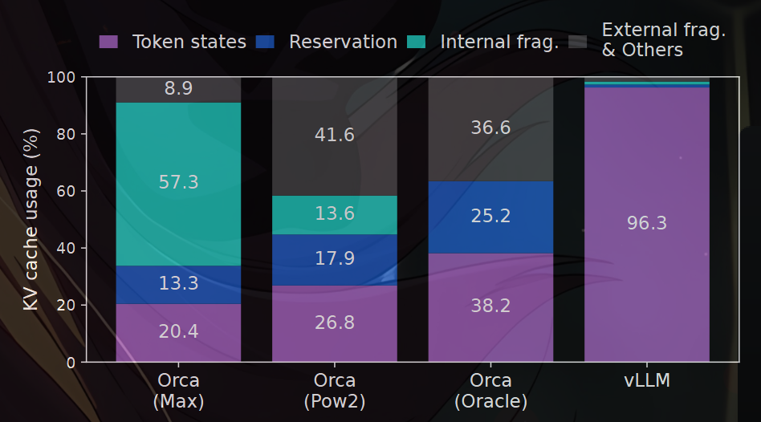

\Facts/----
Additionally, given the current trends, the GPU’s computa-
tion speed grows faster than the memory capacity [ 17]. For
example, from NVIDIA A100 to H100, The FLOPS increases
by more than 2x, but the GPU memory stays at 80GB max-
imum. Therefore, we believe the memory will become an
increasingly significant bottleneck.
\/----

Complex decoding algorithms. LLM services offer a range
of decoding algorithms for users to select from, each with
varying implications for memory management complexity.
For example, when users request multiple random samples
from a single input prompt, a typical use case in program
suggestion [18], the KV cache of the prompt part, which
accounts for 12% of the total KV cache memory in our ex-
periment (§6.3), can be shared to minimize memory usage.
On the other hand, the KV cache during the autoregressive
generation phase should remain unshared due to the dif-
ferent sample results and their dependence on context and
position. The extent of KV cache sharing depends on the
specific decoding algorithm employed. In more sophisticated
algorithms like beam search [49], different request beams
can share larger portions (up to 55% memory saving, 
 of their KV cache, and the sharing pattern evolves as
the decoding process advances.

Scheduling for unknown input & output lengths. The
requests to an LLM service exhibit variability in their input
and output lengths. This requires the memory management
system to accommodate a wide range of prompt lengths. In
addition, as the output length of a request grows at decoding,
the memory required for its KV cache also expands and may
exhaust available memory for incoming requests or ongoing
generation for existing prompts. The system needs to make
scheduling decisions, such as deleting or swapping out the
KV cache of some requests from GPU memory.

3.1 Memory Management in Existing Systems

Since most operators in current deep learning frameworks
[ 33, 39 ] require tensors to be stored in contiguous memory,
previous LLM serving systems [ 31, 60 ] also store the KV
cache of one request as a contiguous tensor across the differ-
ent positions. Due to the unpredictable output lengths from
the LLM, they statically allocate a chunk of memory for a
request based on the request’s maximum possible sequence
length, irrespective of the actual input or eventual output
length of the request.

\repetation just read/-----
3.1 Memory Management in Existing Systems

Fig. 3 illustrates two requests: request A with 2048 max-
imum possible sequence length and request B with a max-
imum of 512. The chunk pre-allocation scheme in existing
systems has three primary sources of memory wastes: re-
served slots for future tokens, internal fragmentation due to
over-provisioning for potential maximum sequence lengths,
and external fragmentation from the memory allocator like
the buddy allocator. The external fragmentation will never
be used for generated tokens, which is known before serving
a request. Internal fragmentation also remains unused, but
this is only realized after a request has finished sampling.
They are both pure memory waste. ---Although the reserved
memory is eventually used, reserving this space for the en-
tire request’s duration, especially when the reserved space
is large, occupies the space that could otherwise be used to
process other requests.--- We visualize the average percentage
of memory wastes in our experiments in Fig. 2, revealing
that the actual effective memory in previous systems can be
as low as 20.4%.

Although compaction [ 54] has been proposed as a poten-
tial solution to fragmentation, performing compaction in a
performance-sensitive LLM serving system is impractical
due to the massive KV cache. Even with compaction, the
pre-allocated chunk space for each request prevents memory
sharing specific to decoding algorithms in existing memory
management systems.
\/-----

4 Method

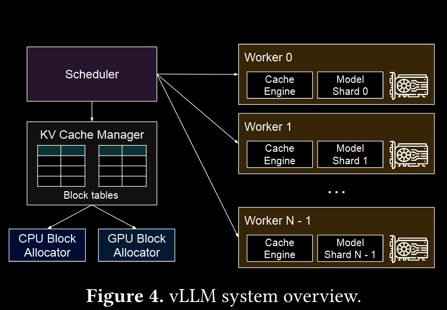

In this work, we develop a new attention algorithm, Page-
dAttention, and build an LLM serving engine, vLLM, to tackle
the challenges outlined in §3. The architecture of vLLM is
shown in Fig. 4. vLLM adopts a centralized scheduler to
coordinate the execution of distributed GPU workers. The
KV cache manager effectively manages the KV cache in a
paged fashion, enabled by PagedAttention. Specifically, the
KV cache manager manages the physical KV cache memory
on the GPU workers through the instructions sent by the
centralized scheduler

Next, We describe the PagedAttention algorithm in §4.1.
With that, we show the design of the KV cache manager in
§4.2 and how it facilitates PagedAttention in §4.3, respec-
tively. Then, we show how this design facilitates effective
memory management for various decoding methods (§4.4)
and handles the variable length input and output sequences
(§4.5). Finally, we show how the system design of vLLM
works in a distributed setting (4.6)

4.1 PagedAttention

To address the memory challenges in §3, we introduce Page-
dAttention, an attention algorithm inspired by the classic idea
of paging [25 ] in operating systems. Unlike the traditional
attention algorithms, PagedAttention allows storing continu-
ous keys and values in non-contiguous memory space. Specif-
ically, PagedAttention partitions the KV cache of each se-
quence into KV blocks

Each block contains the key and value
vectors for a fixed number of tokens,1 which we denote as KV
block size (𝐵). Denote the key block 𝐾𝑗 = (𝑘( 𝑗 −1)𝐵+1, . . . , 𝑘𝑗𝐵 )
and value block 𝑉𝑗 = (𝑣 ( 𝑗 −1)𝐵+1, . . . , 𝑣 𝑗𝐵 ). 

The attention computation in Eq. 3 can be transformed into the following block-wise computation:

\To Understand/-----

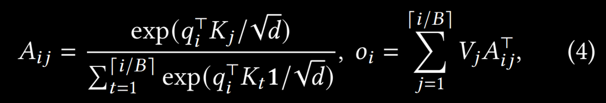

\/-----

where 𝐴𝑖 𝑗 = (𝑎𝑖,( 𝑗 −1)𝐵+1, . . . , 𝑎𝑖,𝑗𝐵 ) is the row vector of atten-
tion score on 𝑗-th KV block.

During the attention computation, the PagedAttention
kernel identifies and fetches different KV blocks separately.
We show an example of PagedAttention in Fig. 5: The key
and value vectors are spread across three blocks, and the
three blocks are not contiguous on the physical memory.

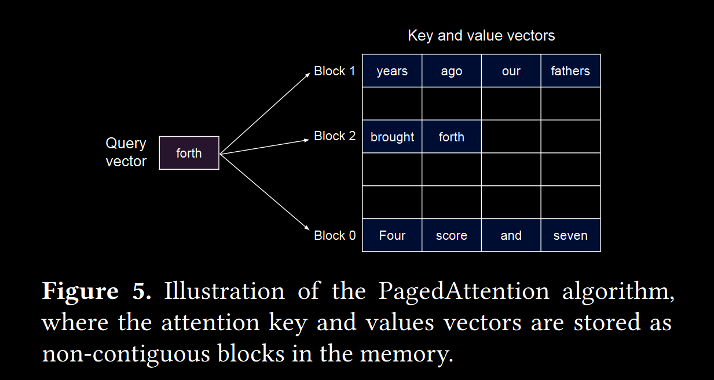

At
each time, the kernel multiplies the query vector 𝑞𝑖 of the
query token (“forth”) and the key vectors 𝐾𝑗 in a block (e.g.,
key vectors of “Four score and seven” for block 0) to compute
the attention score 𝐴𝑖 𝑗 , and later multiplies 𝐴𝑖 𝑗 with the value
vectors 𝑉𝑗 in a block to derive the final attention output 𝑜𝑖 .

In summary, the PagedAttention algorithm allows the
KV blocks to be stored in non-contiguous physical memory,
which enables more flexible paged memory management in
vLLM.

4.2 KV Cache Manager

The key idea behind vLLM’s memory manager is analogous
to the virtual memory [ 25] in operating systems. OS parti-
tions memory into fixed-sized pages and maps user programs’
logical pages to physical pages.  Contiguous logical pages can
correspond to non-contiguous physical memory pages, al-
lowing user programs to access memory as though it were
contiguous. 

Moreover, physical memory space needs not to
be fully reserved in advance, enabling the OS to dynamically
allocate physical pages as needed. vLLM uses the ideas be-
hind virtual memory to manage the KV cache in an LLM
service. Enabled by PagedAttention, we organize the KV
cache as fixed-size KV blocks, like pages in virtual memory.

A request’s KV cache is represented as a series of logical
KV blocks, filled from left to right as new tokens and their KV cache are generated

The last KV block’s unfilled positions
are reserved for future generations.

On GPU workers, a block
engine allocates a contiguous chunk of GPU DRAM and
divides it into physical KV blocks (this is also done on CPU
RAM for swapping; see §4.5). 
The KV block manager also
maintains block tables—the mapping between logical and
physical KV blocks of each request.  Each block table entry
records the corresponding physical blocks of a logical block
and the number of filled positions. Separating logical and
physical KV blocks allows vLLM to dynamically grow the
KV cache memory without reserving it for all positions in
advance, which eliminates most memory waste in existing
systems, as in Fig 2.

4.3 Decoding with PagedAttention and vLLM

Next, we walk through an example, as in Fig. 6, to demon-
strate how vLLM executes PagedAttention and manages the
memory during the decoding process of a single input se-
quence:
○ As in OS’s virtual memory, vLLM does not require
reserving the memory for the maximum possible generated
sequence length initially. 
Instead, it reserves only the nec-
essary KV blocks to accommodate the KV cache generated
during prompt computation.
In this case, The prompt has 7
tokens, so vLLM maps the first 2 logical KV blocks (0 and
1) to 2 physical KV blocks (7 and 1, respectively). In the
prefill step, vLLM generates the KV cache of the prompts
and the first output token with a conventional self-attention
algorithm (e.g., [ 13]). vLLM then stores the KV cache of the
first 4 tokens in logical block 0 and the following 3 tokens
in logical block 1. The remaining slot is reserved for the
subsequent autoregressive generation phase. 

○ In the first
autoregressive decoding step, vLLM generates the new token
with the PagedAttention algorithm on physical blocks 7 and
1. Since one slot remains available in the last logical block,
the newly generated KV cache is stored there, and the block
table’s #filled record is updated. 

○ At the second decoding
step, as the last logical block is full, vLLM stores the newly
generated KV cache in a new logical block; vLLM allocates a
new physical block (physical block 3) for it and stores this
mapping in the block table.

Globally, for each decoding iteration, vLLM first selects
a set of candidate sequences for batching (more in §4.5),
and allocates the physical blocks for the newly required
logical blocks. 

\useless/----
Then, vLLM concatenates all the input tokens
of the current iteration (i.e., all tokens for prompt phase
requests and the latest tokens for generation phase requests)
as one sequence and feeds it into the LLM. During LLM’s
computation, vLLM uses the PagedAttention kernel to access
the previous KV cache stored in the form of logical KV blocks
and saves the newly generated KV cache into the physical
KV blocks.
\/-----

\imp/-----
Storing multiple tokens within a KV block (block
size > 1) enables the PagedAttention kernel to process the
KV cache across more positions in parallel, thus increasing
the hardware utilization and reducing latency. However, a
larger block size also increases memory fragmentation. We
study the effect of block size in §7.2
\/-----

Again, vLLM dynamically assigns new physical blocks to
logical blocks as more tokens and their KV cache are gener-
ated. As all the blocks are filled from left to right and a new
physical block is only allocated when all previous blocks
are full, vLLM limits all the memory wastes for a request
within one block, so it can effectively utilize all the memory,
as shown in Fig. 2. This allows more requests to fit into mem-
ory for batching—hence improving the throughput. Once a
request finishes its generation, its KV blocks can be freed to
store the KV cache of other requests.

In Fig. 7, we show an
example of vLLM managing the memory for two sequences.
The logical blocks of the two sequences are mapped to differ-
ent physical blocks within the space reserved by the block
engine in GPU workers. The neighboring logical blocks of
both sequences do not need to be contiguous in physical GPU
memory and the space of physical blocks can be effectively
utilized by both sequences.

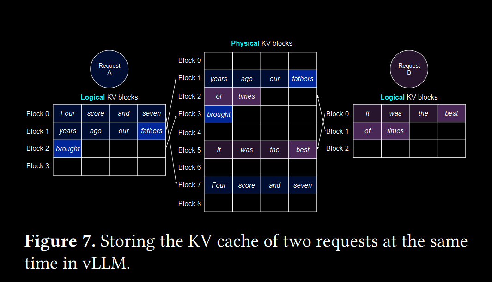

4.4 Application to Other Decoding Scenarios

§4.3 shows how PagedAttention and vLLM handle basic de-
coding algorithms, such as greedy decoding and sampling,
that take one user prompt as input and generate a single out-
put sequence. In many successful LLM applications [ 18, 34],
an LLM service must offer more complex decoding scenarios
that exhibit complex accessing patterns and more opportuni-
ties for memory sharing. We show the general applicability
of vLLM on them in this section

Parallel sampling. In LLM-based program assistants [6, 18],
an LLM generates multiple sampled outputs for a single in-
put prompt; users can choose a favorite output from various
candidates. So far we have implicitly assumed that a request
generates a single sequence. In the remainder of this paper,
we assume the more general case in which a request gener-
ates multiple sequences.  In parallel sampling, one request
includes multiple samples sharing the same input prompt,
allowing the KV cache of the prompt to be shared as well.  Via
its PagedAttention and paged memory management, vLLM
can realize this sharing easily and save memory

Fig. 8 shows an example of parallel decoding for two out-
puts. Since both outputs share the same prompt, we only
reserve space for one copy of the prompt’s state at the prompt
phase; the logical blocks for the prompts of both sequences
are mapped to the same physical blocks: the logical block 0
and 1 of both sequences are mapped to physical blocks 7 and
1, respectively. Since a single physical block can be mapped
to multiple logical blocks, we introduce a reference count for
each physical block. In this case, the reference counts for
physical blocks 7 and 1 are both 2. At the generation phase,
the two outputs sample different output tokens and need
separate storage for KV cache. vLLM implements a copy-on-
write mechanism at the block granularity for the physical
blocks that need modification by multiple sequences, similar
to the copy-on-write technique in OS virtual memory (e.g.,
when forking a process). Specifically, in Fig. 8, when sample
A1 needs to write to its last logical block (logical block 1),
vLLM recognizes that the reference count of the correspond-
ing physical block (physical block 1) is greater than 1; it
allocates a new physical block (physical block 3), instructs
the block engine to copy the information from physical block
1, and decreases the reference count to 1. Next, when sample
A2 writes to physical block 1, the reference count is already
reduced to 1; thus A2 directly writes its newly generated KV
cache to physical block 1.

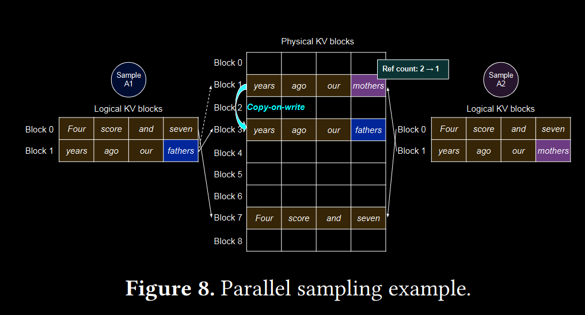

In summary, vLLM enables the sharing of most of the
space used to store the prompts’ KV cache across multiple
output samples, with the exception of the final logical block,
which is managed by a copy-on-write mechanism. By sharing
physical blocks across multiple samples, memory usage can
be greatly reduced, especially for long input prompts

Beam search. In LLM tasks like machine translation [59],
the users expect the top-𝑘 most appropriate translations out-
put by the LLM. Beam search [ 49] is widely used to decode
the most probable output sequence from an LLM, as it miti-
gates the computational complexity of fully traversing the
sample space. 

The algorithm relies on the beam width pa-
rameter 𝑘, which determines the number of top candidates
retained at every step. During decoding, beam search ex-
pands each candidate sequence in the beam by considering
all possible tokens, computes their respective probabilities us-
ing the LLM, and retains the top-𝑘 most probable sequences
out of 𝑘 · |𝑉 | candidates, where |𝑉 | is the vocabulary size.

Unlike parallel decoding, beam search facilities sharing
not only the initial prompt blocks but also other blocks across
different candidates, and the sharing patterns dynamically
change as the decoding process advances, similar to the pro-
cess tree in the OS created by compound forks.

 Fig. 9 shows
how vLLM manages the KV blocks for a beam search ex-
ample with 𝑘 = 4. Prior to the iteration illustrated as the
dotted line, each candidate sequence has used 4 full logi-
cal blocks. All beam candidates share the first block 0 (i.e.,
prompt). Candidate 3 digresses from others from the second
block. Candidates 0-2 share the first 3 blocks and diverge at
the fourth block. At subsequent iterations, the top-4 prob-
able candidates all originate from candidates 1 and 2.

 As
the original candidates 0 and 3 are no longer among the
top candidates, their logical blocks are freed, and the refer-
ence counts of corresponding physical blocks are reduced.
vLLM frees all physical blocks whose reference counts reach
0 (blocks 2, 4, 5, 8).  Then, vLLM allocates new physical blocks
(blocks 9-12) to store the new KV cache from the new can-
didates. Now, all candidates share blocks 0, 1, 3; candidates
0 and 1 share block 6, and candidates 2 and 3 further share
block 7.

Previous LLM serving systems require frequent memory
copies of the KV cache across the beam candidates. For exam-
ple, in the case shown in Fig. 9, after the dotted line, candidate
3 would need to copy a large portion of candidate 2’s KV
cache to continue generation. This frequent memory copy
overhead is significantly reduced by vLLM’s physical block
sharing. 

 This frequent memory copy
overhead is significantly reduced by vLLM’s physical block
sharing. In vLLM, most blocks of different beam candidates
can be shared. The copy-on-write mechanism is applied only
when the newly generated tokens are within an old shared
block, as in parallel decoding. This involves only copying
one block of data

Shared prefix. Commonly, the LLM user provides a (long)
description of the task including instructions and example
inputs and outputs, also known as system prompt [ 36]. The
description is concatenated with the actual task input to form
the prompt of the request. 

The LLM generates outputs based on the full prompt. 
Fig. 10 shows an example. Moreover, the
shared prefix can be further tuned, via prompt engineering,
to improve the accuracy of the downstream tasks [26, 27].

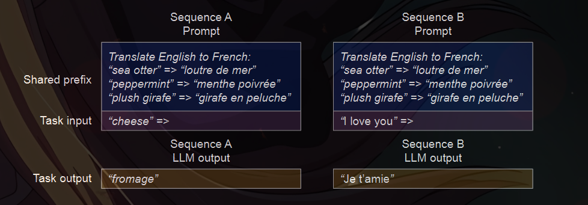

For this type of application, many user prompts share a
prefix, thus the LLM service provider can store the KV cache
of the prefix in advance to reduce the redundant computa-
tion spent on the prefix. In vLLM, this can be conveniently
achieved by reserving a set of physical blocks for a set of
predefined shared prefixes by the LLM service provider, as
how OS handles shared library across processes. A user in-
put prompt with the shared prefix can simply map its logi-
cal blocks to the cached physical blocks (with the last block
marked copy-on-write). The prompt phase computation only
needs to execute on the user’s task input.

\nothing imp/-----

Mixed decoding methods. The decoding methods dis-
cussed earlier exhibit diverse memory sharing and access-
ing patterns. Nonetheless, vLLM facilitates the simultane-
ous processing of requests with different decoding prefer-
ences, which existing systems cannot efficiently do. This is
because vLLM conceals the complex memory sharing be-
tween different sequences via a common mapping layer that
translates logical blocks to physical blocks. The LLM and
its execution kernel only see a list of physical block IDs
for each sequence and do not need to handle sharing pat-
terns across sequences. Compared to existing systems, this
approach broadens the batching opportunities for requests
with different sampling requirements, ultimately increasing
the system’s overall throughput.

\nothing imp/-----

4.5 Scheduling and Preemption

When the request traffic surpasses the system’s capacity,
vLLM must prioritize a subset of requests. In vLLM, we adopt
the first-come-first-serve (FCFS) scheduling policy for all
requests, ensuring fairness and preventing starvation. When
vLLM needs to preempt requests, it ensures that the earliest
arrived requests are served first and the latest requests are
preempted first.

LLM services face a unique challenge: the input prompts
for an LLM can vary significantly in length, and the resulting
output lengths are not known a priori, contingent on both
the input prompt and the model. As the number of requests
and their outputs grow, vLLM can run out of the GPU’s phys-
ical blocks to store the newly generated KV cache. There
are two classic questions that vLLM needs to answer in this
context: (1) Which blocks should it evict? (2) How to recover
evicted blocks if needed again? Typically, eviction policies
use heuristics to predict which block will be accessed fur-
thest in the future and evict that block. Since in our case we
know that all blocks of a sequence are accessed together, we
implement an all-or-nothing eviction policy, i.e., either evict
all or none of the blocks of a sequence. Furthermore, multi-
ple sequences within one request (e.g., beam candidates in
one beam search request) are gang-scheduled as a sequence
group. The sequences within one sequence group are always
preempted or rescheduled together due to potential memory
sharing across those sequences. To answer the second ques-
tion of how to recover an evicted block, we consider two
techniques

Swapping. This is the classic technique used by most virtual
memory implementations which copy the evicted pages to a
swap space on the disk. In our case, we copy evicted blocks to
the CPU memory. As shown in Fig. 4, besides the GPU block
allocator, vLLM includes a CPU block allocator to manage
the physical blocks swapped to CPU RAM. When vLLM
exhausts free physical blocks for new tokens, it selects a set
of sequences to evict and transfer their KV cache to the CPU.
Once it preempts a sequence and evicts its blocks, vLLM
stops accepting new requests until all preempted sequences
are completed. Once a request completes, its blocks are freed
from memory, and the blocks of a preempted sequence are
brought back in to continue the processing of that sequence.
Note that with this design, the number of blocks swapped to
the CPU RAM never exceeds the number of total physical
blocks in the GPU RAM, so the swap space on the CPU RAM
is bounded by the GPU memory allocated for the KV cache

Recomputation. In this case, we simply recompute the KV
cache when the preempted sequences are rescheduled. Note
that recomputation latency can be significantly lower than
the original latency, as the tokens generated at decoding
can be concatenated with the original user prompt as a new
prompt—their KV cache at all positions can be generated in
one prompt phase iteration.

The performances of swapping and recomputation depend
on the bandwidth between CPU RAM and GPU memory and
the computation power of the GPU. We examine the speeds
of swapping and recomputation in §7.3.

4.6 Distributed Execution

Many LLMs have parameter sizes exceeding the capacity of a
single GPU [5 , 9 ]. Therefore, it is necessary to partition them
across distributed GPUs and execute them in a model parallel
fashion [28, 63 ].

This calls for a memory manager capable of
handling distributed memory. vLLM is effective in distributed
settings by supporting the widely used Megatron-LM style
tensor model parallelism strategy on Transformers [47]

This
strategy adheres to an SPMD (Single Program Multiple Data)
execution schedule, wherein the linear layers are partitioned to perform block-wise matrix multiplication, and the the
GPUs constantly synchronize intermediate results via an all-
reduce operation. 

 Specifically, the attention operator is split
on the attention head dimension, each SPMD process takes
care of a subset of attention heads in multi-head attention.

We observe that even with model parallel execution, each
model shard still processes the same set of input tokens, thus
requiring the KV Cache for the same positions. Therefore,
vLLM features a single KV cache manager within the cen-
tralized scheduler, as in Fig. 4. Different GPU workers share
the manager, as well as the mapping from logical blocks to
physical blocks. 

This common mapping allows GPU workers
to execute the model with the physical blocks provided by
the scheduler for each input request.

Although each GPU
worker has the same physical block IDs, a worker only stores
a portion of the KV cache for its corresponding attention
heads

In each step, the scheduler first prepares the message with
input token IDs for each request in the batch, as well as the
block table for each request. Next, the scheduler broadcasts
this control message to the GPU workers. Then, the GPU
workers start to execute the model with the input token IDs.
In the attention layers, the GPU workers read the KV cache
according to the block table in the control message. During
execution, the GPU workers synchronize the intermediate
results with the all-reduce communication primitive without
the coordination of the scheduler, as in [ 47]. In the end, the
GPU workers send the sampled tokens of this iteration back
to the scheduler. In summary, GPU workers do not need
to synchronize on memory management as they only need
to receive all the memory management information at the
beginning of each decoding iteration along with the step
inputs

5.1 Kernel-level Optimization

Since PagedAttention introduces memory access patterns
that are not efficiently supported by existing systems, we
develop several GPU kernels for optimizing it. (1) Fused re-
shape and block write. In every Transformer layer, the new
KV cache are split into blocks, reshaped to a memory layout
optimized for block read, then saved at positions specified
by the block table. To minimize kernel launch overheads, we
fuse them into a single kernel.

(2) Fusing block read and atten-
tion. We adapt the attention kernel in FasterTransformer
to read KV cache according to the block table and perform
attention operations on the fly. To ensure coalesced memory
access, we assign a GPU warp to read each block. More-
over, we add support for variable sequence lengths within a
request batch. 

(3) Fused block copy. Block copy operations,
issued by the copy-on-write mechanism, may operate on
discontinuous blocks. This can lead to numerous invocations
of small data movements if we use the cudaMemcpyAsync
API. To mitigate the overhead, we implement a kernel that
batches the copy operations for different blocks into a single
kernel launch.

5.2 Supporting Various Decoding Algorithms
vLLM implements various decoding algorithms using three
key methods: fork, append, and free. The fork method
creates a new sequence from an existing one. The append
method appends a new token to the sequence. Finally, the
free method deletes the sequence. For instance, in paral-
lel sampling, vLLM creates multiple output sequences from
the single input sequence using the fork method. It then
adds new tokens to these sequences in every iteration with
append, and deletes sequences that meet a stopping condi-
tion using free. The same strategy is also applied in beam
search and prefix sharing by vLLM. We believe future decod-
ing algorithms can also be supported by combining these
methods

7 Ablation Studies
In this section, we study various aspects of vLLM and evalu-
ate the design choices we make with ablation experiments.
7.1 Kernel Microbenchmark
The dynamic block mapping in PagedAttention affects the
performance of the GPU operations involving the stored KV
cache, i.e., block read/writes and attention. Compared to the
existing systems, our GPU kernels (§5) involve extra over-
heads of accessing the block table, executing extra branches,
and handling variable sequence lengths. As shown in Fig. 18a,
this leads to 20–26% higher attention kernel latency, com-
pared to the highly-optimized FasterTransformer implemen-
tation. We believe the overhead is small as it only affects
the attention operator but not the other operators in the
model, such as Linear. Despite the overhead, PagedAttention
makes vLLM significantly outperform FasterTransformer in
end-to-end performance (§6)

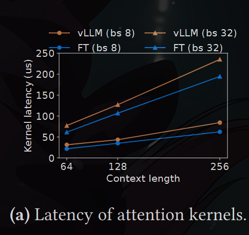

7.2 Impact of Block Size
The choice of block size can have a substantial impact on the
performance of vLLM. If the block size is too small, vLLM
may not fully utilize the GPU’s parallelism for reading and
processing KV cache. If the block size is too large, inter-
nal fragmentation increases and the probability of sharing
decreases.
In Fig. 18b, we evaluate the performance of vLLM with dif-
ferent block sizes, using the ShareGPT and Alpaca traces with
basic sampling under fixed request rates. In the ShareGPT
trace, block sizes from 16 to 128 lead to the best performance.
In the Alpaca trace, while the block size 16 and 32 work
well, larger block sizes significantly degrade the performance
since the sequences become shorter than the block sizes. In
practice, we find that the block size 16 is large enough to
efficiently utilize the GPU and small enough to avoid signifi-
cant internal fragmentation in most workloads. Accordingly,
vLLM sets its default block size as 16

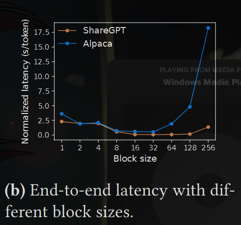

7.3 Comparing Recomputation and Swapping

vLLM supports both recomputation and swapping as its re-
covery mechanisms. To understand the tradeoffs between
the two methods, we evaluate their end-to-end performance
and microbenchmark their overheads, as presented in Fig. 19.
Our results reveal that swapping incurs excessive overhead
with small block sizes. This is because small block sizes often
result in numerous small data transfers between CPU and
GPU, which limits the effective PCIe bandwidth. In contrast,
the overhead of recomputation remains constant across dif-
ferent block sizes, as recomputation does not utilize the KV
blocks. Thus, recomputation is more efficient when the block
size is small, while swapping is more efficient when the block
size is large, though recomputation overhead is never higher
than 20% of swapping’s latency. For medium block sizes from
16 to 64, the two methods exhibit comparable end-to-end
performance.