vAttention: Dynamic Memory Management for
Serving LLMs without PagedAttention

Abstract
PagedAttention is a popular approach for dynamic memory
allocation in LLM serving systems. It enables on-demand allo-
cation of GPU memory to mitigate KV cache fragmentation
— a phenomenon that crippled the batch size (and conse-
quently throughput) in prior systems. However, in trying to
allocate physical memory at runtime, PagedAttention ends
up changing the virtual memory layout of the KV cache
from contiguous to non-contiguous. Such a design leads to
non-trivial programming and performance overheads.

We present vAttention — an approach that mitigates frag-
mentation in physical memory while retaining the virtual
memory contiguity of the KV cache. We achieve this by
decoupling the allocation of virtual and physical memory
using CUDA virtual memory management APIs. We also
introduce various LLM-specific optimizations to address the
limitations of CUDA virtual memory support. Overall, vAt-
tention is a simpler, portable, and performant alternative to
PagedAttention: it supports various attention kernels out-
of-the-box and improves LLM serving throughput by up to
1.23× compared to the use of PagedAttention-based kernels
of FlashAttention-2 and FlashInfer

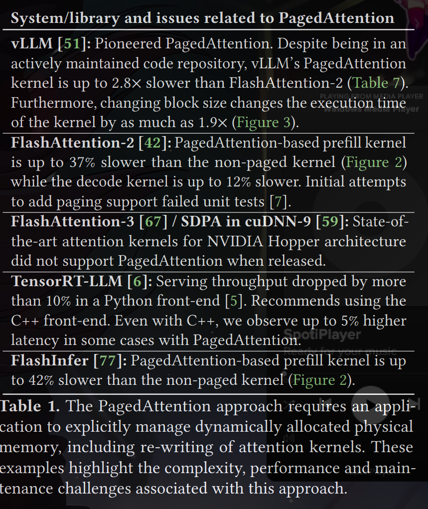

Batching is a powerful technique to boost LLM serving
throughput [35, 51 , 63, 78]. However, achieving a large batch
size requires careful allocation of GPU memory. For each
request, the serving framework stores the activations of all
the tokens processed so far in GPU memory and reuses
them for generating subsequent tokens. This is called the
KV cache [36, 63, 78] which accounts for a majority of GPU
memory usage during inference. Efficiently allocating GPU
memory for the KV cache is challenging for two reasons.
First, the per-request KV cache grows slowly (one token per
iteration), and second, a request’s decode length (or its total
KV cache size) is not known ahead of time.

Inspired by demand paging in OS-based virtual memory
systems, vLLM introduced PagedAttention [ 51] that allo-
cates small blocks of GPU memory on demand i.e., when
previously allocated blocks are fully utilized and the model
continues to generate more tokens. This approach provides
a near-perfect solution for mitigating fragmentation and
hence, PagedAttention has become the de facto standard for
dynamic memory allocation in LLM serving systems, e.g.,
TensorRT-LLM, HuggingFace TGI, LightLLM [4, 6, 28] etc.

However, we show that PagedAttention faces a funda-
mental consequence of dynamic memory allocation: dynam-
ically allocated objects are not guaranteed to be contiguous.
Note that user-level objects are allocated in virtual mem-
ory. Therefore, in trying to enable dynamic allocation of
physical memory, PagedAttention ends up changing the
virtual memory layout of KV cache from contiguous to
non-contiguous. 

We argue that this approach has several
pitfalls (§3). First, it requires rewriting attention kernels, i.e.,
to enable de-referencing all tokens of the non-contiguous KV
cache. Second, it forces developers to implement a memory
manager in the serving framework, i.e., to stitch together dy-
namically allocated virtual memory blocks. Third, it adds run-
time overhead in the critical path of both CPU and GPU exe-
cution. Table 1 provides empirical evidence and real-world
experiences to support these arguments.

The fundamental issue with PagedAttention and prior sys-
tems is that they rely on the reservation-based memory allo-
cation method exposed by the GPU runtime. In this method
(used by cudaMalloc), the runtime allocates both virtual and
physical memory on the GPU meaning that physical mem-
ory is allocated even if the corresponding virtual memory is
not accessed. This is in stark contrast to OS-based demand
paging [52, 62]. 

We show that separating the allocation of
virtual and physical memory allows for more effective KV
cache memory management. To support our claim, we in-
troduce vAttention (§5) — an approach that stores KV cache
in contiguous virtual memory without committing physical
memory ahead-of-time. vAttention decouples the allocation
of virtual and physical memory using the CUDA virtual
memory management (VMM) APIs [12].

In building vAttention, we find that using CUDA VMM
support for KV cache management poses two key efficiency
challenges for an LLM serving system (§6). First, memory
allocation using CUDA VMM APIs incurs high latency be-
cause each allocation involves a round-trip to the OS kernel.

We tackle latency issues with several LLM-specific optimiza-
tions such as overlapping memory allocation with compute,
opportunistically allocating pages ahead of time, and defer-
ring memory reclamation. 

Second, CUDA supports mem-
ory allocation only at the granularity of large pages, i.e., in
multiples of 2MB. Use of large pages can create significant
fragmentation. We address this challenge by modifying the
open-source CUDA unified virtual memory driver, adding
support for smaller 64KB pages.

Our evaluation shows that
use of 64KB pages has no negative impact on the perfor-
mance of attention kernels, i.e., we do not find any evidence
of TLB thrashing. Together, these optimizations mitigate
fragmentation while hiding the latency cost of on demand
memory allocation, making vAttention a simpler, portable
and performant alternative to PagedAttention.

Overall, we make the following contributions:
• We present vAttention – a memory management ap-
proach that retains the virtual contiguity of KV cache
while enabling dynamic allocation of physical memory.
Our implementation of vAttention in vLLM seamlessly
adds dynamic memory allocation support to various
unmodified attention kernels.
• We compare vAttention against PagedAttention-based
alternatives of vLLM, FlashAttention-2 and FlashIn-
fer on Yi-6B, Llama-3-8B and Yi-34B with 1-2 A100
GPUs. Using FlashAttention-2’s non-paged attention
kernel, vAttention outperforms vLLM by up to 1.99×
in decode throughput. In long-context scenarios, it
also improves the end-to-end LLM serving throughput
by up to 1.18× and 1.23× over PagedAttention based
kernels of FlashAttention-2 and FlashInfer
• We demonstrate the portability benefit of vAttention
with the recently launched FlashAttention-3 kernel
(FA3 [67 ]). FA3 is optimized for the NVIDIA Hopper
architecture and was not released with PagedAtten-
tion support. vAttention supports FA3 out-of-the-box,
leading to 1.26 − 1.5× higher throughout over Page-
dAttention based FlashAttention-2

2 Background
2.1 Large Language Models
LLMs are built atop one of the variants of the transformer
architecture [ 73]; an LLM consists of multiple transformer
blocks. Internally, a transformer block contains two types of
operators: position-wise and sequence-wise [ 78]. The former
category includes feed-forward network, layer normaliza-
tion, activation, embedding layer, output sampling layer, and
residual connections whereas attention is a sequence-level
operator. We primarily focus on attention since it is the pri-
mary consumer of GPU memory in LLM inference. Table 2
summarizes the notations used in the paper

recap the basics from the img
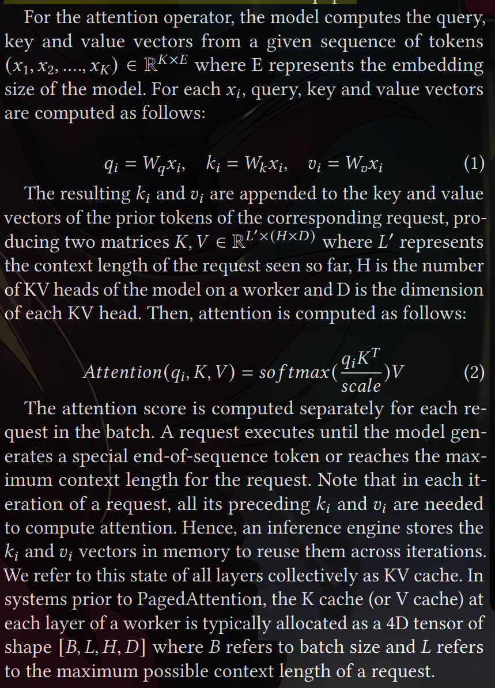

recall pagedAttn
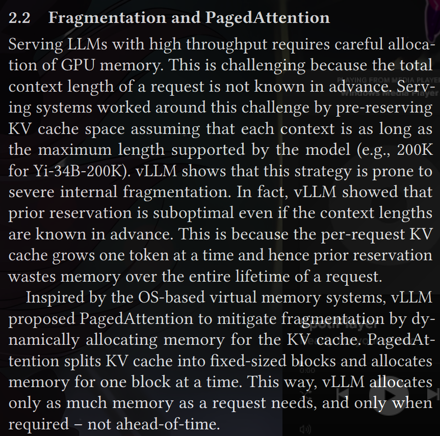

GPUs and page sizes: NVIDIA GPUs support multiple page
sizes in the hardware [ 22, 58, 65, 79]. A single call to a CUDA
VMM API can allocate one or more physical pages, which
we refer to as a page-group. We use page-groups to support
multiple allocation granularities for the KV cache, similar to
how multiple page sizes are commonly used in conventional
OS-based virtual memory systems [52, 62].

3 Issues with the PagedAttention Approach
Despite being inspired by demand paging, the PagedAtten-
tion approach is different from it: PagedAttention implements
demand paging in user space whereas conventional demand
paging is transparent to applications. This section elaborates
on issues that arise with such an approach.

3.1 Requires Re-writing the Attention Kernel
Conventional implementations of the attention operator as-
sume that the two input tensors K and V (Equation 2) are
stored in contiguous memory. By departing from the con-
ventional memory layout, PagedAttention requires an im-
plementation of the attention operator to be modified so as
to compute attention scores over non-contiguous KV cache
blocks. Writing correct and performant GPU kernels can be
challenging for most programmers [7].
Being a fundamental building block of the transformer
architecture, the attention operator has witnessed a tremen-
dous pace of innovation in the systems and ML communities
for performance optimizations, and this trend is likely to continue. In the PagedAtten-
tion model, keeping up with new research requires continued
efforts in porting new optimizations to a PagedAttention-
aware implementation. Production systems can therefore
easily fall behind research, potentially losing performance
and competitive advantage. To provide an example, Table 7
shows that the paged kernel of vLLM is already up to 2.8×
slower than the FlashAttention-2 kernel

3.2 Adds Redundancy in the Serving Framework
PagedAttention makes an LLM serving system responsible
for managing the mappings between KV cache and dynami-
cally allocated memory blocks. For example, consider a re-
quest that allocates four KV cache blocks over time (left
half of Figure 1). These blocks are usually non-contiguous
in virtual memory. During the computation of Equation 2,
PagedAttention kernel needs to access all the elements of the
four KV cache blocks. To facilitate this, the serving system
needs to track the virtual memory addresses of KV cache
blocks and pass them to the attention kernel at runtime. This
approach effectively requires duplicating what the operating
system already does for enabling virtual-to-physical address
translation (right half in Figure 1)

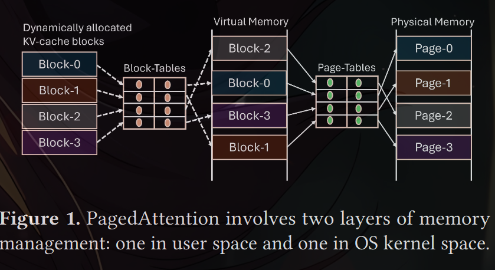

3.3 Performance Overhead
3.3.1 Runtime overhead on the GPU. PagedAttention
slows down attention computation by adding extra code in
the critical path of execution. For example, the vLLM paper
acknowledges that the PagedAttention-based implementa-
tion was 20−26% slower than the corresponding none-paged
FasterTransformer kernel, primarily due to the overhead
of looking up Block-Tables and executing extra branches
(see Figure 18a in [ 51]). In addition, Figure 2 shows that
incorporating PagedAttention has also added a significant
performance overhead in other state-of-the-art kernel li-
braries. For example, PagedAttention based prefill kernels
of FlashAttention-2 and FlashInfer are up to 37% and 42%
slower than the non-paged kernels in the corresponding li-
braries. Our analysis reveals that the number of instructions
executed in PagedAttention kernels is 7 − 13% higher than
the non-paged kernels. Caching page indices also increases
register pressure, causing register spilling.

To highlight another example of difficulty involved in
writing an efficient paged kernel, Figure 3 shows that the
performance of vLLM’s paged decode kernel is significantly
worse with large block sizes of 64 and 128. Our analysis
indicates that this is likely due to L1 cache efficiency: smaller
blocks have a higher memory bandwidth utilization due to
higher hit rates in the L1 cache.

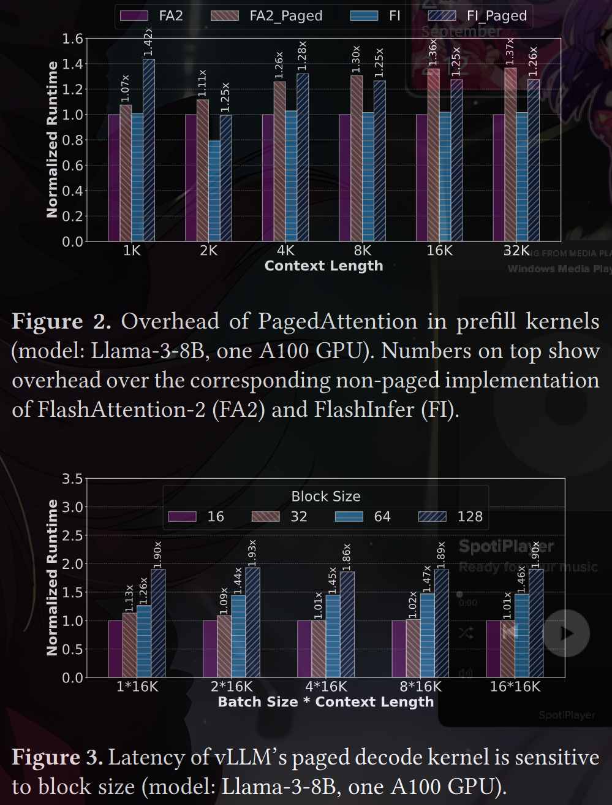

3.3.2 Runtime overhead on the CPU. Implementing an
additional memory manager can add performance issues in
the CPU runtime of the serving system. We refer to a few
real-world examples and our own observations on vLLM to
corroborate this argument.

\sus with details/---
To enable PagedAttention, a serving system needs to sup-
ply Block-Tables to the attention kernel. In vLLM, the latency
of preparing a Block-Table depends on batch composition
and grows proportional to max_num_blocks × batch_size
where max_num_blocks refers to the number of KV cache
blocks in the longest request of the batch. This is because
vLLM manages a Block-Table as a 2D tensor and aligns the
number of KV cache blocks in each request by padding un-
occupied slots with zeros. If a batch contains a few long and
many short requests, such padding results in a significant
overhead
\/---

In our earlier experiments, we observed that Block-
Table preparation in vLLM was contributing 30% latency in
decode iterations. While a recent fix [ 17] has mitigated some
of this overhead, we find that it can still be as high as 10%.
High overhead of PagedAttention has also been found in
TensorRT-LLM, degrading throughput by 11%

This issue
was attributed to the Python runtime of TensorRT-LLM and
moving to a C++ runtime can mitigate the CPU overhead.
However, doing so requires non-trivial programming effort.

4 Insights into LLM Serving Systems

Observation-1: KV cache memory requirement is predictable
on a per-iteration basis. Due to auto-regressive decoding,
once a request enters the decode phase, its KV cache size
increases uniformly by one token per iteration. This allows
the serving system to determine in advance if additional
memory will be required during the iteration’s execution

Observation-2: KV cache does not require high memory allo-
cation bandwidth. The memory footprint of a single token
across all layers is typically few 10s-100s of kilobytes of
memory. For example, the per-token memory footprint of
Yi-6B, Llama-3-8B and Yi-34B is 64KB, 128KB and 240KB,
respectively. Further, each iteration runs for 10s-100s of mil-
liseconds implying that a request requires at most a few
megabytes of memory per second. While batching improves
system throughput [ 35 , 36 , 63 , 82 ], the number of tokens
generated per second plateaus beyond a certain batch size
(Figure 4a). This implies that the memory allocation band-
width requirement also saturates at large batch sizes (e.g., at
256 for Yi-34B). For all the models we studied, we observe
that the highest memory allocation rate is at most 750MB per
second (Figure 4b). vAttention leverages these observations
to optimize KV cache memory management.

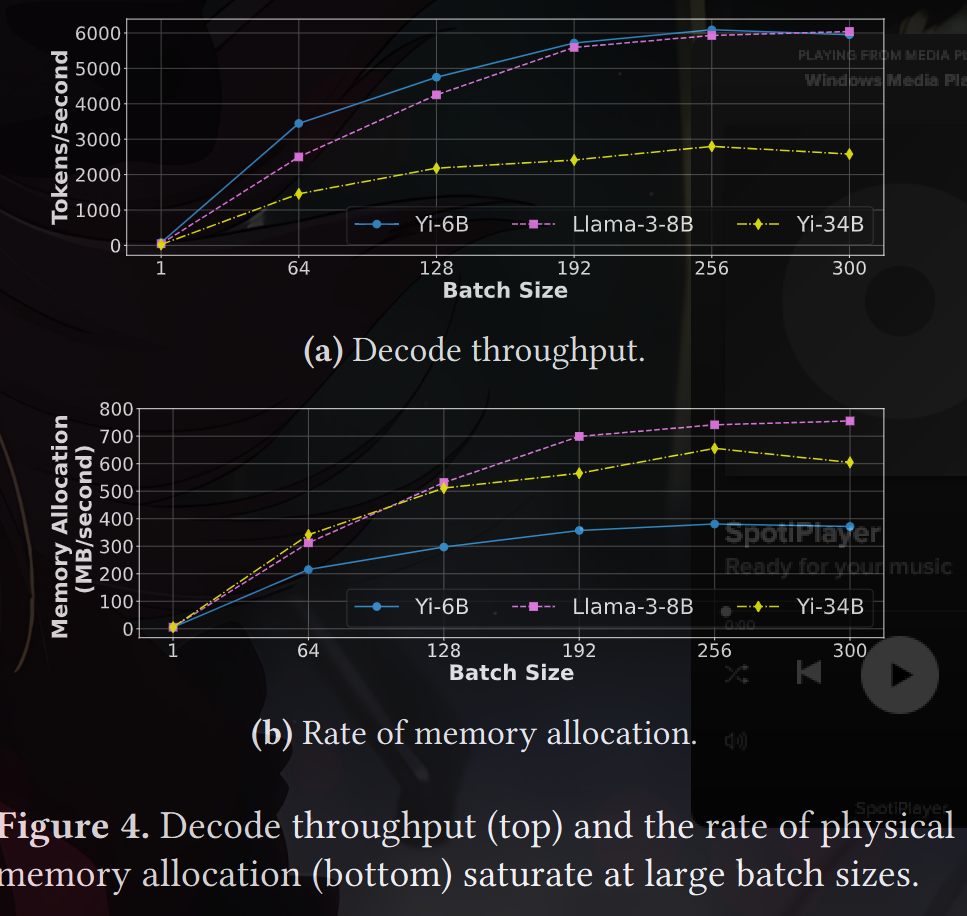

5 vAttention: Design and Implementation
Our primary observation is that physical memory fragmenta-
tion can be avoided without making KV cache non-contiguous
in virtual memory.To realize this, vAttention decouples the
allocation of virtual memory from physical memory by lever-
aging system support for demand paging (instead of imple-
menting demand paging in user space, as in PagedAttention).

5.1 Design Overview
vAttention employs distinct allocation policies for virtual and
physical memory. Specifically, we allocate a large contiguous
buffer for the KV cache in virtual memory ahead-of-time
(similar to systems prior to PagedAttention) while deferring
the allocation of physical memory to runtime (similar to
PagedAttention). This design preserves virtual contiguity
of KV cache without fragmenting physical memory. Note
that this approach could fragment and waste virtual mem-
ory. However, this is not an issue since virtual memory is
abundant, e.g., modern 64-bit systems provide a 128TB user-
addressable virtual memory per process
(64-bit systems use only 48 bits for virtual addresses today, providing a per-
process virtual memory space of 256TB which is divided equally between
the user space and (OS) kernel space.)

5.1.1 Pre-reserving virtual memory. Since virtual mem-
ory is abundant, we pre-allocate it in size that is large enough
to hold the KV cache of the maximum batch size (config-
urable) that needs to be supported. In doing so, we assume
that each request’s context length is same as the maximum
supported by the model.

5.1.2 Number of virtual memory buffers. A serving
framework maintains separate K and V tensors for each layer
of the model. Therefore, we reserve 2×𝑁 buffers on a worker
where 𝑁 is the number of layers managed by that worker

5.1.3 Size of a virtual memory buffer. The maximum
size of a buffer is 𝐵𝑆 = 𝐵 × 𝑆 where B is the maximum
batch size and 𝑆 is the maximum size of a single request’s
per-layer K cache (or V cache) on a worker. Further, 𝑆 =
𝐿 × 𝐻 × 𝐷 × 𝑃, where 𝐿 is the maximum context length
supported by the model, 𝐻 is the number of KV heads on
a worker, 𝐷 is the dimension of each KV head and 𝑃 is the
number of bytes based on model precision (e.g., P=2 for
FP16/BF16)

 As an example, consider Yi-34B with FP16 and
two-way tensor-parallelism (TP-2). In this case, 𝑁 = 60, 𝐻 =
4, 𝐷 = 128, 𝑃 = 2 (8 KV heads of Yi-34B are split evenly on
two GPUs), and maximum supported context length 𝐿 =
200𝐾. For this configuration, 𝑆 = 200𝑀𝐵 (200𝐾 ∗ 4 ∗ 128 ∗
2). Assuming 𝐵 = 500, the maximum size of each buffer
per-worker is 𝐵𝑆 = 100𝐺𝐵 (500 × 200𝑀𝐵). Therefore, the
total virtual memory requirement for 60 layers is 120 buffers
of 100GB each (12TB total). Note that the size of virtual
address space available grows with the number of workers,
e.g., with two TP workers, the total size of user-addressable
virtual address space is 256TB. Therefore, virtual memory is
always plentiful to satisfy large allocations. Figure 5 shows
an example of how vAttention allocates physical memory
pages dynamically

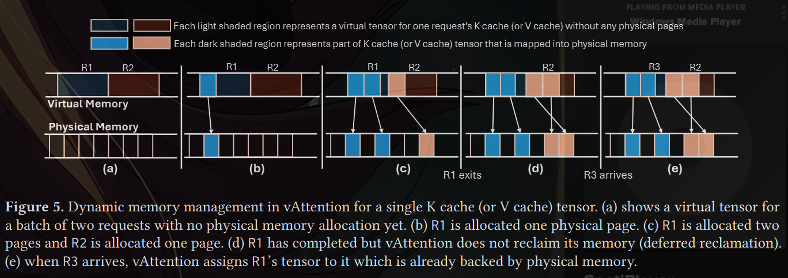

5.2 Leveraging CUDA Virtual Memory Support

The standard GPU memory allocation interface cudaMalloc
does not support demand paging, i.e., it allocates virtual
memory and physical memory at the same time. However,
recent CUDA versions provide programmers a fine-grained
control over managing virtual and physical memory, includ-
ing support for decoupling their allocations [12 , 45 ]. We
leverage these low-level APIs.

5.2.1 CUDA virtual memory APIs. Table 3 provides
an overview of CUDA VMM APIs that allow decoupling
the allocation of virtual memory from physical memory.

The allocation granularity depends on the page size used by
the GPU. Further, the size of a virtual memory buffer or a
physical memory handle must be a multiple of the physical
memory allocation granularity. 

Physical memory pages can
be allocated to (or de-allocated from) sub-regions in a virtual
memory buffer independently of other sub-regions.

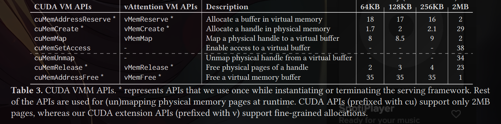

5.2.2 Extending PyTorch caching allocator. KV cache
is a collection of tensors. In current deep learning frame-
works such as PyTorch, a tensor allocated via APIs such as
torch.empty comes with pre-allocated physical memory.
This is because the PyTorch caching allocator relies on the
cudaMalloc interface (Figure 6). Relying on the low-level
API support from CUDA, we extend the PyTorch caching
allocator to allow an application to reserve a virtual memory
buffer for a tensor without committing physical memory
ahead-of-time. We refer to tensors allocated via these APIs
as virtual tensors

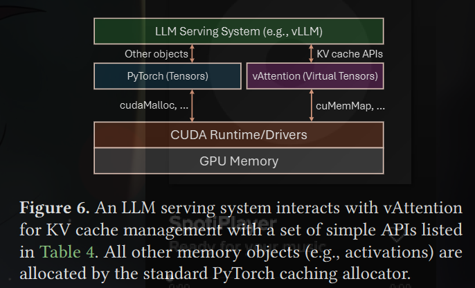
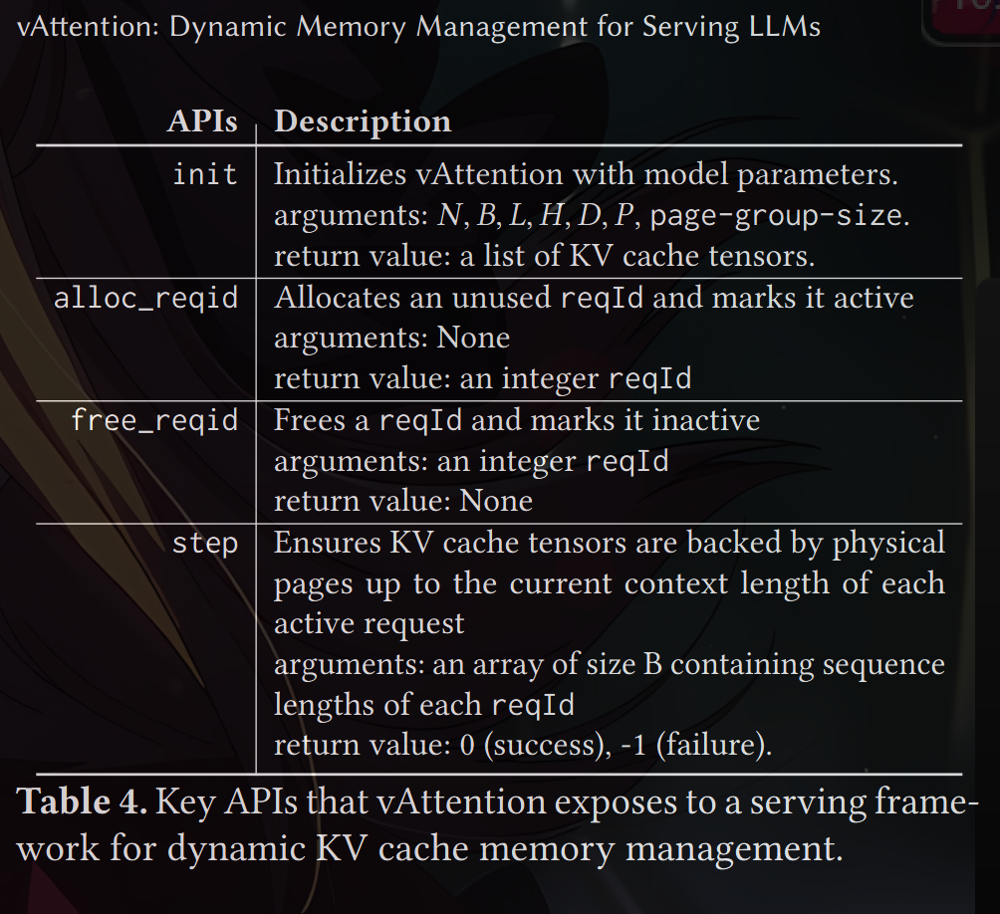

5.2.3 Request-level KV cache indexing.(TO DISCUSS)
A virtual ten-
sor represents the K cache (or V cache) of a layer for the maxi-
mum batch size B. In these tensors, different requests occupy
different non-overlapping sub-regions (say sub-tensors). We
locate the sub-tensor of a request with a unique integer iden-
tifier reqId that lies in the range of 0 to 𝐵 − 1 (note that
at most 𝐵 requests run simultaneously). The K cache (or V
cache) offset of a request’s sub-tensor in the virtual tensor of
the entire batch is reqId × 𝑆 where 𝑆 is the maximum size
of per-layer K cache (or V cache) of a request on a worker.
The request identifier reqId is allocated by vAttention.

5.3 Serving LLMs with vAttention
We build vAttention as a Python library that internally uses
a CUDA/C++ extension for interacting with CUDA drivers.
Our library exposes a set of simple APIs to the serving frame-
work (shown in Figure 6, Table 4 and Algorithm 1). For
simplicity, we discuss the use of these APIs from a single
worker’s perspective; all workers behave the same.

5.3.1 Initial setup. When the serving framework starts,
each model worker loads the vAttention library and config-
ures it with model parameters 𝑁 , 𝐻, 𝐷, 𝑃, 𝐵 and a preferred
page-group size (§6.2) via the init API (line 4 in Algorithm 1).

\The below thing is done irrespective of request coming or not, it is done as soon as serving llm is started/---
Internally, vAttention reserves 2 × 𝑁 virtual tensors on the
worker, as shown in Figure 5(a), where 𝑁 is the number of
layers hosted by the worker. These virtual tensors are re-
served for the lifetime of the serving application. In addition,
vAttention also pre-allocates physical memory pages at each
worker during initialization. However, these pages are not
mapped into the KV cache at this point.
\/---

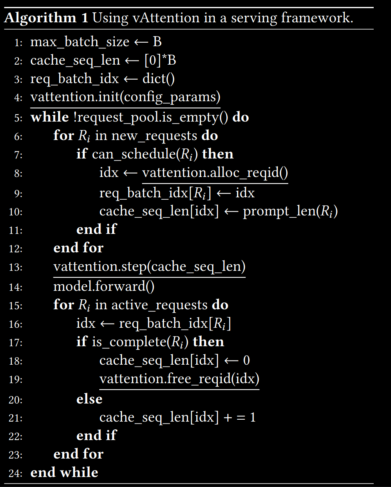

5.3.2 Scheduling a new request. When a new request is
scheduled for the first time, the serving framework obtains
a new reqId from vAttention via alloc_reqid (line 8). All
subsequent memory management operations of the request
are tagged with this reqId.

5.3.3 Model execution. 

Before scheduling a batch for ex-
ecution, the framework needs to ensure that the KV cache
sub-tensors of each active request are backed by physical
memory (Figure 5(b) and (c)). For this purpose, before dis-
patching the first kernel of an iteration to the GPU, the
framework invokes the step API (line 13), specifying the
current context length of each request (context length is
set to 0 for each inactive reqId). Internally, vAttention en-
sures that enough physical pages are mapped for each active
reqId before returning execution back to the framework. If
vAttention cannot satisfy the memory demand, it returns
with a failure in response to which a serving framework can
preempt one or more requests to allow forward progress
(this is similar to vLLM’s default behavior). We leave more
sophisticated policies such as swapping out KV cache to CPU
memory as future work.

Depending on whether a request is in the prefill phase
or decode phase, different amount of physical memory may
need to be mapped for a given iteration. The prefill phase
processes the input tokens of a given prompt in parallel.
Therefore, the amount of physical memory needed to be
mapped depends on the number of prompt tokens being
scheduled.

If the total K cache size of all prompt tokens at
one layer of the model is 𝑠 and page-group size is 𝑡, then each
worker needs to ensure that at least (𝑠 + 𝑡 − 1)/𝑡 page-groups
are mapped in each of the 2 × 𝑁 KV cache sub-tensors of the
given reqId.

For a request in the decode phase, the number of new
page-groups required is at most one per virtual tensor. This
is because each iteration produces only one output token for
a request. vAttention internally tracks the number of page-
groups mapped for each request and maps new page-groups
only when prior page-groups are about to be exhausted.

5.3.4 Request completion. A request terminates when
it reaches user specified or the maximum context length
supported by the model, or when the model produces a spe-
cial end-of-sequence token. The framework notifies vAtten-
tion of a request’s completion with free_reqid (line 19).

5.3.4 Request completion. A request terminates when
it reaches user specified or the maximum context length
supported by the model, or when the model produces a spe-
cial end-of-sequence token. The framework notifies vAtten-
tion of a request’s completion with free_reqid (line 19).
Internally, vAttention may unmap the physical pages of a
completed request or defer them to be freed later (§6.1.2)

\TO DISCUSS/---
Supporting continuous batching: Continuous batching
poses one challenge in computing attention in our design.
When a request from somewhere in the middle of a batch
exits, it creates an unused hole in the virtual tensors of
KV cache. This layout is not supported by implementations
that expect the query (Q) and KV cache to be of the same
size in batch (𝐵) dimension. However, FlashAttention pro-
vides rich API support to address this issue; its argument
cache_batch_idx allows Q and KV cache to have different
batch sizes and also be arranged in arbitrary order (i.e., batch
index 0 in Q can be mapped to batch index 1 in KV cache). vAt-
tention benefits from this API support in terms of both per-
formance and ease of programming; when the request com-
position of a batch changes, we update cache_batch_idx
of running requests such that their Q tensors map to their
respective KV cache based on their reqId
\/---

6 Optimizations
There are two challenges in using CUDA virtual memory
support for serving LLMs. First, invoking CUDA VMM APIs
at runtime incurs high latency. Second, cuMemCreate cur-
rently allocates memory only at the granularity of large
pages, i.e., multiples of 2MB. Use of large pages can waste
physical memory due to internal fragmentation. This section
details a set of simple-yet-effective optimizations that we
introduce to overcome these challenges

6.1 Hiding Latency of Memory Allocation

The serving framework invokes the step API in every itera-
tion. The latency of step depends on the number of page-
groups that need to be mapped into KV cache. 

Consider,
for example, that the KV cache of one request needs to be
extended for Yi-34B which has 60 layers. This requires 120
calls to cuMemMap + cuMemSetAccess each of which takes
about 40 microseconds. Therefore, growing the KV cache of
one request by new page-groups (two per layer) adds about
5 millisecond latency to the corresponding iteration. The
latency overhead grows proportional to the number of re-
quests that need new page-groups in a given iteration. We
propose the following optimizations to hide this latency:

6.1.1 Overlapping memory allocation with compute
(decode phase).

We leverage the predictability of memory
demand to overlap memory allocation with computation. In
particular, note that each iteration produces a single output
token for every decode request. Therefore, memory demand
for a decode iteration is known ahead-of-time. Further, in the
decode phase, a request requires at most one new page-group
for each of its virtual tensors. vAttention keeps track of the
current context length and how much physical memory is
already mapped for each request. Using this information, it
determines when a request would need more memory and
uses a background thread to allocate new page-groups when
the preceding iteration is executing. For example, consider
that a request R1 would require more physical memory in
iteration i. When the serving framework invokes step API
in iteration i-1, vAttention launches a background thread
that maps page-groups for iteration i. Since per-iteration
latency is typically in the range of 10s-100s of milliseconds,
the background thread has enough time to prepare physical
memory mappings for an iteration before it starts executing.
This way, vAttention hides the latency of CUDA APIs by
performing memory allocations out of the critical path.

6.1.2 Deferred reclamation + eager allocation (prefill
phase).

6.1.2 Deferred reclamation + eager allocation (prefill
phase). We observe that allocating physical memory for the
prefill phase can be avoided in many cases. Consider that
a request R1 completed in iteration i and a new request R2
joins the running batch in iteration i+1. To avoid allocating
page-groups to R2 from scratch, vAttention simply defers the
reclamation of R1’s page-groups (Figure 5(d)) and assigns
R1’s reqId to R2. This way, R2 uses the same tensors for its
KV cache that R1 was using – which are already backed by
physical pages (Figure 5(e)). Therefore, new allocations are
required only if R2’s context length is higher than R1.
We further optimize the prefill phase by proactively allo-
cating a small number of page-groups ahead of time. For this
purpose, we try to keep a certain number of page-groups
mapped into the virtual tensors of one of the inactive reqId.
When a new request arrives, we allocate this reqId. At the
same time, we identify a new reqId to be allocated next and
eagerly map physical page-groups for it. In most cases, these
eager allocations obviate the need to allocate physical mem-
ory in the critical path of prefill execution. Finally, we trigger
memory reclamation only when the number of page-groups
cached in vAttention falls below a certain threshold (e.g.,
less than 10% of GPU memory). We delegate both deferred
reclamation and eager allocation to the background thread
that the step API spawns.

6.2 Mitigating Internal Fragmentation

We mitigate internal fragmentation by reducing the granu-
larity of physical memory allocation. NVIDIA GPUs natively
support at least three page sizes: 4KB, 64KB and 2MB [ 22,
58, 65, 79]. Therefore, in principal, physical memory can be
allocated in any multiple of 4KB sizes. The simplest way to
achieve this would be to extend the existing CUDA VMM
APIs (listed in Table 3) to also support allocating smaller
pages (similar to how mmap in Linux supports multiple page
sizes [52, 62 ]). Unfortunately, the CUDA VMM APIs are im-
plemented in the closed-source NVIDIA drivers which makes
it impossible for us to modify their implementation.
Fortunately, some part of NVIDIA drivers (particularly re-
lated to unified memory management) is open-source. There-
fore, we implement a new set of APIs in the open-source
NVIDIA drivers to mimic the same functionality that existing
CUDA APIs provide but with support for multiple page sizes.
The second column in Table 3 shows our new APIs: most of
our APIs have a one-to-one relationship with existing CUDA
APIs except for vMemMap that combines the functionality
of cuMemMap and cuMemSetAccess, and vMemRelease that
combines the functionality of cuMemUnmap and cuMemRelease
for simplicity. In contrast to CUDA VMM APIs, our APIs al-
locate physical memory in 64KB, 128KB and 256KB sized
page-groups. A serving framework can configure a desired
page-group size in vAttention while initializing it (we use
the standard 2MB pages if the configured page-group size is
2MB). Table 3 shows the latency of each API with different
page-group sizes.