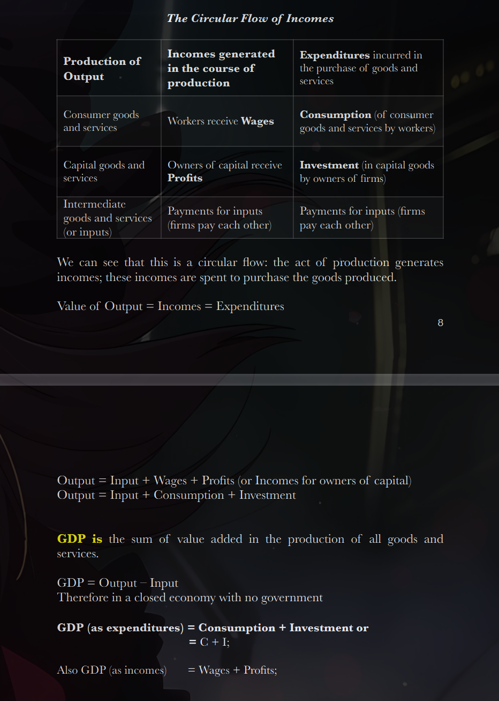
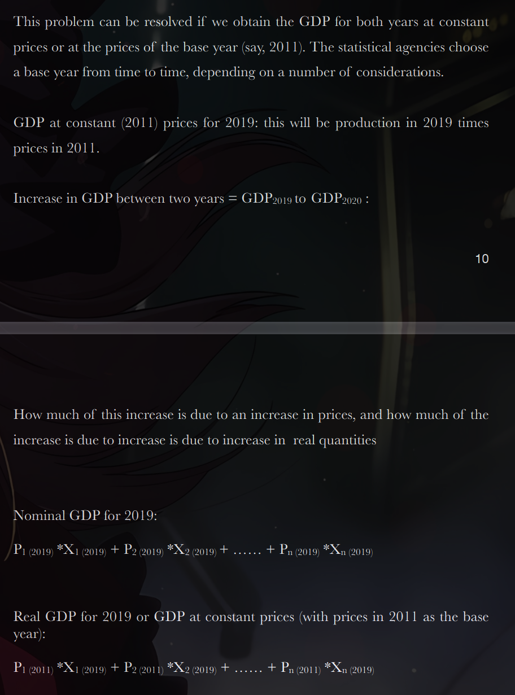

Notes on National Income Accounting and
Balance of Payments

>The Circular Flow Of Incomes

-Production of goods (say, food grains, steel or garments) and services (say, hair
cutting or architectural services) generates value.
-Production of goods and services generates incomes in the form of wages
for workers or profits for the owners of firms.
-One of the ways in which the value of a good or service is measured is by the
price it commands in the market
-In a market economy, the value is realized when the goods and services are
exchanged (sale and purchase) in the market. The purchase of goods and
services leads to expenditures in the economy.
-We can see that production leads to the supply of goods and services.
Expenditure generates demand for the goods and services supplied.
-To complete a cycle of production-sale-purchase, both production-supply and
expenditure-demand are critical.
-An economy’s growth can slow down
due to demand or supply constraints.

>The Economy and Social Classes

-In a typical society, there are two classes of persons: workers who provide
labour and owners of capital.
-Workers receive wages or salaries in return for the labour they provide. The
owners of capital receive rewards in various forms depending on the nature of
the capital they own: profits (for business enterprises), rent (for owners of land or
buildings), interest (for creditors or holders of bank deposits), and dividends (for
those who own equity). Unless otherwise specified, we shall refer to all these
forms of payments to capital as ‘profits’.
-Of the total income, what part should go to labour as wages, and what
part should remain with the capitalists as profits? Such class conflicts often shape
social and political relations in a society.
-The winners and losers of labour-capital conflicts are not determined by
economic factors alone. Wages and profits are not always proportionate to the
economic contributions of labour and capital, respectively. Historical, social and
political factors also come into play. In rural India, women workers receive lower
wages than male workers, mainly as an extension of the relative disadvantages
women face in society.

How does the Circular Flow Operate?
The value of all goods and services produced in a country in a particular period
= Incomes generated in the course of this production = Expenditures
incurred in the purchase of these goods and services

GDP is Quantities times Prices

What is GDP or Gross Domestic Product? GDP is the sum of the value added
by the production of all goods and services in a country during a given period
(typically a year or a quarter).

GDP is the sum of incomes received by persons who participate in the
production process (as workers or as capitalists). GDP is also equivalent to
expenditures on the goods and services produced in the economy.

Value added refers to the value of output minus the value of inputs.

If X 1 is the quantity of good/service 1 and P1 is its price, and so on...
GDP = P1 X1 + P2 X2 +........+ Pn Xn

GDP at Current (or nominal GDP) and
GDP at Constant Prices (or real GDP)

